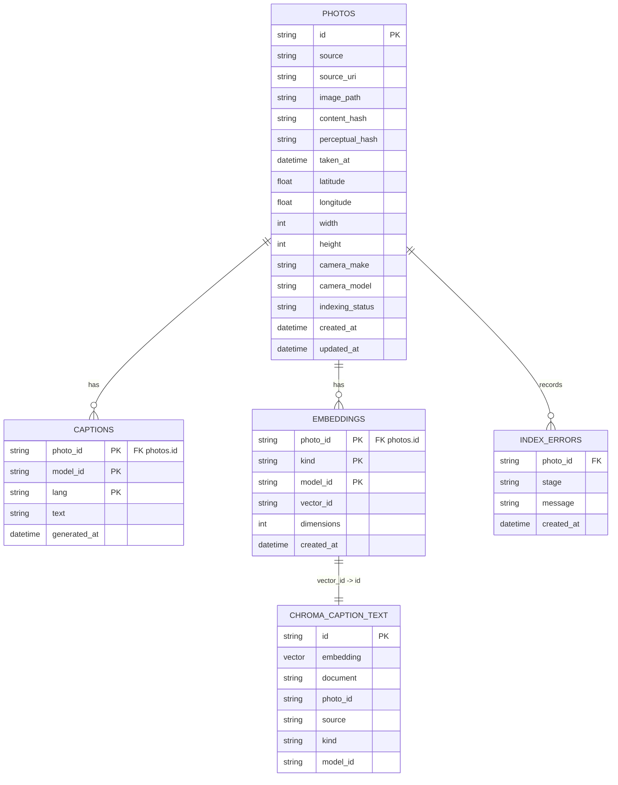

# Foundation DB + Chroma Usage and Status

Date: 2026-06-07

This document is the operational source of truth for the current EDDR
foundation database build. It covers implemented behavior, commands, artifacts,
verification, current measured status, and remaining work.

## Implemented Scope

The current build implements the 2026-06-10 foundation database path:

- SQLite ledger at `data/eddr.sqlite`.
- Chroma persistent vector sidecar at `data/index/chroma`.
- Chroma collection `eddr_caption_text_v1`.
- Source loading from EDA cache, Google Takeout manifest, and Photos export dir.
- Photos materialization wrapper around `osxphotos export`.
- Local Ollama Vision caption batch.
- Local Ollama caption-text embedding batch.
- Semantic caption search CLI.

The project selected Chroma over FAISS for this phase because persistence,
upsert, metadata filtering, count/query, and resume behavior are built in.
FAISS remains a later option only if measured retrieval speed becomes the
actual bottleneck.

## Runtime Requirements

- Python environment managed by `uv`.
- Local Ollama service.
- Ollama caption model: `gemma4:e2b`.
- Ollama embedding model: `qwen3-embedding:8b`.
- `osxphotos` for Photos/iCloud export.
- macOS Photos permission and iCloud download permission for full asset
  materialization.

## Artifacts

| Artifact | Purpose |
|---|---|
| `data/eddr.sqlite` | Canonical local ledger for photos, captions, embeddings, errors, and status checkpoints |
| `data/index/chroma/` | Persistent Chroma vector sidecar |
| `data/photos_export/` | Exported Photos/iCloud image files |
| `data/photos_export/.osxphotos_export.db` | `osxphotos` resume/export state |
| `data/photos_export/export.csv` | `osxphotos` export report |
| `data/google_photos/manifest.jsonl` | Google Takeout source manifest |
| `data/eda_cache/` | EDA-derived source cache |

## Current Implemented ERD

This ERD describes the implemented foundation schema as of 2026-06-07. It is
smaller than the full MVP data model in `docs/PLAN.md`: trip grouping, person
tables, reverse-geocode cache, daily-radius areas, and image-vector storage are
planned but not implemented in the current foundation database.



SQLite constraints:

- `photos.id` is the primary photo identity in EDDR.
- `photos` has `UNIQUE(source, source_uri)` to prevent source-level duplicate rows.
- `captions` uses composite primary key `(photo_id, model_id, lang)`.
- `embeddings` uses composite primary key `(photo_id, kind, model_id)`.
- `captions.photo_id`, `embeddings.photo_id`, and `index_errors.photo_id`
  reference `photos.id` with `ON DELETE CASCADE`.

Chroma sidecar boundary:

- Chroma collection: `eddr_caption_text_v1`.
- Chroma id format: `caption_text:<photo_id>:<embedding_model>`.
- Chroma document: generated caption text.
- Chroma metadata: `photo_id`, `source`, `kind`, `model_id`.
- SQLite stores `embeddings.vector_id`; SQLite does not store vector payloads.

## CLI Commands

Install dependencies:

```bash
uv sync
```

Initialize the SQLite ledger:

```bash
uv run eddr db init --db data/eddr.sqlite
```

Load available source records into the ledger:

```bash
uv run eddr db load-sources --db data/eddr.sqlite --eda-cache data/eda_cache --takeout-manifest data/google_photos/manifest.jsonl --photos-export data/photos_export
```

Print the Photos export command without running it:

```bash
uv run eddr photos export --print-only
```

Run the Photos export:

```bash
uv run eddr photos export
```

The wrapper runs this command shape:

```bash
osxphotos export data/photos_export --download-missing --use-photokit --update --skip-movies --not-hidden --filename "{uuid}" --exportdb data/photos_export/.osxphotos_export.db --report data/photos_export/export.csv
```

Run a resumable Vision caption + caption-text embedding batch:

```bash
uv run eddr vision run --db data/eddr.sqlite --chroma data/index/chroma --limit 100
```

Run semantic caption search:

```bash
uv run eddr search semantic "해변 불빛" --db data/eddr.sqlite --chroma data/index/chroma --k 10
```

Backfill BLAKE3 content hashes and dHash perceptual hashes (stage ④, resumable):

```bash
uv run eddr dedup backfill-hashes --db data/eddr.sqlite
```

Mark cross-source BLAKE3 duplicates (idempotent full recompute, PLAN §4.2):

```bash
uv run eddr dedup mark --db data/eddr.sqlite
```

Reverse-geocode photos with GPS via Nominatim (1 req/s, cached, resumable):

```bash
uv run eddr geocode run --db data/eddr.sqlite
```

Propose Daily Radius candidates and confirm them interactively (D15 wizard):

```bash
uv run eddr setup daily-radius --db data/eddr.sqlite            # 대화형 확정
uv run eddr setup daily-radius --db data/eddr.sqlite --propose-only  # 후보만 출력
```

## Status Semantics

| Status | Meaning |
|---|---|
| `meta_done` | Source metadata is loaded and an image path is available for Vision |
| `missing_image` | Source metadata is loaded but the image file is not available locally |
| `caption_done` | Caption, SQLite embedding ledger row, and Chroma vector upsert are complete |
| `trip_assigned` | Future trip/grouping stage has assigned the photo |

The Vision batch reads rows that are not `caption_done` or `trip_assigned`.
If an image path is missing on disk during the batch, the row is marked
`missing_image`. Successful caption + embedding work marks the row
`caption_done`.

## Current Measured Status

Verified on 2026-06-07 from local artifacts:

| Metric | Value |
|---|---:|
| Source load output | `loaded=11696 skipped=473 errors=0` |
| SQLite `photos` rows | 11,689 |
| `caption_done` photos | 1 |
| `meta_done` photos | 3,114 |
| `missing_image` photos | 8,574 |
| SQLite `captions` rows | 1 |
| SQLite `embeddings` rows | 1 |
| `caption_text` embeddings using `qwen3-embedding:8b` | 1 |
| Chroma vectors | 1 |

Semantic search has been smoke-tested end to end, but search quality is not yet
meaningfully evaluated because only one caption-text vector exists.

## Verified Commands

These checks have passed in this build:

```bash
.venv/bin/pytest -q
```

Result: `33 passed`.

```bash
uv run eddr db init --db data/eddr.sqlite
```

Result: initialized the SQLite ledger.

```bash
uv run eddr db load-sources --db data/eddr.sqlite --eda-cache data/eda_cache --takeout-manifest data/google_photos/manifest.jsonl --photos-export data/photos_export
```

Result: `loaded=11696 skipped=473 errors=0`.

```bash
uv run eddr vision run --db data/eddr.sqlite --chroma data/index/chroma --limit 1
```

Result: `processed=1 failed=0`.

```bash
uv run eddr search semantic "해변 불빛" --db data/eddr.sqlite --chroma data/index/chroma --k 1
```

Result: one Chroma-backed result returned. This is an integration smoke, not a
quality benchmark.

## Remaining Operational Work

The foundation DB ledger is built, but the full caption/vector load is not done.
Remaining work for the 2026-06-10 build window:

1. Run `uv run eddr photos export` with Photos/iCloud access so missing assets
   are materialized into `data/photos_export/`.
2. Rerun `uv run eddr db load-sources ...` after export so `missing_image`
   records can become `meta_done` where files now exist.
3. Run `uv run eddr vision run ... --limit 100` repeatedly or with a larger
   controlled limit until available `meta_done` rows are exhausted.
4. Recheck SQLite status counts and Chroma count after each run.
5. Treat semantic search quality as unproven until a meaningful number of
   caption vectors exists.

## Privacy Boundary

The current path keeps photo bytes, precise location, captions, and embeddings
local. Vision and embedding calls use local Ollama. Images are not sent to
Claude or external LLM services in this build.
