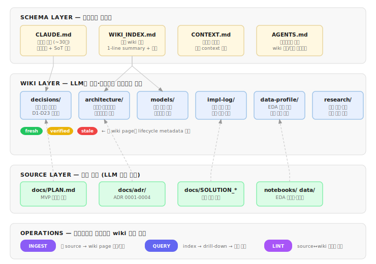

# EDDR Second-Brain 설계서

> **목적**: 프로젝트 성장에 따른 context pollution을 방지하고, 에이전트가 의사결정·플랜작성·작업 시 self-contained wiki를 활용·갱신하는 워크플로우 중심 구축
>
> **작성일**: 2026-05-31 | **상태**: 기획안 (미구현)
>
> **YAGNI 주의**: 이 문서는 **개념 확보 + 단계별 도입 계획**이다. 현재(코드 0행, 문서 9개/63KB ≈ 20K tokens) 상태에서 전체를 한 번에 구축하는 것은 YAGNI 위반이다. §9의 단계적 도입 로드맵을 따른다.

---

## 1. 문제 정의

### 1.1 Context Pollution이란

LLM 에이전트의 context window에 불필요하거나 중복된 정보가 누적되면서 **추론 품질이 저하**되는 현상. Morph 연구(2026)에 따르면 frontier 모델 18개 전부에서 context 길이 증가 시 성능 저하가 확인되었으며, 100K token에서 이미 50%+ accuracy drop이 관측된다.

3가지 메커니즘:

- **Lost-in-the-Middle**: RoPE 기반 모델은 시작/끝 위치의 정보에 편향. 중간 위치 content의 정확도가 30%+ 하락
- **Attention Dilution**: token 수가 늘면 pairwise relationship 수가 기하급수적으로 증가하여 관련 정보가 희석
- **Distractor Interference**: 의미적으로 유사하지만 무관한 content가 모델을 오도

> **근거**: Morph "Context Rot" (2026), CodeDelegator (arxiv:2601.14914), Anthropic "Effective Context Engineering for AI Agents" (2025.09)

### 1.2 EDDR의 현재 상황과 위험

현재 EDDR 프로젝트 문서는 9개, 총 약 63.6KB (~20,000 tokens). 아직 관리 가능한 규모이나, 다음 문제가 이미 존재한다:

**(A) 4중 중복**: Privacy 경계, Photo 정체성, LLM Tool 5개 목록이 CLAUDE.md, CONTEXT.md, ADR, PLAN.md에 동일 내용으로 반복. 갱신 시 4곳을 동기화해야 하는 부채.

**(B) CLAUDE.md가 포인터가 아닌 복사본**: 불변규칙·기술스택·빌드순서를 원본(PLAN.md, ADR)에서 복사하여 재진술. 문서 변경 시 drift 발생 필연.

**(C) PLAN.md가 SoT라 선언하지만 outdated**: ADR-0004의 범위 축소 결정(D8 보류, D10 폐기)과 SOLUTION_REVIEW.md의 모델 교체 권고가 PLAN.md에 미반영.

**(D) SOLUTION_REVIEW.md의 위상 불명확**: CLAUDE.md SoT 목록에 미포함. 23KB로 가장 큰 문서이나, 권고의 수락/거부 추적이 없음.

**코드 구현이 시작되면** 디렉터리 구조, 테스트 방법, API surface, migration 이력 등이 추가되어 CLAUDE.md가 팽창하고, 스키마(PLAN.md 4.1절)와 실제 코드 간 dual truth 문제가 발생한다.

---

## 2. 해결 접근: Karpathy LLM Wiki 패턴

### 전체 아키텍처 다이어그램



### 2.1 핵심 개념

Andrej Karpathy가 2026년 4월 공개한 LLM Wiki 패턴은 **RAG와 근본적으로 다른 접근**이다.

| 비교 | RAG | LLM Wiki |
|------|-----|----------|
| 지식 축적 | 없음 (매번 원본에서 검색·재합성) | 있음 (한 번 컴파일하여 persistent wiki 구축) |
| cross-reference | 불가 | LLM이 자동 유지 |
| 모순 감지 | 불가 | Lint operation으로 주기적 검증 |
| 인프라 | embedding + vector store 필요 | markdown 파일 + index.md만으로 충분 |

~100 source, ~400K word 규모까지는 embedding infrastructure 없이 index.md + context window만으로 운용 가능 (Atlan 분석, 2026).

> **근거**: Karpathy LLM Wiki Gist (2026.04, 5,000+ stars), Pratiyush/llm-wiki 구현체, LLM Wiki v2 (rohitg00)

### 2.2 3-Layer Architecture

```
┌─────────────────────────────────────────────────────┐
│  SCHEMA LAYER  — 에이전트 행동 규칙 + 진입점        │
│  CLAUDE.md, WIKI_INDEX.md, CONTEXT.md, AGENTS.md    │
│  → 항상 context에 로드                               │
├─────────────────────────────────────────────────────┤
│  WIKI LAYER  — LLM이 소유·갱신하는 컴파일된 지식     │
│  wiki/ 디렉터리 아래 topic별 markdown                │
│  → index 보고 필요한 page만 on-demand 로드           │
├─────────────────────────────────────────────────────┤
│  SOURCE LAYER  — 불변 원본 (LLM 읽기 전용)           │
│  docs/PLAN.md, docs/adr/, docs/SOLUTION_REVIEW.md   │
│  → wiki page의 근거. 인간이 직접 수정               │
└─────────────────────────────────────────────────────┘
```

### 2.3 3가지 Operation

| Operation | 트리거 | 동작 |
|-----------|--------|------|
| **INGEST** | 새 source 추가, 의사결정 발생, 구현 완료 | source를 읽고 관련 wiki page 생성/갱신. WIKI_INDEX.md 목차 갱신 |
| **QUERY** | 에이전트가 작업 시작 | WIKI_INDEX.md → 관련 page drill-down → 작업 수행. 좋은 결과물은 새 wiki page로 filing |
| **LINT** | 주기적, 또는 명시적 요청 | source↔wiki 일관성 검증, stale page 탐지, 모순 플래그, orphan link 정리 |

---

## 3. EDDR 프로젝트 적용 설계

### 3.1 디렉터리 구조

```
eddr/
├── CLAUDE.md              # Schema: 포인터 전용 (~30행). 불변규칙 + SoT 링크
├── CONTEXT.md             # Schema: 도메인 용어집 (변경 없음, 항상 로드)
├── AGENTS.md              # Schema: wiki 읽기/쓰기 프로토콜 정의 (신규)
├── wiki/                  # Wiki Layer (신규)
│   ├── WIKI_INDEX.md      # 전체 wiki 목차 (1-line summary + 링크)
│   ├── decisions/         # 결정 요약: D1-D23, ADR 컴파일
│   ├── architecture/      # 스키마·파이프라인·컴포넌트 요약
│   ├── models/            # 기술 선택 근거·벤치마크 요약
│   ├── impl-log/          # 구현 진행 기록 (이슈·해결·학습)
│   ├── data-profile/      # EDA 결과·실측 수치 정리
│   └── research/          # 외부 논문·기술 비교
├── docs/                  # Source Layer (기존 유지, 읽기 전용)
│   ├── PLAN.md
│   ├── SOLUTION_REVIEW.md
│   ├── 01_eda_findings.md
│   └── adr/
├── src/                   # (향후 코드)
└── tests/                 # (향후 테스트)
```

### 3.2 각 계층의 역할과 규칙

#### Schema Layer (항상 context 로드)

**CLAUDE.md** — 리팩터링 방향:
- 현재 55행에서 **~30행으로 축소**
- 불변규칙은 **한 줄 요약 + wiki 링크**로 교체 (e.g., "Privacy 경계 → `wiki/decisions/privacy.md`")
- 기술스택·빌드순서 중복 제거 → PLAN.md로의 포인터만 유지
- `wiki/WIKI_INDEX.md`를 읽으라는 지시 추가

**WIKI_INDEX.md** — wiki 전체의 목차:
- 각 wiki page를 **1줄 요약 + 파일 링크**로 나열
- 에이전트는 WIKI_INDEX.md를 먼저 읽고, 관련 page만 drill-down
- 200행 이내 유지 (넘으면 하위 INDEX 분리)

**CONTEXT.md** — 변경 없음. 도메인 용어가 코드 전반에 쓰이므로 항상 로드.

**AGENTS.md** — 신규. 에이전트의 wiki 워크플로우 규칙 정의:
- QUERY 프로토콜: "작업 시작 시 WIKI_INDEX.md → 관련 page 로드 → 작업"
- INGEST 프로토콜: "의사결정/구현 완료 시 wiki page 갱신 + WIKI_INDEX.md 목차 갱신"
- LINT 프로토콜: "source와 wiki 간 모순 감지 시 flag"
- wiki page frontmatter 규격

#### Wiki Layer (LLM 소유, 에이전트가 갱신)

각 wiki page의 frontmatter:

```yaml
---
title: "Privacy 경계 결정"
source: ["docs/adr/0001-privacy-boundary.md", "docs/PLAN.md#D6"]
last_verified: 2026-05-31
status: fresh  # fresh | verified | stale | archived
confidence: high  # high | medium | low
tags: [privacy, llm-tool, pii]
---
```

**Wiki 디렉터리별 목적**:

| 디렉터리 | 내용 | Source 대응 |
|-----------|------|-------------|
| `decisions/` | D1-D23 + ADR 결정의 **컴파일된 요약**. 무엇을 왜 결정했는지 한 곳에 정리 | PLAN.md D-log, docs/adr/* |
| `architecture/` | DB 스키마, 파이프라인, 컴포넌트별 인터페이스 요약. **코드가 진화하면 코드 기준으로 갱신** | PLAN.md §4-6, 실제 코드 |
| `models/` | 기술 선택 근거, 벤치마크, 교체 권고 상태 추적 | SOLUTION_REVIEW.md |
| `impl-log/` | 구현 중 발생한 이슈, 해결 방법, 학습 사항 | 구현 과정에서 생성 |
| `data-profile/` | EDA 결과, 실측 수치, 가정 검증 결과 | 01_eda_findings.md, notebooks/ |
| `research/` | 참조한 외부 논문·기술·사례 비교 | 웹 리서치 결과 |

#### Source Layer (인간 소유, LLM 읽기 전용)

- docs/ 아래 기존 파일은 변경하지 않음
- **Source가 변경되면** 관련 wiki page의 status를 `stale`로 마킹하고 INGEST 수행
- Source의 권위가 wiki보다 상위: **Source와 wiki가 충돌하면 Source가 맞고 wiki를 수정**
- 단, Source 자체가 outdated인 경우(e.g., ADR-0004 반영 전의 PLAN.md)에는 **먼저 Source를 수정한 후** wiki를 갱신. wiki가 Source를 우회하여 사실상 SoT가 되는 것을 방지

### 3.3 Context Budget 관리

에이전트의 세션 시작 시 로드되는 token 예산:

| 계층 | 파일 | 예상 크기 | 로드 시점 |
|------|------|-----------|-----------|
| Schema | CLAUDE.md | ~1KB (30행) | 자동 로드 |
| Schema | CONTEXT.md | ~7KB | 항상 로드 |
| Schema | AGENTS.md | ~3KB | 항상 로드 |
| Schema | WIKI_INDEX.md | ~3KB | 세션 시작 시 로드 |
| **합계** | | **~14KB (~4,500 tokens)** | |

현재(63.6KB ≈ 20,000 tokens) 대비 **세션 시작 시 context 사용량 70% 절감**. 나머지는 QUERY operation으로 필요 시 on-demand 로드.

### 3.4 Wiki Lifecycle Management

LLM Wiki v2(rohitg00)의 lifecycle 관리를 단순화하여 적용:

```
fresh ──(30일 경과)──→ verified ──(60일 경과)──→ stale ──(아카이브)──→ archived
  ↑                        ↑                        │
  └───── INGEST로 갱신 ────┘────── LINT로 검증 ──────┘
```

- **fresh**: 최근 생성/갱신된 page. source와 일치 확인됨
- **verified**: 30일 경과 후 자동 전환. 여전히 유효하지만 재검증 권장
- **stale**: 60일 경과, 또는 source 변경 감지 시. LINT가 flag
- **archived**: 더 이상 유효하지 않은 page. context 로드 대상에서 제외

**단순화 근거**: EDDR은 1인 프로젝트이므로 Ebbinghaus decay나 confidence scoring은 과도. status 4단계 + last_verified 날짜로 충분.

> **YAGNI 원칙 준수**: 복잡한 scoring 체계는 v2 후보.

---

## 4. 에이전트 워크플로우 통합

### 4.1 세션 시작 워크플로우 (QUERY)

```
1. CLAUDE.md 자동 로드 (기존)
2. CONTEXT.md 로드
3. AGENTS.md 로드 → wiki 프로토콜 인지
4. wiki/WIKI_INDEX.md 로드 → 전체 wiki 목차 파악
5. 사용자 요청 분석 → 관련 wiki page 식별
6. 필요한 wiki page만 selective 로드
7. (필요 시) source 파일 drill-down
8. 작업 수행
```

### 4.2 의사결정 후 워크플로우 (INGEST)

```
1. 결정 내용 정리
2. wiki/decisions/ 에 해당 page 갱신 (또는 신규 생성)
3. 관련 wiki page (architecture/, models/ 등) 연쇄 갱신
4. wiki/WIKI_INDEX.md 목차 갱신
5. 각 page의 frontmatter: status=fresh, last_verified=today
```

### 4.3 구현 완료 후 워크플로우 (INGEST)

```
1. 구현 내용 요약
2. wiki/impl-log/ 에 기록 (이슈·해결·학습)
3. wiki/architecture/ 의 관련 page 갱신 (실제 코드 기준)
4. (스키마 변경 시) wiki/architecture/db-schema.md 갱신
5. (기술 변경 시) wiki/models/ 갱신
6. wiki/WIKI_INDEX.md 목차 갱신
```

### 4.4 일관성 검증 워크플로우 (LINT)

```
1. wiki/ 전체 page의 frontmatter 스캔
2. stale page 목록 생성
3. 각 stale page의 source 파일 읽기
4. source↔wiki 불일치 탐지
5. 불일치 항목 리포트 생성
6. (사용자 확인 후) wiki 갱신 또는 source 수정 제안
```

---

## 5. 학술적 근거 요약

이 설계에 영향을 준 핵심 연구:

| 연구 | 핵심 기여 | 적용 포인트 |
|------|-----------|-------------|
| **CodeDelegator** (arxiv:2601.14914) | Ephemeral-Persistent State Separation. planner와 coder의 context 분리로 context pollution 해결 | wiki를 persistent knowledge로 유지, 작업별 context는 ephemeral |
| **Anthropic Context Engineering** (2025.09) | Selection, Compression, Ordering, Isolation, Format Optimization 5원칙 | WIKI_INDEX → selective loading, 중요 정보를 Schema Layer에 배치 |
| **HiRAG** (arxiv:2503.10150) | 계층적 검색으로 multi-level abstraction 구축 | 3-layer 계층 구조, index-first navigation |
| **Context Rot** (Morph, 2026) | 모든 frontier 모델에서 context 길이↑ → 성능↓ 실증 | context budget 14KB 목표의 근거 |
| **Memory for Autonomous LLM Agents** (arxiv:2603.07670) | write-manage-read loop 형식화, 5가지 memory mechanism | INGEST-QUERY-LINT 3-operation 설계 |
| **Complexity Trap** (arxiv:2508.21433) | 단순한 observation masking이 LLM summarization만큼 효과적 | over-engineering 경고 → lifecycle 4단계로 단순화 |

---

## 6. 기존 프로젝트와의 정합성

### 6.1 불변 규칙 준수

- **Privacy 경계 (ADR-0001)**: wiki에 PII 미포함. wiki page에는 "country/city/district까지만" 같은 규칙 요약만 기록
- **YAGNI (ADR-0003, D21)**: wiki 구조를 최소한으로 시작. confidence scoring, embedding index 등은 v2 후보
- **사진 SoT (D4)**: wiki는 코드/설계 지식만 관리. 사진 데이터는 SQLite DB가 SoT

### 6.2 기존 문서 처리

| 기존 파일 | 처리 방안 |
|-----------|-----------|
| `CLAUDE.md` | 포인터 전용으로 리팩터링. 중복 내용 제거, wiki 링크 추가 |
| `CONTEXT.md` | 변경 없음. Schema Layer에 유지 |
| `docs/PLAN.md` | Source Layer에 유지. wiki/decisions/에 컴파일된 요약 생성 |
| `docs/adr/*` | Source Layer에 유지. wiki/decisions/에 통합 요약 생성 |
| `docs/SOLUTION_REVIEW.md` | Source Layer에 유지. wiki/models/에 요약 + 수락/거부 상태 추적 |
| `docs/01_eda_findings.md` | Source Layer에 유지. wiki/data-profile/에 핵심 수치 요약 |

### 6.3 빌드 순서 내 위치

현재 빌드 순서(PLAN.md §10): ① 골든셋 → ② 스켈레톤 → ③ 인덱싱 → ...

Second-Brain은 **한 번에 구축하지 않고 단계적으로 도입**한다 (§9 로드맵 참조):
- **Phase 0 (지금)**: CLAUDE.md 리팩터링 + 기존 문서 불일치 해소만. 빌드 순서에 영향 없음
- **Phase 1 (② 스켈레톤 시)**: 코드 디렉터리 생성과 함께 CLAUDE.md 확장 시 필요에 따라 wiki 포인터 추가
- **Phase 2 (③-④ 이후)**: context가 40K tokens을 넘기면 wiki/ 정식 도입
- **Phase 3 (⑤-⑦ 이후)**: 모듈 수 증가에 따라 lifecycle 관리 도입

---

## 7. 참고 구현체 비교

EDDR에 적합한 접근 선택을 위한 비교:

| 구현체 | 접근 | 장점 | 단점 | EDDR 적합성 |
|--------|------|------|------|-------------|
| **Karpathy LLM Wiki** (원본 패턴) | markdown 파일 + index.md | 인프라 0, 단순 | lifecycle 관리 없음 | ★★★★ 기반 채택 |
| **Pratiyush/llm-wiki** | MCP server + session 자동 수집 | 12개 tool, 세션 히스토리 보존 | TypeScript 의존, 과도한 기능 | ★★ 참조만 |
| **rohitg00/agentmemory** | 4-tier memory + hybrid search | 51개 tool, 다중 에이전트 | SQLite+vector, 복잡한 설정 | ★ 과도 |
| **LLM Wiki v2** (rohitg00 gist) | lifecycle + confidence scoring | stale 방지, typed relationship | 1인 프로젝트에 과도 | ★★★ lifecycle만 채택 |
| **OmegaWiki** | 연구 논문 lifecycle 전체 | 26개 skill, bilingual | 연구용, 소프트웨어 개발과 무관 | ★ 부적합 |

**EDDR 선택**: Karpathy 원본 패턴 + LLM Wiki v2의 lifecycle 4단계. 인프라 없이 markdown 파일만으로 운용.

---

## 8. 리스크와 완화

| 리스크 | 영향 | 완화 |
|--------|------|------|
| wiki 갱신을 잊어서 stale 누적 | 에이전트가 오래된 wiki 기반으로 잘못된 결정 | LINT operation 정기 실행 + AGENTS.md에 INGEST 의무 명시 |
| wiki page가 source보다 권위를 갖는 착각 | source 변경 후 wiki 미갱신 시 모순 | "Source > Wiki" 원칙을 AGENTS.md에 명시 |
| WIKI_INDEX.md가 200행 초과 | index 자체가 context 오염 | 하위 INDEX 파일 분리 규칙 사전 정의 |
| wiki 갱신의 오버헤드로 작업 속도 저하 | 매 작업마다 wiki 갱신은 비효율 | "의사결정/구현 완료 시에만 INGEST" — 일상적 코드 수정에는 불필요 |

---

## 9. 단계적 도입 로드맵

### YAGNI 원칙에 따른 트리거 기반 도입

현재(코드 0행, 20K tokens)에서 전체 wiki를 구축하는 것은 해결할 문제가 아직 없는 상태에서 인프라를 만드는 것이다. **실제 context pollution이 발생하는 시점에 필요한 만큼만 도입한다.**

### Phase 0: 지금 즉시 (코드 없는 현재)

CLAUDE.md의 구조적 부채만 해소. wiki 인프라 불필요.

1. **CLAUDE.md 리팩터링**: 4중 중복 제거, 포인터 전용화. 불변규칙은 1줄 요약 + ADR 링크로 교체
2. **기존 문서 불일치 해소**: PLAN.md에 ADR-0004(D8 보류, D10 폐기) 반영, SOLUTION_REVIEW.md의 권고 수락/거부 상태 명확화

### Phase 1: 스켈레톤 구축 시 (빌드 순서 ②)

코드 디렉터리가 생기면서 CLAUDE.md에 개발 명령이 추가되는 시점.

3. **CLAUDE.md에 "wiki/WIKI_INDEX.md를 참조하라" 지시 추가** (실제 wiki는 아직 불필요하면 생략)
4. **docs/ 내 불일치가 3건 이상 누적되면** → wiki/decisions/ 생성하여 결정 요약 컴파일 시작

### Phase 2: 구현 중반 (인덱싱 1단계 이후, 빌드 순서 ③-④)

코드 + 테스트 + 스키마 변경이 쌓이면서 context가 40K tokens을 넘기 시작하는 시점.

5. **wiki/ 디렉터리 + WIKI_INDEX.md 정식 생성**
6. **AGENTS.md 작성**: QUERY/INGEST 프로토콜 정의
7. **기존 source에서 초기 INGEST**: PLAN.md → decisions/ + architecture/, SOLUTION_REVIEW.md → models/

### Phase 3: 구현 후반 (Vision + Trip 이후, 빌드 순서 ⑤-⑦)

모듈 수가 늘고 기술 결정이 누적되는 시점.

8. **impl-log/, research/ 디렉터리 활성화**
9. **LINT operation 도입**: lifecycle frontmatter 적용, stale 페이지 탐지
10. **WIKI_INDEX.md가 200행 초과 시** → 하위 INDEX 분리

### 도입 판단 기준

| 트리거 조건 | 도입 항목 |
|-------------|-----------|
| CLAUDE.md가 100행 초과 | Phase 1 즉시 실행 |
| docs/ 문서간 불일치 3건 이상 | wiki/decisions/ 생성 |
| 세션 시작 시 로드 token이 40K 초과 | Phase 2 전체 실행 |
| wiki page가 30개 초과 | LINT operation + lifecycle 도입 |
| WIKI_INDEX.md가 200행 초과 | 하위 INDEX 분리 |

---

## 10. 참고 자료

- Karpathy, A. (2026). "LLM Wiki" — https://gist.github.com/karpathy/442a6bf555914893e9891c11519de94f
- Morph (2026). "Context Rot: Why LLMs Degrade" — https://www.morphllm.com/context-rot
- Fei et al. (2025). "CodeDelegator: Context Pollution via Role Separation" — arxiv:2601.14914
- Anthropic (2025). "Effective Context Engineering for AI Agents" — https://www.anthropic.com/engineering/effective-context-engineering-for-ai-agents
- Liu et al. (2025). "HiRAG: Hierarchical RAG" — arxiv:2503.10150
- Zhang et al. (2026). "Memory for Autonomous LLM Agents" — arxiv:2603.07670
- rohitg00 (2026). "LLM Wiki v2" — https://gist.github.com/rohitg00/2067ab416f7bbe447c1977edaaa681e2
- Atlan (2026). "LLM Wiki vs RAG" — https://atlan.com/know/llm-wiki-vs-rag-knowledge-base/
- arxiv:2508.21433. "The Complexity Trap: Simple Observation Masking"
