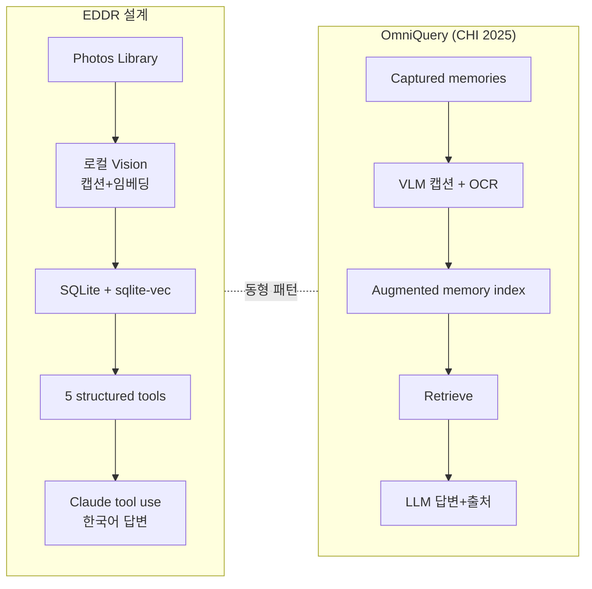
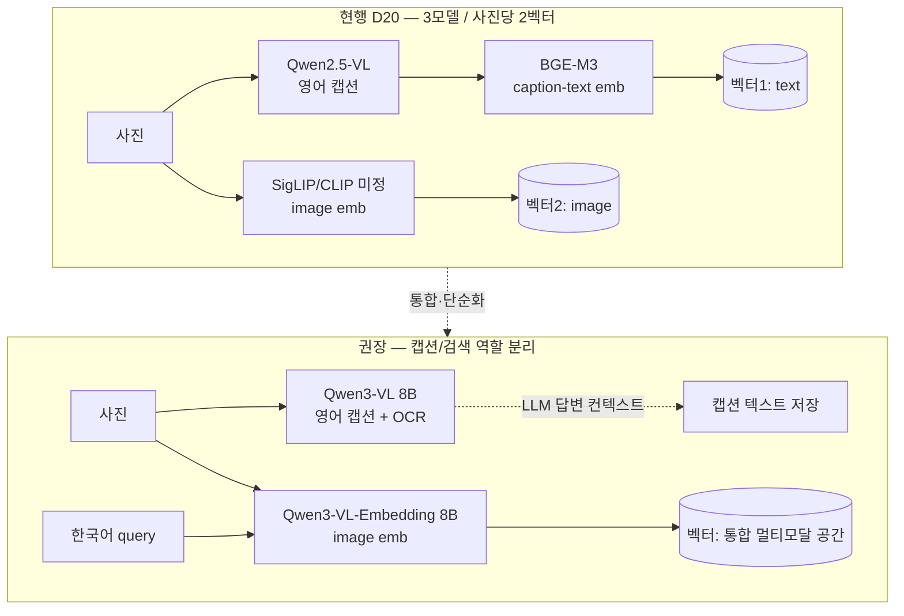
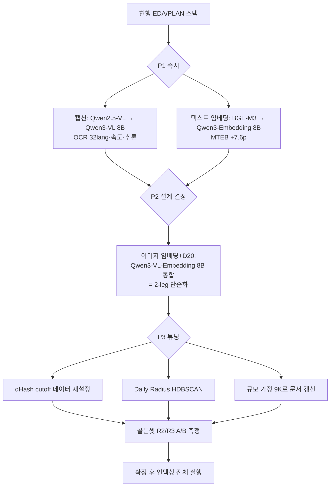

# EDDR EDA 솔루션 적절성 평가 보고서

> 작성일: 2026-05-31
> 대상: `notebooks/01_eda.ipynb` 및 `docs/PLAN.md`(D1–D23)에서 채택·제안된 솔루션
> 평가 기준: arXiv 1차 출처, 공식 벤치마크(MTEB/MMTEB·OpenCompass·MMEB-V2), 동급 공개 프로젝트
> 범위: 전체 파이프라인(인입·dedup·geocode·Daily Radius·Trip·Vision·임베딩·검색·DB) + 모델 SoTA

---

## 0. 결론 먼저 (TL;DR)

**전체 아키텍처는 적절하며, 동급 학술 연구(OmniQuery, CHI 2025)가 동일한 설계 패턴으로 71.5% QA 정확도를 달성해 검증한다.** 단, **Vision 두 모델(캡션·임베딩)은 즉시 교체해야 한다.** PLAN이 제안받은 Qwen2.5-VL(2025-01)과 BGE-M3는 작성 시점엔 합당했으나, 그 후 더 강하고 **로컬 실행 가능한** 후속 모델이 나왔다. 사용자의 추정("더 좋은 모델이 나와있을 것")은 **사실로 확인된다.**

판정 요약:

| # | 구성요소 | 판정 | 핵심 근거 |
|---|---|---|---|
| 1 | 전체 아키텍처(caption→RAG→LLM tool use) | ✅ VALIDATED | OmniQuery(CHI 2025) 동일 패턴, 71.5% 정확도, RAG 대비 우세 |
| 2 | 인입(osxphotos hybrid: 메타 전수 + 샘플 export) | ✅ VALIDATED | person/burst/hidden/UUID는 Photos DB에만 존재 → osxphotos 필수. 표준 관행과 일치 |
| 3 | dedup(BLAKE3 정확 + dHash 근접) | 🟡 NEEDS-ADJUSTMENT | 2단 전략은 표준. **단 dHash cutoff=1이 너무 타이트**(EDA가 이미 이상 신호 노출) |
| 4 | reverse-geocode(Nominatim 1req/s + 캐시) | ✅ VALIDATED | 개인·로컬 규모 적합. 양자화 캐시 합리적 |
| 5 | Daily Radius(KDE→격자 양자화) | 🟡 OK, 보강 권고 | EDA가 KDE를 격자로 교체한 판단은 옳음. **DBSCAN/HDBSCAN이 더 정석** |
| 6 | Trip 세그멘테이션(반경+24h gap) | ✅ VALIDATED (휴리스틱) | 규칙 기반 적정. GPS 없는 773장(9%) 한계는 인지됨 |
| 7 | **캡션 모델 Qwen2.5-VL 7B** | 🔴 UPGRADE | **Qwen3-VL**(2025-11)이 추론·속도 우위 + **OCR 32개 언어**(여행 표지판·간판) |
| 8 | **텍스트 임베딩 BGE-M3** | 🔴 UPGRADE | **Qwen3-Embedding-8B** MTEB-multi **70.58 vs BGE-M3 63.0** (+7.6p) |
| 9 | **이미지 임베딩(미정: SigLIP)** + **2-leg 설계(D20)** | 🔴 REDESIGN | **Qwen3-VL-Embedding**(2026-01, MMEB-V2 77.8)이 2-leg를 1모델로 통합 |
| 10 | DB(SQLite + sqlite-vec) | ✅ VALIDATED | 10만 규모·단일 사용자엔 충분. 표준 선택 |

> **한 줄 권고:** 캡션 모델은 **Qwen3-VL 8B vs Gemma 4 26B MoE** 중 골든셋 A/B로 확정, 검색 임베딩은 **Qwen3-VL-Embedding 8B 단일 통합 모델**로 가면 D20의 "사진당 임베딩 2개" 복잡도까지 함께 정리된다. dHash cutoff는 인덱싱 후 분포로 재튜닝한다.

---

## 1. 평가 방법 및 출처 신뢰성

기술 선택은 프로젝트 규약(`CLAUDE.md`)에 따라 arXiv 등 기존 연구를 토대로 평가했다. 사용한 출처 등급:

- **1차(최우선)**: arXiv 논문·기술 리포트(Qwen3-VL TR 2511.21631, Qwen3-Embedding 2506.05176, Qwen3-VL-Embedding 2601.04720, SigLIP 2 2502.14786, OmniQuery 2409.08250), 공식 leaderboard(MTEB multilingual).
- **2차**: 공식 모델 카드(Hugging Face), 공식 블로그(Qwen Team).
- **참고**: 벤더 중립 비교 글은 방향 확인용으로만 사용하고, 수치는 1차 출처로 교차 검증.

> ⚠️ 한계: 일부 벤치마크는 평가 프롬프트·조건이 모델마다 달라(특히 InternVL3가 보고한 Qwen2.5 점수는 자체 재현치) **절대 점수의 1:1 비교에는 주의**가 필요하다. 본 보고는 가능한 한 동일 leaderboard(MTEB-multi, MMEB-V2) 내 비교만 인용한다.

---

## 2. 전체 아키텍처 적절성 — 동급 연구로 검증

EDDR의 핵심 흐름은 **"로컬 vision으로 캡션·임베딩 생성 → 구조화 검색 → 외부 LLM이 tool use로 답"**이다. 이 패턴은 학술적으로 검증돼 있다.

**OmniQuery (ACM CHI 2025, arXiv 2409.08250)** — EDDR와 거의 동형(同型)의 시스템:
- 개인의 멀티모달 기억(사진)을 **멀티모달 모델로 캡션 생성 + OCR + (오디오) 전사**해 인덱싱.
- 질문이 오면 관련 기억을 **retrieve → LLM이 출처와 함께 답 생성**.
- **사람 평가에서 정확도 71.5%**, 통상 RAG 대비 **74.5%의 경우에서 승 또는 무승부**.

이는 EDDR의 D2(메타+캡션/임베딩), D5(Claude로 답변), D21(structured tool)의 설계 방향이 **임의 선택이 아니라 검증된 패턴**임을 뒷받침한다.

추가로 personal/episodic memory QA 계열 연구(LifelongMemory 2312.05269 등)도 **"캡션·텍스트로 인코딩 → LLM 추론"** 구조를 공통적으로 채택한다. EDDR가 영상 대신 사진, 외부 대신 로컬 vision으로 좁힌 것은 스코프 축소일 뿐 패턴 이탈이 아니다.

**판정: ✅ VALIDATED.** 아키텍처 자체는 교체 대상이 아니다. 개선 여지는 *구성 모델*과 *임베딩 설계*에 있다.

---

## 3. 모델 평가 — 사용자 질문의 핵심

### 3.1 캡션 모델 — Qwen2.5-VL 7B → **Qwen3-VL 8B 로 교체 권고** 🔴

PLAN은 캡션에 **Qwen2.5-VL 7B**(2025-01-28 공개)를 제안했고, EDA 스파이크는 임시로 `gemma4`를 썼다. 그러나 그 후 동일 계열의 후속이 나왔다.

**Qwen3-VL** (기술 리포트 arXiv 2511.21631, 2025-11):
- **추론·시각 이해 전반에서 Qwen2.5-VL 대비 세대적 향상**, 동급 7~8B 비교에서 추론 우위.
- **추론 속도 15–60% 빠름**, TTFT 20–40% 단축 → 10만 장 배치 캡션 생성에 직접 유리(성능·효율 요구 충족).
- **OCR 지원 32개 언어로 확대(이전 19개)**, 저조도·블러·기울기에 강건, 39개 언어까지 다국어 OCR 확장.
- **로컬 실행 가능**: dense **4B/8B/32B** 변형이 **Ollama(`qwen3-vl:8b`)·MLX·llama.cpp**로 제공 → D3("전부 로컬, M4 Pro 64GB")와 정합.

> **EDDR 맥락에서 OCR 32개 언어가 왜 중요한가:** 여행 사진엔 표지판·간판·메뉴·티켓의 텍스트가 많다("몽골/이탈리아" 같은 R1 질의의 장소 단서). 캡션 모델의 OCR이 강해질수록 캡션 텍스트에 지명·상호가 포착되고, 이것이 D20의 caption-text 임베딩 leg를 통해 한국어 의미 검색의 recall을 끌어올린다.

대안 비교(로컬 캡션용):

| 모델 | 크기(로컬) | 강점 | EDDR 적합성 |
|---|---|---|---|
| **Qwen3-VL 8B** ✅권장 | 4B/8B/32B dense, Ollama·MLX | 추론·속도·OCR 32lang, 동일 계열 마이그레이션 용이 | 최적. D3 충족 |
| Qwen2.5-VL 7B (PLAN 현행) | 7B | 검증됨, 문서/다이어그램 강함 | 작동하나 구형 |
| InternVL3 8B | 8B | OpenCompass 다수 항목 Qwen2.5-VL 상회 | 유력 대안. 단 생태계·Ollama 편의는 Qwen3-VL이 우위 |
| Gemma 3 (4B/12B/27B) | 1B~27B | 경량·다국어·128K context | 가능. vision 추론은 Qwen3-VL이 앞섬 |
| **Gemma 4 E4B** (2026-04-02) | 4.5B effective / 8B w/ emb | 150M vision encoder, 140+ 언어, Apache 2.0, M4 Pro에서 ~57 tok/s | **유력 대안.** 경량·빠른 추론. 단 vision encoder가 작아(150M) 세밀한 캡션 품질은 A/B 필요 |
| **Gemma 4 26B MoE** (2026-04-02) | 4B active / 26B total | 550M vision encoder, MMMU Pro 73.8%, MoE라 추론 비용≈4B급 | **유력 대안.** 대형 vision encoder + 낮은 추론 비용. M4 Pro 64GB에서 ~16GB Q4로 구동 가능 |

> ⚠️ **Gemma 4 누락 고지:** 본 보고의 초판(2026-05-31)은 Gemma 4(2026-04-02 공개)를 후보에서 누락했다. 조사 범위 오류이며, 위 두 변형을 후보에 추가한다. Gemma 4 31B(dense)는 M4 Pro 64GB에서 메모리 부담이 크고 캡션 배치 처리에는 과잉이므로 후보에서 제외한다. 최종 권장은 **골든셋 A/B(Qwen3-VL 8B vs Gemma 4 26B MoE)로 확정**해야 한다.

**근거 주의:** "InternVL3 > Qwen2.5-VL"은 InternVL3 저자 측 OpenCompass 재현 비교이며 두 모델 모두 Qwen2.5 base를 공유한다. 절대 우열보다 **"Qwen2.5-VL이 더 이상 최신 프런티어가 아니다"**라는 방향성이 핵심이다.

### 3.2 텍스트 임베딩 — BGE-M3 → **Qwen3-Embedding-8B 로 교체 권고** 🔴

PLAN은 캡션-텍스트 임베딩에 **BGE-M3 또는 SigLIP**을 제안했다. 텍스트 leg(한국어 query ↔ 영어 caption 매칭, D19/D20)의 성능이 R2/R3 의미 검색 품질을 좌우한다.

**MTEB Multilingual leaderboard 비교**(1차: Qwen 공식 블로그·arXiv 2506.05176, 2025-06):

| 모델 | 파라미터 | MTEB-multi | 비고 |
|---|---|---|---|
| **Qwen3-Embedding-8B** ✅권장 | 8B | **70.58 (No.1)** | 100+ 언어(한국어 포함), MRL 가변 차원, 32K context |
| Qwen3-Embedding-4B | 4B | 상위권 | 64GB 메모리 여유 시 절충안 |
| Qwen3-Embedding-0.6B | 0.6B | 64.64(MMTEB-R) | 경량, 빠른 인덱싱 |
| **BGE-M3 (PLAN 현행)** | 0.55B | **63.0** | dense+sparse 하이브리드, 검증됨 |
| OpenAI text-embedding-3 | API | 64.6 | (참고) 로컬 아님 → D6 위배 |

- **격차: +7.6p**(70.58 vs 63.0)는 multilingual retrieval에서 유의미하다. Qwen3-Embedding은 **100+ 언어를 명시 지원**하며 한국어가 포함된다.
- **MRL(Matryoshka)** 지원 → 같은 모델에서 차원을 줄여 sqlite-vec 인덱스 크기·속도를 조절 가능(성능·효율 요구에 부합).
- **로컬 실행**: Ollama `qwen3-embedding`로 제공. 0.6B/4B/8B 중 선택.
- 함께 공개된 **Qwen3-Reranker**(0.6B/4B/8B)로 2단계(retrieve→rerank) 확장 시 정밀도 추가 향상 가능.

> ⚠️ **주의 — 한국어 단독 벤치 부재**: 위 수치는 MTEB *multilingual 집계*다. 한국어 단일 태스크 공개 벤치는 출처에서 확정적으로 못 찾았다. 따라서 **"한국어에서도 BGE-M3보다 낫다"는 강한 결론은 보류**하고, EDDR 골든셋(R2/R3)으로 **두 모델 A/B를 직접 측정**해 확정할 것을 권한다. 이것이 가정을 숨기지 않는 정직한 판단이다.

### 3.3 이미지 임베딩 + 2-leg 설계(D20) — **단일 통합 모델로 재설계 권고** 🔴

PLAN은 사진당 임베딩 **2개**(image leg + caption-text leg, D20)를 두고, image leg 모델은 **SigLIP/CLIP 도입 시점까지 미정**으로 남겼다(EDA S11 caveat에서 명시). 이 공백을 메우는 두 갈래가 있다.

**갈래 A — SigLIP 2 / Jina-CLIP v2 (전통적 dual-encoder)**

- **SigLIP 2** (arXiv 2502.14786, Google DeepMind, 2025-02): **109개 언어**, zero-shot 분류·**image-text retrieval**·dense feature 전 영역에서 SigLIP 상회. ViT-B(86M)/L/So400m(400M)/g(1B). 한국어 포함 다국어 image retrieval에 적합.
- **Jina-CLIP v2** (arXiv 2412.08802, 0.9B): **89개 언어**, Flickr30k i2t **98.0%** SoTA, NLLB-CLIP-SigLIP 대비 다국어 image retrieval +4%.

→ 둘 다 **"한국어 query ↔ 사진 픽셀" 직접 검색**을 단일 인코더로 제공한다. PLAN의 image leg 공백을 바로 채울 수 있고, **D20의 image leg와 text leg를 같은 공간**으로 묶으려던 원래 의도와도 부합.

**갈래 B (권장) — Qwen3-VL-Embedding 단일 통합 모델**

- **Qwen3-VL-Embedding / Reranker** (arXiv 2601.04720, 2026-01): 텍스트·이미지·문서이미지·비디오를 **단일 표현 공간**으로 매핑하는 통합 멀티모달 리트리버.
- **Qwen3-VL-Embedding-8B: MMEB-V2 종합 77.8 (SoTA)** — 직전 최고 오픈소스 대비 **+6.7%**, API 모델 포함 전 모델 상회. Image 도메인 80.1, Visual Document 82.4.
- **2B/8B** 제공, **MRL 가변 차원**, 32K 토큰.

**왜 갈래 B가 D20을 정리하는가:** 현재 D20은 (1) 캡션 모델, (2) 텍스트 임베딩 모델, (3) 이미지 임베딩 모델 → **세 모델 + 사진당 2 벡터**를 요구해 운영·업그레이드 비용(전체 재생성)이 크다. Qwen3-VL-Embedding은 **이미지 임베딩과 캡션-텍스트 임베딩을 한 모델·한 공간**에서 처리하므로:

- 한국어 query를 **이미지에 직접**(caption 경유 없이) 매칭 → caption 누락·오역 리스크 감소.
- "사진당 임베딩 2개"를 **이미지 임베딩 1개(+선택적 caption 임베딩)**로 단순화 가능.
- 캡션은 여전히 **LLM이 읽을 텍스트 컨텍스트**로서 가치가 있으므로 유지(Qwen3-VL 8B). 즉 **캡션과 임베딩의 역할을 분리**: 캡션=LLM 답변용 설명, 임베딩=검색용 벡터.

> **caption-vs-CLIP 보조 근거:** 연구(ICCV 2023 Kornblith 등; Long-CLIP ECCV 2024)에 따르면 **캡션 품질이 retrieval recall을 크게 좌우**(예: caption 디코딩 개선만으로 R@1 26.5→49.4%)하고, 순수 CLIP image emb는 전역 의미에 치우쳐 세부 instance 검색이 약하다. 따라서 EDDR가 **이미지 임베딩과 캡션 텍스트를 둘 다 보유**하려는 방향(D20의 취지)은 옳다. 다만 그 구현을 **레거시 3모델이 아니라 통합 모델 + 고품질 캡션**으로 하는 것이 효율적이다.

---

## 4. 인덱싱 파이프라인 비(非)모델 요소 평가

### 4.1 인입 — osxphotos hybrid ✅ VALIDATED

EDA의 "메타데이터 전수(읽기 전용) + 픽셀 점검용 ~150장 stratified export" 전략은 적절하다. person 라벨·burst·hidden·UUID는 **원본 EXIF가 아니라 Photos DB에만** 존재하므로 osxphotos가 사실상 유일 경로다(ADR-0002의 "Photos asset=identity SoT"와 정합). 공개 도구 생태계(osxphotos 기반 dedup·fingerprint 프로젝트들)도 동일 접근을 쓴다.

- 실측: 9,047 assets → INDEXABLE 8,574(94.8%), GPS 91.0%, valid taken_at 100%. **D18 필터 waterfall이 의도대로 동작**.
- 주의: 실제 라이브러리는 **9,047장**으로, PLAN의 "~10만 장" 가정과 **한 자릿수 배 차이**. 규모 가정은 문서에서 현실값으로 갱신 권장(인덱싱 시간·배치 설계의 상류 전제).

### 4.2 dedup — BLAKE3 + dHash 🟡 NEEDS-ADJUSTMENT (cutoff)

- **2단 전략(정확=BLAKE3, 근접=dHash)은 표준**이고 적절하다. BLAKE3는 빠른 콘텐츠 해시, dHash는 시각 근접용으로 역할 분담이 맞다.
- **문제는 cutoff=1.** EDA S8에서 **93개 파일 중 near-dup 쌍이 93개** 검출됐다(S12 표). 90여 장 무작위 샘플에서 이 정도면 cutoff가 **실제 near-dup이 아닌 쌍까지 포함**할 가능성이 있다(8×8=64bit dHash에서 Hamming≤1은 매우 엄격해 보이지만, 저정보·유사 구도 사진에서 우연 충돌이 난다).
- **문헌 권고**: dHash 임계는 보통 **Hamming ≤ 2**(거의 동일)에서 **<10**(유사)까지 쓰인다. EDDR는 64bit 기준이므로, **인덱싱 후 전수 pairwise 분포를 보고 cutoff를 데이터로 재설정**(D8이 이미 "튜닝 가능"으로 열어둠)하고, near-dup은 삭제가 아니라 그룹화(`near_duplicate_group_id`)이므로 **약간 느슨하게 잡아 UI에서 1장만 노출**하는 편이 안전하다.

### 4.3 reverse-geocode — Nominatim ✅ VALIDATED

개인·로컬·1 req/sec + 좌표 양자화 캐시는 OSM 이용약관과 규모에 적합하다. country/city/district까지만 외부 전송(ADR-0001)도 일관. GPS 91% 커버리지면 geocode 효용이 충분하다.

### 4.4 Daily Radius — KDE→격자 양자화 🟡 OK, 보강 권고

- EDA가 PLAN의 KDE를 **~5km 격자 양자화 + 상위 밀집 셀**로 바꾼 것은 **타당한 실용적 판단**이다(전 지구 좌표에서 KDE bandwidth가 까다롭다는 노트는 정확).
- 다만 격자는 **셀 경계에 걸친 군집이 쪼개지는** 약점이 있다. 정석은 **DBSCAN/HDBSCAN**(밀도 기반, haversine metric)로, 집/직장/본가 같은 임의 형태 군집을 경계 문제 없이 잡는다. 구현 부담이 작고(scikit-learn) 결과가 더 견고하므로, setup wizard 후보 추출 단계에 **HDBSCAN 도입을 권장**한다.

### 4.5 Trip 세그멘테이션 — 반경+24h ✅ VALIDATED (휴리스틱)

- "일상 반경 밖 + 24h 이상 연속" 규칙은 D14/CONTEXT 정의를 충실히 구현한 합리적 휴리스틱이다. 다국가 1 trip 처리도 정의와 일치.
- 실측 한계 인지됨: **GPS 없는 dated 사진 773장(indexable의 9%)**은 위치로 trip 배정 불가. → PLAN Risk 표의 "시간만 있으면 trip 포함, GPS 없으면 null" 대응과 일관. v1 휴리스틱으로 충분하나, 경계 사례(반경 50km 잠정값)는 골든셋으로 검증 후 고정할 것.

### 4.6 DB — SQLite + sqlite-vec ✅ VALIDATED

단일 파일·백업 용이·단일 사용자·~9천(또는 ~10만) 벡터 규모에 sqlite-vec는 충분하다. 별도 벡터 DB(FAISS/Milvus) 도입은 현 규모에서 YAGNI(ADR-0003 정신과 일치). 임베딩 차원이 커지면(Qwen3-Embedding-8B는 4096차원) **MRL로 축소**해 인덱스 비용을 관리하라.

---

## 5. 종합 권고 (우선순위)

**P1 — 모델 즉시 교체(저위험·고효과):**
1. **캡션**: Qwen2.5-VL 7B → **Qwen3-VL 8B**. 동일 계열이라 프롬프트·파이프라인 호환, Ollama/MLX 제공. 효과: 캡션 품질·OCR·속도. 부작용: 거의 없음(메모리 8B Q4 ≈ 6GB 수준, M4 Pro 64GB 여유).
2. **텍스트 임베딩**: BGE-M3 → **Qwen3-Embedding-8B**(또는 4B). 효과: multilingual retrieval +7.6p. 부작용: 차원↑(4096) → MRL로 흡수.

**P2 — 임베딩 설계 결정(D20 재검토):**
3. 이미지 임베딩 leg를 **Qwen3-VL-Embedding 8B 단일 통합 모델**로 채택하고, "사진당 2벡터"를 **이미지 통합 임베딩 중심**으로 단순화. 캡션은 LLM 답변 컨텍스트로 유지. *대안*: 통합 모델 부담이 크면 **SigLIP 2 So400m** 또는 **Jina-CLIP v2**로 image leg만 채워도 PLAN 의도 충족.

**P3 — 데이터 기반 튜닝(인덱싱 후):**
4. dHash cutoff를 전수 분포로 재설정(현 cutoff=1은 과타이트 신호).
5. Daily Radius 후보 추출에 **HDBSCAN**(haversine) 도입.
6. PLAN의 "~10만 장" → 실측 **~9천 장**으로 규모 가정 갱신(인덱싱 시간·배치 설계 전제).

**검증 게이트:** 모든 모델 교체는 **`docs/golden_set.yaml` 10문항 회귀**(특히 R2 person, R3 semantic)로 **A/B 측정 후 확정**한다. 특히:
- **캡션 모델**: **Qwen3-VL 8B vs Gemma 4 26B MoE** A/B — 여행 사진 캡션 품질(OCR·장면 묘사·세부 인스턴스)을 골든셋으로 비교. Gemma 4의 550M vision encoder가 실제 캡션 품질에서 우위를 보이는지 확인.
- **한국어 임베딩**: 벤치만으로 단정하지 말고 골든셋으로 확인할 것(§3.2 주의).

---

## 6. 의도적으로 평가 보류한 것 / 미해결

- **한국어 단일 retrieval 벤치마크**: Qwen3-Embedding의 한국어 단독 우위는 공개 출처에서 확정 못 함 → 골든셋 실측으로 대체.
- **로컬 추론 실제 속도(M4 Pro)**: 보고의 속도 수치는 벤더 리포트 기준. 실제 10만(또는 9천) 장 배치 wall-clock은 환경 측정 필요.
- **Qwen3.5/Qwen3.6-VL 등 차세대**: 검색 중 일부 글이 "Qwen3.5가 Qwen3-VL을 상회"라 언급하나, 1차 리포트·로컬 배포 성숙도(Ollama/MLX 안정 버전) 기준으로 **현 시점 안전 선택은 Qwen3-VL**. 차세대는 안정화 후 재평가.

---

## 부록 A. 출처 (1차 우선)

**모델·벤치마크**
- Qwen3-VL Technical Report — arXiv:2511.21631 · https://arxiv.org/abs/2511.21631
- Qwen3-Embedding (TR) — arXiv:2506.05176 · https://arxiv.org/abs/2506.05176 · 공식: https://qwenlm.github.io/blog/qwen3-embedding/
- Qwen3-VL-Embedding & Reranker — arXiv:2601.04720 · https://arxiv.org/abs/2601.04720
- SigLIP 2 — arXiv:2502.14786 · https://arxiv.org/abs/2502.14786
- Jina-CLIP v2 — arXiv:2412.08802 · https://arxiv.org/abs/2412.08802
- InternVL3 — arXiv:2504.10479 · https://arxiv.org/abs/2504.10479
- Gemma 3 Technical Report — arXiv:2503.19786 · https://arxiv.org/pdf/2503.19786
- **Gemma 4** — Google DeepMind 공식: https://deepmind.google/models/gemma/gemma-4/ · 블로그: https://blog.google/innovation-and-ai/technology/developers-tools/gemma-4/ · 모델카드: https://ai.google.dev/gemma/docs/core/model_card_4
- Gemma 4, Phi-4, Qwen3 비교 — arXiv:2604.07035 · https://arxiv.org/abs/2604.07035
- Ollama Gemma 4 — https://ollama.com/library/gemma4
- Qwen2.5-VL Technical Report — arXiv:2502.13923 · https://arxiv.org/pdf/2502.13923
- Ollama Qwen3-VL — https://ollama.com/library/qwen3-vl · Qwen3-Embedding — https://ollama.com/library/qwen3-embedding

**동급 시스템 / 검색 연구**
- OmniQuery (CHI 2025) — arXiv:2409.08250 · https://arxiv.org/abs/2409.08250 · https://dl.acm.org/doi/10.1145/3706598.3713448
- LifelongMemory — arXiv:2312.05269 · https://arxiv.org/abs/2312.05269
- Guiding Image Captioning toward Specific Captions (ICCV 2023) — arXiv:2307.16686
- Long-CLIP (ECCV 2024) — https://www.ecva.net/papers/eccv_2024/papers_ECCV/papers/06793.pdf

**dedup / 해싱**
- imagededup (idealo) — https://idealo.github.io/imagededup/methods/hashing/
- Duplicate image detection with perceptual hashing — https://benhoyt.com/writings/duplicate-image-detection/
