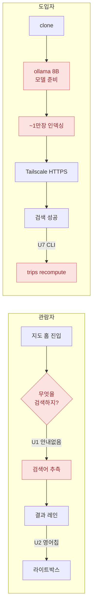
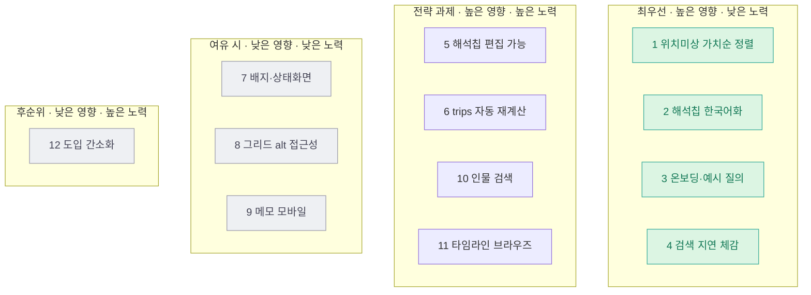

# EDDR 제3자 사용자 평가 — 기능성·사용성

## 0. 결론 (먼저)

**EDDR은 "검색 코어·프라이버시·로컬 우아한 열화(graceful degradation)"에서 동급 자가호스팅 사진앱 대비 분명히 앞선다. 그러나 제3자가 _처음_ 만났을 때의 사용성은 4개 지점에서 막힌다 — ① 온보딩 부재, ② 검색 해석의 언어 불일치(한→영)·비편집성, ③ 위치 미상 보강 동선의 "가치순 아님" 정렬, ④ 검색 지연 체감. 도입자(자가호스팅) 관점에선 설치·인덱싱 장벽이 사실상 최대 게이트인데, 이는 '1인 로컬' 설계가 의도적으로 지불한 비용이다.**

판정을 한 줄로: **제품의 엔진은 출시급, 운전석(첫 사용자 경험)은 베타급.**

### 관점별 점수 (5점 만점, 정성 평가)

| 관점 | 기능성 | 사용성 | 도입성 | 핵심 마찰 (1개) |
|---|---|---|---|---|
| 비기술 관람자 (가족) | 4.0 | 3.5 | N/A(소유자가 띄워줌) | "무엇을 검색할 수 있는지" 모름 + 해석칩 영어 |
| 신규 자가호스팅 도입자 | 4.0 | 3.0 | **1.5** | 설치·모델·인덱싱·CLI 장벽 |
| UX 전문가(휴리스틱) | — | **3.3 (B)** | — | H10(도움말)·H3(제어)·H7(효율)·H2(언어) 위반 |

### Top 5 개선점 (심각도×빈도+ROI 순)

1. **해석 칩 한국어화 + 편집 가능화** — 한국어 질의에 영어 키워드칩, 게다가 표시 전용. 오해석 시 전체 재입력해야 함. (U2+U3 · H2·H3)
2. **위치 미상 드로어를 "가치순" 정렬로** — 현재 `date DESC`라 최근 스크린샷류 1장 그룹이 위로, 개심사 16장 같은 진짜 여행 묶음이 525그룹 아래에 묻힘. (U4 · H7)
3. **첫 실행 온보딩 / 빈 상태 + 예시 질의 칩** — 지금은 지도와 검색창뿐, 능력을 추측해야 함. (U1 · H10·H6)
4. **검색 지연 체감 개선(스켈레톤 레인·진행 표시)** — p95 < 8s 목표인데 스피너만. 8초는 Nielsen 10초 한계 근처. (U5 · H1)
5. **trips 자동 재계산** — 위치 저장 후 토스트가 "`eddr trips recompute` 실행하세요"라고 CLI를 시킴. 비기술 사용자는 불가. (U7 · H9)

### 가장 중요한 트레이드오프

**"1인 로컬·완전 프라이버시"가 강점인 동시에 제3자 도입성의 천장이다.** 외부 LLM 0회·좌표 로컬 노출만·API 키 불필요는 관람·프라이버시 측면에서 탁월하지만, 그 대가로 도입자는 macOS·Photos·ollama 8B 모델·Tailscale·CLI 인덱싱을 모두 갖춰야 한다. 제3자 _사용자 기반_을 넓히려는 게 아니라면(설계상 그렇다), 이 비용은 "버그"가 아니라 "포지셔닝"이다. 평가의 나머지는 그 포지셔닝 _안에서_ 제3자가 겪는 마찰에 집중한다.

> 이 평가를 이렇게 구성한 이유: 이 앱은 설계상 1인 자가호스팅이라 "제3자 유저"가 모호하다. 그래서 (a) 관람자, (b) 도입자, (c) 전문가 대리 — 세 렌즈로 분리해 각각의 마찰을 구분했다. 실 사용자 리서치 데이터가 없으므로(§1.3), 페르소나는 _문서 기반 분석적 구성물_이며, 모든 사용성 주장은 코드·스크린샷에 근거를 1:1로 매단다(§부록 A).

---

## 1. 평가 방법론 · 범위 · 한계

### 1.1 평가 대상(빌드 상태)

PRD가 **v2로 피벗**(D26, 2026-06-11)했다 — "채팅" 완전 제거, **지도 중심 로컬 검색**으로 전환. 따라서 평가 대상은 채팅 SPA가 아니라 현재 코드베이스의 지도/검색 앱이다.

| 마일스톤 | 상태 | 평가 반영 |
|---|---|---|
| M2 지도 셸 + Tailscale HTTPS | ✅ 폰 검증 완료 | 동작 전제로 평가 |
| M3 로컬 검색 + 채팅 삭제 | 구현·리뷰 완료, **게이트 잔여**(골든 match 규칙) | 코드·스크린샷 존재 → 평가 |
| M4 위치 미상 보강 | 구현·리뷰 완료, **게이트 잔여**(폰 실지정) | 코드·스크린샷 존재 → 평가 |
| M5 사진 메모 | 구현·리뷰 완료, 골든 회귀 잔여 | 코드·스크린샷 존재 → 평가 |

즉 M3~M5는 "기능은 동작하나 골든셋 게이트 미통과" 상태다. 사용성·기능성은 **현재 구현된 동작**을 기준으로 평가한다(게이트 통과 여부는 정확도 메트릭이지 UX가 아니므로 별도 취급).

### 1.2 방법 (왜 이 프레임인가)

사용자 인터뷰·설문 데이터가 없는 단일 사용자 제품이므로, 검증된 권위를 가진 **전문가 휴리스틱 평가**를 1차 방법으로 채택했다. 근거:

- **Nielsen 10 Usability Heuristics** (Nielsen & Molich, 1990; Nielsen, 1994, NN/g) — 인터페이스 사용성 평가의 사실상 표준.
- **심각도 척도 0–4** (Nielsen, "Severity Ratings for Usability Problems", NN/g) — 0=문제아님, 1=화장품 수준, 2=경미, 3=중대, 4=재앙.
- **체감 응답시간 한계** (Miller, 1968; Nielsen, *Usability Engineering*, 1993) — 0.1s(즉각), 1s(흐름 유지), 10s(주의 유지 한계). U5 판정의 근거.
- **우선순위** = `영향(심각도×빈도) ÷ 노력` 의 ROI 관점 — 사용자 지정.

기술 개선 제안은 프로젝트 규칙(arxiv 등 기존 연구 기반)에 따라, 신규 라이브러리를 끌어오기보다 **프로젝트 자체 문서·데이터(검증 자산)와 표준 UX 원칙**에 근거를 둔다. 모델 교체급 제안(인물검색 등)은 그들의 기존 백로그(D20 image leg)에 연결한다.

### 1.3 한계 (숨기지 않음)

- **실 사용자 데이터 없음** — 본 평가는 _분석적_(전문가 대리)이며 _경험적_(실사용 관찰)이 아니다. 휴리스틱 평가는 평가자 1인당 문제의 약 35%만 발견한다는 게 정설이다(Nielsen, 1994). 따라서 본 리포트는 "확정된 결함 목록"이 아니라 "검증할 가설의 우선순위"다.
- **라이브 구동 불가** — 평가는 코드(web/src 전량)·스크린샷 13종·문서의 정적 분석이다. 이 환경에서 ollama(gemma4:e2b·qwen3-embedding:8b)·소유자 Photos·Chroma에 접근할 수 없어 실측 지연·추출 정확도는 _문서의 목표치_로만 다룬다.
- **페르소나는 구성물** — scenario.md의 문서화된 소유자/관람자 페르소나 + 도입자/전문가 렌즈를 합성한 것이며, 허구 인물이 아니라 평가 렌즈로만 쓴다.

---

## 2. 평가 대상 정의 — "제3자 유저" 3관점

scenario.md는 사용자를 **소유자 1명 + 관람자(가족)**로 못박는다. "제3자"를 평가 가능하게 만들기 위해 3개 렌즈로 분해한다.

### 페르소나 A — 관람자 "가족" (앱 내 UX 중심)
- **누구**: 소유자가 폰을 건네주거나 화면을 함께 봄. 계정·권한 없음(S8).
- **하려는 것**: "그때 몽골에서 본 별 보여줘" — 직접 검색하거나 소유자 검색 결과를 같이 봄.
- **기술 수준**: 일반 사진앱 사용자. CLI·인덱싱 개념 없음.
- **성공 기준**: 검색창에 한 번 치면 사진이 뜬다. 라이트박스 풀스크린·넘김.
- **대표 마찰**: 첫 화면에서 "뭘 검색하면 되는지" 모름(U1) · 결과 해석칩이 영어(U2).

### 페르소나 B — 도입자 "다른 개발자" (설치·적응 비용 포함)
- **누구**: 자기 사진으로 EDDR을 직접 돌려보려는 기술 사용자.
- **하려는 것**: clone → 인덱싱 → 폰에서 접속.
- **기술 수준**: 개발자. 그래도 ollama 8B 모델·Tailscale·~1만 장 인덱싱은 비용.
- **성공 기준**: 반나절 내에 내 사진이 검색된다.
- **대표 마찰**: 설치·모델·인덱싱·CLI 운영(F1) · trips 수동 재계산(U7).

### 페르소나 C — 전문가 대리 (휴리스틱 점검자)
- 사용자를 대신해 Nielsen 10원칙으로 인터페이스를 점검. §4가 이 렌즈의 결과다.

---

## 3. 기능성 평가

### 3.1 동작하는 것 (강점)

기능적으로 EDDR의 코어는 견고하다. 제3자 관점에서 즉시 가치로 느껴지는 것:

- **핵심 가치 명료 — "질문 → 사진"**. 텍스트 답변·후속맥락의 군더더기를 의도적으로 제거. 마찰이 낮다(scenario S2).
- **완전 로컬·프라이버시**: 런타임 외부 LLM 0회, API 키 불필요, 좌표는 내 서버→내 브라우저만(ADR-0009 §3). 자가호스팅 사진앱 중 드문 수준.
- **검색 투명성**: 해석 칩이 "무엇으로 이해했는지"를 보여주고, 추출 실패 시 `⚠️ 단순 의미 검색` 폴백 배지를 _맨 앞에_ 노출(ResultLanes.tsx). 사용자가 오해석을 즉시 인지.
- **견고한 검색 코어**: 임베딩(qwen3-embedding:8b) + BM25(FTS5) + 메모 leg를 RRF 융합, KST 날짜 정규화, dedup(바이트동일 165), trips(83개) 기반 GPS 무 사진 우회 검색.
- **우아한 열화**: ollama 다운 → 503 + 한국어 토스트 / 메모 저장은 성공하고 `embedded:false` 반환 / 이미지 404 → 셀만 숨김 / 위치미상 목록 로드 실패를 "없습니다 🎉" 허위완료로 치환하지 않음(NoLocationDrawer 의도적 처리).
- **위치 보강의 실용성**: 날짜 그룹 일괄 지정 + 후보 0건이어도 항상 가능한 long-press 직접 지정 — 한국 POI가 약한 Nominatim의 약점을 우회.
- **라이트박스 완성도**: 키보드(←/→/Esc)·스와이프·핀치줌(네이티브 위임)·의미있는 `alt`(날짜·장소)·`aria-modal` 모두 구현(Lightbox.tsx). 메모 입력 중 화살표가 사진 넘김으로 새지 않게 가드.

### 3.2 기능 공백 (gap)

| ID | 공백 | 영향받는 관점 | 의도된 범위? | 근거 |
|---|---|---|---|---|
| F1 | **도입 장벽** — macOS·Photos·ollama 8B·Tailscale·CLI 인덱싱 | 도입자 | 예(1인 로컬 설계) | prd §2·§6 |
| F2 | **멀티유저/게스트 뷰 부재** — 관람자가 독립 사용 불가 | 관람자 | 예(S9 스케치만) | scenario S8/S9 |
| F3 | **인물("누구랑") 검색 부재** — 가치제안엔 있으나 미구현 | 전 관점 | 부분(persons 명세 보류) | CLAUDE.md 가치제안 vs TODO |
| F4 | **탐색/브라우즈 부재** — 타임라인·연도·앨범·필터 없음 | 관람자·전문가 | 예(trip 탭 폐기) | scenario §5 |
| F5 | **메모 1건·텍스트 only** — 태그·인물·복수 메모 없음 | 전 관점 | 예(M5 범위) | NoteEditor.tsx |
| F6 | **동영상 제외 · 날짜미상 764장 위치지정 불가** | 전 관점 | 예(백로그) | scenario §6 |
| F7 | **검색 정확도 = 로컬 추출 품질 의존** — 상대날짜·한국 지명 약점, 폴백은 있으나 사용자가 제어 못함 | 전 관점 | 아니오(개선 여지) | prd §9 리스크, U3 연결 |

F3·F4·F7은 "공백"이자 "개선 기회"다(§6에서 우선순위화). F1·F2·F6은 설계상 의도된 경계이므로 평가에서 감점하지 않고 _포지셔닝의 비용_으로만 기록한다.

---

## 4. 사용성 평가 (Nielsen 10 휴리스틱)

### 4.1 휴리스틱별 요약

| Nielsen 휴리스틱 | 진단 | 최고 심각도 |
|---|---|---|
| H1 시스템 상태 가시성 | 스피너·배지 있으나 검색 지연 체감·배지 의미 약함 | 2 (U5·U6) |
| H2 시스템-현실 일치 | 한국어 질의에 **영어 키워드칩·외국어 지명** | 3 (U2) |
| H3 사용자 제어·자유 | 해석칩 **편집 불가** → 좁히기/되돌리기 어려움 | 3 (U3) |
| H4 일관성·표준 | 대체로 일관(시트·토스트 패턴 통일). 그리드 alt 부재 | 2 (U8) |
| H5 오류 예방 | 확인 모달·드래그 오발화 가드 양호 | 1 |
| H6 회상보다 인지 | 첫 화면이 능력을 보여주지 않음(예시 질의 없음) | 3 (U1) |
| H7 유연성·효율 | 위치미상 정렬이 가치순 아님 → 핵심 작업 비효율 | 3 (U4) |
| H8 미니멀 디자인 | 전반 절제. 모바일 메모 영역만 협소 | 1–2 (U9) |
| H9 오류 복구 | trips 재계산을 **CLI로 떠넘김** | 2–3 (U7) |
| H10 도움말·문서 | 앱 내 도움말·온보딩 사실상 없음 | 3 (U1) |

> 강점도 휴리스틱으로 명시: H5(오류예방)·H9의 열화 처리·라이트박스 H4 일관성은 _상위권_이다. 약점은 H10·H6(온보딩), H2·H3(검색 제어), H7(보강 효율)에 집중된다.

### 4.2 화면별 핵심 이슈 (심각도·빈도·근거)

**U1 — 첫 실행 안내 부재 · 심각도 3 · 빈도 높음 · [H10·H6]**
지도 홈은 "어디더라?" 제목, "9,218 검색 가능" 배지, 검색창 placeholder("예: 몽골 은하수")뿐. 무엇을(인물? 음식? 장소?) 어떻게 검색할 수 있는지, 검색이 _유일한_ 진입로인지 알 수 없다. 관람자·도입자 모두 첫 30초에 막힌다.
근거: `App.tsx`(빈 상태/온보딩 컴포넌트 없음), 지도 홈 스크린샷.

**U2 — 해석 칩 언어 불일치 · 심각도 3 · 빈도 높음(모든 검색) · [H2]**
"몽골 은하수" 검색 시 해석칩이 `몽골 · milky way · night sky`로, 한국어 입력에 영어 키워드가 섞인다. 레인 헤더 지명도 `Булган`(몽골어 키릴)으로 노출. 소유자는 `keywords_en`이 내부 표현임을 알지만, 제3자에겐 "내가 한국어로 쳤는데 왜 영어가?"라는 불일치다.
근거: `m3-search-lanes.png`, `ResultLanes.tsx`(`keywords_en.map(...)` 회색칩), `InterpretationChips`(countries/cities 원문, place 서버값 그대로).

**U3 — 해석 칩 비편집성 · 심각도 3 · 빈도 중상 · [H3·H6]**
칩은 표시 전용 ``이다(핸들러 없음). 추출이 날짜를 잘못 잡거나 키워드를 헛짚어도 사용자가 칩을 눌러 제거/수정해 결과를 좁힐 수 없다. 유일한 복구는 전체 재입력. 검색의 "되돌리기·정교화" 자유가 없다.
근거: `ResultsSheet.tsx`의 `InterpretationChips`(모두 정적 span).

**U4 — 위치 미상 드로어 "가치순 아님" 정렬 · 심각도 3 · 빈도 높음 · [H7]**
드로어는 `date DESC`로 525그룹/2,867장을 나열한다. 그 결과 _최근의 위치없는 스크린샷류(1장 그룹)_가 맨 위에 오고, 개심사 벚꽃 16장 같은 _의미 있는 여행 묶음_은 한참 아래에 묻힌다. 보강은 이 제품의 핵심 노동인데, 가장 보람 있는 그룹을 먼저 보여주지 못해 동기와 효율을 모두 깎는다. PRD도 "521그룹 수동 지정 피로"를 리스크로 인정하나, 완화책(trip 힌트·진행표시)이 _정렬_을 고치지는 않는다.
근거: `m4-drawer.png`(상단 2026 1장 어두운 썸네일), `client.ts`(`no-location ... date DESC`), `prd §9`.

**U5 — 검색 지연 체감 · 심각도 2 · 빈도 높음 · [H1]**
검색 성공지표가 p95 < 8s(로컬). 그동안 사용자는 스피너 하나만 본다 — 스켈레톤 레인도, 부분 결과도, 진행 단계(추출→검색)도 없다. 8초는 Nielsen "주의 유지 10초 한계"에 근접하므로, 체감 개선(스켈레톤·단계 표시)이 없으면 느린 질의에서 이탈 위험.
근거: `SearchBar.tsx`(spinner만), `prd §8` 지연 목표.

**U6 — 상태 배지 의미 불명·무동작 · 심각도 1–2 · 빈도 중 · [H1]**
"9,218 검색 가능" 배지는 9,218이 무엇의(왜 11,689이 아닌지) 부분집합인지 설명이 없고, 탭해도 상태 화면으로 가지 않는다(``, 핸들러 없음 — S6 상태화면은 M6로 이연). 가시성은 있으나 _설명 가능성_과 _상호작용 기대_가 어긋난다.
근거: `App.tsx`(배지 span, onClick 없음), TODO(S6=M6).

**U7 — trips 재계산을 CLI로 떠넘김 · 심각도 2–3 · 빈도 중 · [H9]**
위치 저장 성공 토스트가 "`eddr trips recompute`로 실행하세요"를 안내한다. 즉 위치 보강의 _효과 일부(여행 묶음 반영)_가 즉시 적용되지 않고, 사용자가 터미널 명령을 직접 쳐야 완성된다. 관람자는 불가능, 도입자도 매끄럽지 않다.
근거: `GeocodeFlow.tsx` save 토스트 `hint`.

**U8 — 부분적 접근성 공백 · 심각도 2 · 빈도(현 단일사용자) 낮음 · [H4·접근성]**
긍정: 버튼 `aria-label`·토스트 `role`·라이트박스 키보드/alt/`aria-modal`은 양호. 공백: 레인·그리드 썸네일이 `alt=""`(장식 처리)라 스크린리더 사용자는 라이트박스 진입 전 사진을 구분할 수 없고, 지도 마커는 canvas 기반이라 키보드 도달 경로가 없다. 모달 포커스 트랩도 미확인.
근거: `ResultLanes.tsx`(`alt=""`), `Lightbox.tsx`(양호), MapView(canvas).

**U9 — 라이트박스 메모 영역 모바일 협소 · 심각도 1–2 · 빈도 중 · [H8]**
사진 위에 2행 textarea + 저장/삭제 + 토스트가 겹쳐, 작은 화면에서 사진과 입력이 시각적으로 경쟁한다.
근거: `m5-note-editor.png`, `NoteEditor.tsx`(rows=2, 토스트 오버레이).

**U10 — 인물("누구랑") 검색 부재 · 심각도 2–3 · 빈도 중 · [H2·기능기대]**
CLAUDE.md 가치제안은 "언제·어디서·**누구랑**·뭘"인데, 인물/얼굴 검색은 미구현이다(persons 명세 보류). 캡션이 우연히 인물을 묘사할 때만 잡힌다. 제3자의 자연스러운 기대("엄마랑 간 데")와 어긋난다.
근거: CLAUDE.md, TODO(persons 보류·D20 image leg).

**U11 — 검색·지도 외 탐색로 부재 · 심각도 2–3 · 빈도 중 · [H6]**
"뭘 검색할지 모르는" 탐색형 사용자에겐 막다른 길이다. 타임라인/연도/앨범/필터가 없고 trip 브라우즈 탭은 폐기됐다. 지도가 공간 브라우즈를 대신하지만 _시간·주제_ 브라우즈는 비어 있다.
근거: scenario §5(trip 탭 폐기), `App.tsx`(검색+지도+위치미상만).

---

## 5. 개선점 우선순위 (심각도×빈도 + ROI)

영향 = 심각도×빈도, ROI = 영향÷노력. 좌상단(높은 영향·낮은 노력)이 최우선.

### 우선순위 백로그

| 순위 | 개선 | 이슈 | 영향 | 노력 | ROI | 기존 백로그 매핑 |
|---|---|---|---|---|---|---|
| 1 | 위치 미상 드로어 **가치순 정렬**(장수·trip 힌트 우선, 스크린샷류 후순위) | U4 | 높음 | 낮음(서버 정렬키) | ★★★★★ | prd §9 피로 완화 |
| 2 | 해석 칩 **한국어화**(keywords_en→ko 라벨, 지명 한국어 표기) | U2 | 높음 | 낮음 | ★★★★★ | M6 `name:ko` 스타일 인접 |
| 3 | **온보딩/빈 상태** + 예시 질의 칩(탭하면 즉시 검색) | U1·U11 | 높음 | 낮음 | ★★★★☆ | 신규 |
| 4 | 검색 **지연 체감**(스켈레톤 레인 + 추출→검색 단계 표시) | U5 | 높음 | 중간 | ★★★★☆ | 신규 |
| 5 | 해석 칩 **편집 가능화**(칩 탭=제거/날짜 수정→재검색) | U3 | 높음 | 중간 | ★★★☆☆ | 신규(검색 정교화) |
| 6 | **trips 자동 재계산**(저장 후 백그라운드 또는 웹 트리거) | U7 | 중간 | 중간 | ★★★☆☆ | M6 운영 |
| 7 | 상태 배지 **설명 + 상태화면 연결** | U6 | 중간 | 낮음 | ★★★☆☆ | S6/M6 |
| 8 | 그리드 썸네일 **alt 부여**(날짜·장소) + 마커 키보드 경로 | U8 | 중간 | 중간 | ★★☆☆☆ | 신규 |
| 9 | 메모 영역 **모바일 레이아웃** 정리 | U9 | 낮음 | 낮음 | ★★☆☆☆ | 신규 |
| 10 | **인물 검색**(이미지 임베딩 leg / 얼굴 클러스터) | U10·F3 | 높음 | 높음 | ★★☆☆☆ | TODO D20 image leg |
| 11 | **타임라인/연도 브라우즈** | U11·F4 | 중간 | 높음 | ★☆☆☆☆ | 신규 |
| 12 | **도입 간소화**(설치 스크립트/모델 경량화) | F1 | 중간 | 높음 | ★☆☆☆☆ | 신규(도입자 한정) |

### Now / Next / Later

- **Now (이번 주, 낮은 노력·높은 영향)**: 1 위치미상 정렬, 2 해석칩 한국어화, 3 온보딩/예시 질의 — 셋 다 서버 정렬키·라벨 매핑·정적 빈상태 수준의 작업.
- **Next (다음 사이클)**: 4 지연 체감, 5 칩 편집, 6 trips 자동화, 7 배지/상태화면.
- **Later (전략·큰 노력)**: 10 인물 검색(D20과 함께), 11 타임라인, 12 도입 간소화 — 제품 방향 결정 후.

---

## 6. 트레이드오프 · 반론 (균형)

- **"채팅 제거가 옳았나?"** — 옳다. 제3자에게도 "질문→사진"이 더 직관적이다. 다만 채팅이 _암묵적으로_ 제공하던 "무엇을 물어볼 수 있는지 예시"가 사라졌다 → U1/U3가 그 공백을 메워야 한다. 즉 피벗의 부작용을 온보딩·편집칩으로 보상하는 게 맞다.
- **"해석칩 영어가 정말 문제인가?"** — 소유자에겐 디버그 가시성으로 유용하다. 반론을 수용하면, _기본은 한국어 라벨, 길게 누르면 원본 keywords_en 표시_ 같은 절충이 양쪽을 만족시킨다.
- **"위치미상 date DESC가 의도일 수 있다"** — "최근 것부터 치운다"는 합리적 멘탈모델이다. 그러나 보강의 _가치_(여행 묶음 복원)는 최근성과 무관하다. 정렬 토글(최신순/가치순)을 주면 둘 다 지원.
- **"a11y는 1인 사용자에 과한 요구 아닌가"** — 맞다. 그래서 U8 빈도를 낮게 잡았다. 단 멀티유저(S9)로 가면 즉시 심각도가 오른다 — 그 전환의 _선행 부채_로 기록한다.

---

## 부록 A. 주장 ↔ 근거 대조표

| 이슈 | 1차 근거(코드/파일) | 2차 근거(스크린샷/문서) |
|---|---|---|
| U1 온보딩 부재 | `web/src/App.tsx`(빈상태 없음) | `m2-map-browse.png` |
| U2 영어 해석칩 | `ResultLanes.tsx`·`ResultsSheet.tsx InterpretationChips` | `m3-search-lanes.png`(milky way/night sky/Булган) |
| U3 칩 비편집 | `ResultsSheet.tsx`(정적 span) | — |
| U4 정렬 date DESC | `api/client.ts`(no-location DESC) | `m4-drawer.png`(2026 1장 상단), prd §9 |
| U5 지연 체감 | `SearchBar.tsx`(spinner) | prd §8 p95<8s |
| U6 배지 무동작 | `App.tsx`(span, no onClick) | TODO S6=M6 |
| U7 trips CLI | `GeocodeFlow.tsx` 토스트 hint | scenario S4 |
| U8 a11y 부분 | `ResultLanes.tsx`(alt="")·`Lightbox.tsx`(양호) | — |
| U9 메모 협소 | `NoteEditor.tsx`(rows=2) | `m5-note-editor.png` |
| U10 인물검색 부재 | TODO(persons 보류) | CLAUDE.md 가치제안 |
| U11 브라우즈 부재 | `App.tsx`·scenario §5 | — |

## 부록 B. 참고 문헌

- Nielsen, J., & Molich, R. (1990). *Heuristic evaluation of user interfaces*. CHI '90.
- Nielsen, J. (1994). *10 Usability Heuristics for User Interface Design*. Nielsen Norman Group.
- Nielsen, J. (1994). *Severity Ratings for Usability Problems* (0–4 척도). Nielsen Norman Group.
- Miller, R. B. (1968). *Response time in man-computer conversational transactions*. / Nielsen, J. (1993). *Usability Engineering* — 0.1s·1s·10s 한계.
- 1차 자료(권위 원본): `docs/prd.md`(v2)·`docs/scenario.md`(v2)·`web/src/**`·`screenshots/**`·`TODO.md`.
