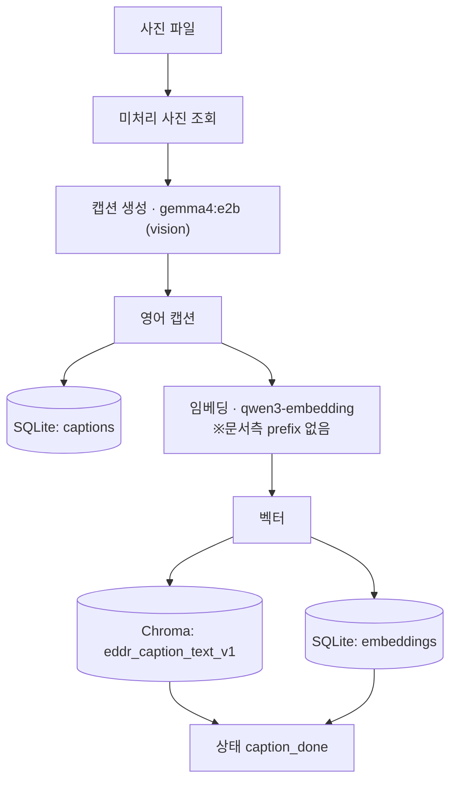
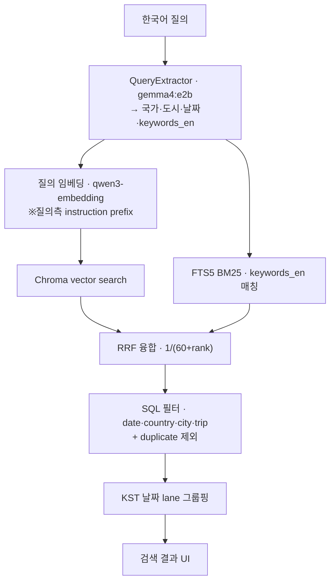
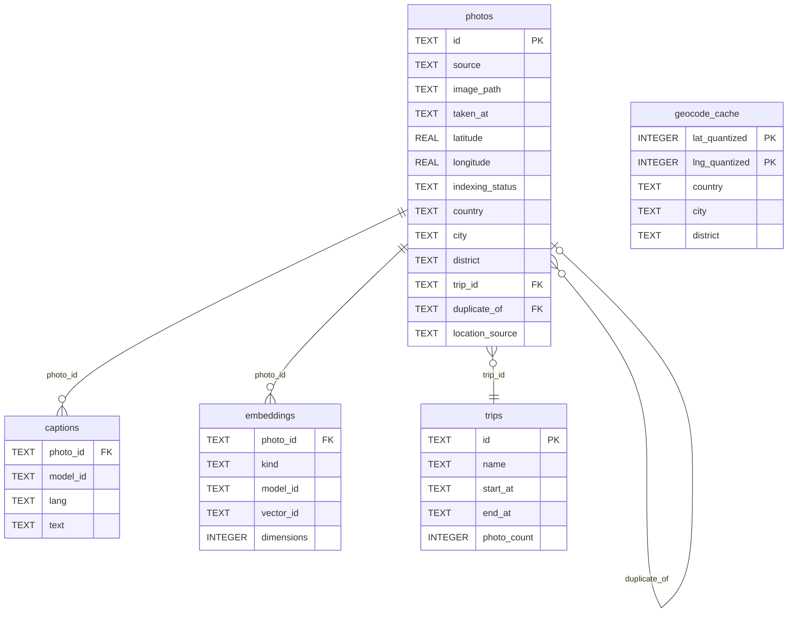

# EDDR RAG 품질 평가 및 개선 통합 리포트

작성일: 2026-06-14
대상 시스템: EDDR 로컬 사진 검색 RAG
최신 기준 commit: `f3d705e`

<a id="sec0"></a>
## 0. 결론 요약 — 과제 항목별 최종 결과

| # | 과제 항목 | 최종 결과 | 한 줄 요약 |
|---|---|---|---|
| ① | 평가 질문셋 | 10문항·4유형 완비 | 단순조회 G04·G08 / 종합 G01·G02·G06 / 비교 G03·G07 / 자연어 G05·G09·G10 |
| ② | Baseline RAG | 설정 정리 완료 · mean recall norm **0.644** | 캡션=검색문서(splitter 없음) · qwen3-embedding:8b + Chroma · k=20 · query추출 gemma4:e2b |
| ③ | 개선 실험(≥2) | 3개 수행 · 최고 **0.749** | 실험1 instruction +0.088 / 실험2 Top-k50 +0.105 / 실험3 RRF +0.074 — 동일 k=20에선 실험1(instruction)이 최선·권고 |
| ④ | 결과 분석 | 변경·기대·결과·원인 4요소 분석 + golden **9/10 PASS** | 병목은 retriever가 아니라 캡션 품질(냉면 오캡션→검색 증폭) |

**핵심 권고 3줄**
- retrieval 기본값은 query instruction 적용 유지
- 날짜·사실 질의(G08)는 semantic search 대신 trip/date 인덱스로 라우팅
- 검색 품질 상한은 캡션 품질 — 고위험 도메인부터 큰 비전 모델로 재캡션

세부 실험표는 [§5](#sec5), 실험별 변경·기대·결과·원인 분석도 [§5](#sec5), end-to-end golden은 [§6](#sec6), 캡션 품질 병목 구조는 [§7](#sec7)에 있다.

<a id="sec0-1"></a>
## 0.1 읽는 방법과 범위

이 보고서는 "생성형 챗봇 RAG(질의 전에 외부 DB에서 근거를 검색해 활용하는 구조 → [용어집](#appendix-glossary))"가 아니라 "개인 사진 검색 RAG"를 평가한다. 따라서 최종 산출물은 긴 답변 문장이 아니라 사진 결과, 날짜 lane(날짜 단위로 묶은 결과 묶음 → [용어집](#appendix-glossary)), 검색 근거다. 과제에서 요구한 Text Splitter, Retriever, Prompt, LLM 구성요소는 EDDR 구조에 맞게 다음처럼 대응시켰다.

- Text Splitter: 사진 1장당 캡션 1개가 이미 짧은 검색 문서이므로 별도 chunking은 적용하지 않는다.
- Retriever(후보 문서를 검색·순위화하는 검색기 → [용어집](#appendix-glossary)): Chroma vector search, FTS5 lexical search, RRF 융합, top-k 설정이 핵심 평가 대상이다.
- Prompt/LLM: 외부 답변 생성 LLM은 쓰지 않는다. 대신 로컬 `QueryExtractor`(`gemma4:e2b`, structured output, temperature 0 → [용어집](#appendix-glossary))가 한국어 질의에서 국가·도시·날짜·`keywords_en` 등 검색에 필요한 필드를 뽑아 구조화한다. 추출 필드 정의는 [§3](#sec3)에 정리했다. 여기서 `intent`/`answer_type` 같은 의도 라벨은 **추출하지 않는다**(현 동작).
- query embedding instruction은 답변 LLM이나 gemma 프롬프트가 아니라, **질의를 임베딩 모델(`qwen3-embedding`)에 넣기 직전 앞에 붙이는 검색 지시 prefix**다. 문서(캡션) 측은 prefix 없이 임베딩하므로 **asymmetric embedding**(질의 측에만 prefix를 붙이는 비대칭 임베딩 → [용어집](#appendix-glossary))이며, 이 prefix의 retrieval 효과를 [§5](#sec5)에서 측정했다(실험1, +0.088).
- Vector DB 품질: 사진 캡션 자체가 외부 DB 문서이므로, 캡션 생성 모델의 품질도 RAG 품질에 직접 영향을 준다.

저장(색인) 시 캡션은 로컬 비전 모델로 생성한 뒤 임베딩해 Chroma·SQLite에 적재한다. 이때 문서(캡션) 측에는 instruction prefix를 붙이지 않는다.



검색 시 한국어 질의는 QueryExtractor로 구조화되고, 임베딩 leg(질의 측 instruction prefix 적용)와 FTS5 BM25 leg가 후보를 만든 뒤 RRF로 융합·필터·날짜 lane 그룹핑을 거쳐 UI 결과가 된다.



핵심 용어 정의는 문서 끝 [부록 A. 용어집](#appendix-glossary)에 모았다. 본문에서는 각 용어가 처음 등장할 때 짧게 풀어 쓰고 용어집으로 링크한다.

<a id="sec1"></a>
## 1. 과제 요구사항 대응표

요건별 근거 위치는 다음과 같다.

| 요구사항 | 근거 위치 |
|---|---|
| 최소 10개 평가 질문 | `docs/rag_quality/questions.yaml`, [§2](#sec2) |
| 질문 난이도 4유형 | [§2](#sec2)(단순조회·종합·비교·자연어) |
| Baseline RAG 설정 | [§3](#sec3) |
| 개선 실험 ≥2 | [§5](#sec5)(실험1 instruction·실험2 Top-k·실험3 RRF) |
| 결과 비교 분석 | [§5](#sec5)~[§6](#sec6) |
| RAG 품질 한계 분석 | [§6](#sec6)(G08)·[§7](#sec7)(캡션 병목)·[§8](#sec8) |

<a id="sec2"></a>
## 2. 평가용 질문셋

질문셋은 총 10문항이며, 실제 사용자가 사진 라이브러리에 대해 물어볼 법한 질의로 구성했다. `docs/rag_quality/questions.yaml`의 metadata 기준으로 `assignment: rag_quality_evaluation`, `selected_by: user`, `selected_at: 2026-06-11`, `pass_threshold: 8`이다. 즉 10문항 중 8문항 이상 통과를 기본 성공 기준으로 둔다.

각 질문은 자동 평가를 위해 `match` 규칙을 가진다. `photo_ids_any`, `date_lane_top`, `caption_contains_any` 같은 규칙은 검색 결과가 기대 신호를 만족하는지 판정한다.

| ID | 난이도 | 유형 | 질문 | 평가 신호 |
|---|---|---|---|---|
| G01 | medium | 여러 문서를 종합해야 하는 질문 | 이탈리아 여행 사진 중 돌로미티나 산악 풍경을 찾아줘 | 이탈리아 trip 범위 안에서 mountain, alpine, peak 성격의 캡션 사진이 상위에 노출되어야 한다. |
| G02 | hard | 여러 문서를 종합해야 하는 질문 | 아이슬란드 여행에서 차량 이동이나 도로가 나온 사진을 찾아줘 | 아이슬란드 여러 trip에서 road, car, vehicle, driving 장면을 넓게 회수해야 한다. |
| G03 | hard | 조건 비교가 필요한 질문 | 몽골에서 별이나 은하수가 나온 사진 찾아줘 | 은하수 사진 중 국내 운여해변 distractor를 피하고 몽골 trip 결과를 우선해야 한다. |
| G04 | medium | 단순 사실 조회 | 부산 1박2일 여행 사진은 언제 찍힌 것들이야? | 부산 1박2일 trip의 날짜 lane이 상위에 노출되어야 한다. |
| G05 | medium | 사용자가 실제로 물어볼 법한 자연어 질문 | 겹벚꽃이나 봄꽃이 크게 나온 사진 찾아줘 | 꽃 클로즈업 사진을 찾되 특정 연도를 과추출하지 않아야 한다. |
| G06 | hard | 여러 문서를 종합해야 하는 질문 | 개심사에서 절 건물과 꽃이 함께 나온 사진 찾아줘 | GPS와 지명 캡션이 부족한 데이터 부재 케이스에서 temple/flower 후보를 찾아야 한다. |
| G07 | medium | 조건 비교가 필요한 질문 | 제주에서 검은 바위 해변이나 현무암 해안이 나온 사진 찾아줘 | 제주 장소 조건과 basalt/black rock 장면 조건을 함께 만족해야 한다. |
| G08 | easy | 단순 사실 조회 | 내가 이탈리아를 언제 갔더라? | 이탈리아 trip 시작 날짜 lane이 상위에 노출되어야 한다. |
| G09 | hard | 사용자가 실제로 물어볼 법한 자연어 질문 | 용산에서 뭘 먹었었는지 보여줘 | 서울 용산구 음식 사진을 찾고 평창 용산리 동음이의 잡음을 줄여야 한다. |
| G10 | easy | 사용자가 실제로 물어볼 법한 자연어 질문 | 은하수 사진들 찾아줘 | 장소 조건 없이 전체 라이브러리에서 milky way 사진을 폭넓게 회수해야 한다. |

질문 설계에서 의도한 점은 다음과 같다.

- G01/G02/G03/G07/G09는 장소 조건과 semantic 조건을 함께 만족해야 하므로 단순 키워드 검색보다 어렵다.
- G04/G08은 사진 내용보다 trip/date metadata가 중요한 사실 조회형 질의다.
- G06은 데이터 gap을 노출하기 위한 문항이다. 개심사 사진은 폴더명에는 정보가 있지만 GPS가 없고 캡션에도 장소명이 충분하지 않다.
- G10은 장소 조건 없는 broad semantic search가 동작하는지 확인한다.

<a id="sec3"></a>
## 3. Baseline RAG 설정

RAG는 Retrieval-Augmented Generation의 약자다. 질문을 바로 LLM에 넣는 대신, 먼저 외부 데이터베이스에서 관련 문서나 근거를 검색하고, 그 결과를 답변 또는 UI 결과에 활용하는 구조다. EDDR에서는 일반 문서가 아니라 사진 캡션과 metadata가 외부 DB 역할을 한다.

| 항목 | 설정 |
|---|---|
| document unit | 사진 1장당 caption document 1개 |
| chunk size | 해당 없음 |
| chunk overlap | 해당 없음 |
| chunking을 하지 않는 이유 | 각 사진 캡션은 이미 짧은 검색 단위이므로 긴 문서를 쪼개는 text splitter가 의미 없다. |
| embedding model | `qwen3-embedding:8b` |
| vector store | Chroma persistent sidecar, `data/index/chroma`, collection `eddr_caption_text_v1` |
| metadata store | SQLite ledger, `data/eddr.sqlite` |
| retriever | `QueryService.semantic_search_photos` |
| baseline top-k | retrieval microbench 기준 `k=20` |
| production search cap | `k=50` |
| query extractor | Ollama local `gemma4:e2b`, structured output, temperature 0 |
| prompt(질의 추출 지시) | QueryExtractor structured-output 지시문 + 스키마(국가·도시·날짜·`keywords_en`), temperature 0 |
| runtime LLM | 답변 생성용 외부 LLM 미사용 — 로컬 gemma4:e2b가 질의 필드(국가·도시·날짜·keyword) 추출만 담당(생성형 답변 평가는 [§8](#sec8) 한계) |

전통적인 RAG 과제에서는 `Text Splitter`, `Prompt`, `LLM answer generation`이 핵심 구성요소가 된다. 하지만 EDDR는 사진 검색 시스템이므로 구조가 다르다.

- text splitter 대신 사진 1장 단위 caption document를 사용한다.
- LLM은 답변 문장 생성보다 query 필드 추출(국가·도시·날짜·keyword 구조화)에 사용된다.
- 최종 출력은 "답변 텍스트"보다 날짜 lane과 사진 결과 목록이다.

이 차이는 한계이기도 하다. 수업 제출 기준이 생성형 답변까지 요구한다면, 검색 결과를 근거로 짧은 답변과 인용을 생성하는 prompt 평가 섹션을 추가해야 한다.

<a id="sec3-1"></a>
### 3.1 질의 추출 필드

QueryExtractor(`gemma4:e2b`, structured output, temperature 0)는 한국어 질의에서 아래 6필드를 뽑아 `ExtractedQuery`로 만든다. `intent`/`answer_type` 같은 의도 라벨 필드는 현재 동작에 **없다**.

| 필드 | 의미 |
|---|---|
| `keywords_en` | 장면·사물·활동 영어 키워드 2~4개 (FTS5 BM25 매칭용) |
| `keywords_ko` | keywords_en의 한국어 표기 — 표시 전용, 검색 미사용 |
| `date_from` / `date_to` | 촬영일 하한/상한 `YYYY-MM-DD` (연도 표지 없으면 None) |
| `countries` | 한국어 국가명 (DB photos.country 표기, 예: 이탈리아) |
| `cities` | 한국어 도시명 (DB photos.city 표기, 예: 제주) |

### 3.2 query embedding instruction prefix

질의를 `qwen3-embedding`에 넣기 직전 앞에 붙이는 검색 지시 prefix는 다음과 같다. 이 prefix는 질의 측에만 적용하고, 캡션은 raw text를 그대로 임베딩한다(asymmetric embedding). retrieval 효과는 [§5](#sec5) 실험1에서 측정했다.

```text
QUERY_EMBED_INSTRUCTION = "Instruct: Given a web search query, retrieve relevant passages that answer the query\nQuery:{query}"
```

### 3.3 데이터베이스 구성

검색 대상 외부 DB는 SQLite 4개 핵심 테이블과 Chroma sidecar(임베딩 벡터를 보관하는 별도 벡터 스토어 → [용어집](#appendix-glossary)) 컬렉션으로 구성된다. 관계는 다음과 같다.



geocode는 별도 per-photo 테이블이 아니라 `photos.country/city/district` 컬럼에 비정규화 저장되며, `geocode_cache`가 위경도 양자화 셀 단위로 reverse-geocode 결과를 캐싱한다.

핵심 컬럼 정의는 다음과 같다(출처: `src/eddr/db/repository.py`).

**photos**

| 컬럼 | 의미 |
|---|---|
| `id` | `source:<hash>` 전역 고유 PK |
| `source` | 출처 (photos_library·google_takeout·local) |
| `image_path` | 로컬 경로 |
| `taken_at` | 촬영 KST ISO8601 |
| `latitude` / `longitude` | GPS |
| `indexing_status` | meta_done·caption_done·skipped_video·trip_assigned 등 |
| `country` / `city` / `district` | 한국어 지명 |
| `trip_id` | FK → trips |
| `duplicate_of` | FK → photos, dedup canonical |
| `location_source` | NULL=EXIF, manual=수동 |

**captions**

| 컬럼 | 의미 |
|---|---|
| (`photo_id`, `model_id`, `lang`) | 복합 PK |
| `model_id` | gemma4:e2b·qwen3-vl:8b |
| `lang` | en 고정 |
| `text` | 영어 캡션 |

**embeddings**

| 컬럼 | 의미 |
|---|---|
| (`photo_id`, `kind`, `model_id`) | 복합 PK |
| `kind` | caption_text·note_text |
| `model_id` | qwen3-embedding |
| `vector_id` | Chroma 벡터 id |
| `dimensions` | 벡터 차원 수 |

**trips**

| 컬럼 | 의미 |
|---|---|
| `id` | PK |
| `name` | 자동 생성, 예 "강릉시 여행 2019-06" |
| `start_at` / `end_at` | 여행 기간 |
| `photo_count` | 노출 기준 사진 수 (dup 제외) |

<a id="sec4"></a>
## 4. 평가 방법

이 섹션은 검색 레이어를 두 가지로 평가한다 — microbench([§4.1](#sec4-1))는 랭킹 품질("주어진 코퍼스에서 GT가 k 안에 드나"), golden([§4.2](#sec4-2))은 E2E("사용자 질문에 옳은 사진이 최종 노출되나")를 본다. 상류 데이터 품질, 즉 캡션·코퍼스가 사진을 맞게 적었는지는 검색과 다른 축이라 [§7](#sec7)에서 따로 본다. 합치지 않는 이유는 순환 편향이다 — microbench는 정답(GT)을 캡션 단어로 뽑는데 캡션 품질까지 같은 점수에 섞으면 "캡션으로 캡션을 채점"하는 꼴이 된다. 그래서 검색(§4)과 코퍼스 품질([§7](#sec7))을 별 축으로 둔다.

<a id="sec4-1"></a>
### 4.1 Retrieval microbench

**왜 이 측정이 필요한가**: 검색이 나쁠 때 retriever 랭킹 탓인지 다른 요인 탓인지 가르려면, LLM·UI를 떼어내고 검색 레이어만 따로 점수화해야 한다. 그러지 않으면 어느 층을 고쳐야 할지 알 수 없다. `scripts/bench_retrieval.py`로 검색 레이어만 분리해, 검색 결과가 정답 집합에 얼마나 닿는지만 본다.

여기서 **정답 집합(ground truth)**은 이 질문에 "맞다"고 볼 사진들의 모음이다. 사람이 9천 장을 일일이 라벨링하는 대신, 캡션에 특정 단어가 든 사진을 정답으로 자동 간주한 **근사치**(대리·근사 정답, proxy GT → [용어집](#appendix-glossary))를 쓴다. 예컨대 G10 '은하수' 질문의 정답을, 사람이 고르는 대신 캡션에 `milky way`가 든 사진 36장으로 자동 정의한다. 캡션 모델은 `gemma4:e2b` 기준이다.

이 근사 때문에 microbench recall은 '사람이 보기에 이 사진이 정말 정답인가'를 잰 절대 점수가 아니다. 캡션 단어 매칭으로 정답을 근사했을 뿐이라, 설정 A·B 중 어느 쪽이 정답 후보를 더 많이 끌어올리는지 **상대 비교**하는 용도로만 쓴다.

측정 문항은 사진 검색형 8문항이다.

- 포함: G01, G02, G03, G05, G06, G07, G09, G10
- 제외: G04, G08

G04/G08은 날짜·사실 질의라 semantic photo retrieval microbench보다 end-to-end golden에서 보는 것이 맞다.

주요 지표는 다음과 같다.

- `mean recall norm`(정규화 평균 recall → [용어집](#appendix-glossary)): 각 질문에서 `hits / min(k, GT size)`를 계산한 뒤 평균낸 값이다. 여기서 **GT size**는 그 질문의 정답 후보 사진 수다(예: G10 '은하수' 36장 → [용어집](#appendix-glossary)). k보다 GT가 클 때 달성 가능한 상한 `min(k, GT size)` 대비 적중률이라, top-k가 달라져도 어느 정도 비교 가능하도록 정규화한 recall이다.
- `diag recall@500`(임베딩 전역 진단 지표 → [용어집](#appendix-glossary)): 하이브리드 검색은 두 경로로 후보를 만든다 — 하나는 벡터(임베딩) 검색, 다른 하나는 BM25 어휘 검색이다. 그중 **embedding leg**(벡터 검색 쪽 → [용어집](#appendix-glossary))만 떼어, 운영 파이프라인(SQL 필터·top-k 절단·RRF 융합)을 건너뛰고 질의 임베딩으로 Chroma 전역 상위 500을 직접 뒤졌을 때 정답이 든 비율이다. '임베딩이 애초에 정답을 못 찾는 것'과 '뒤에서 필터·절단이 떨어뜨린 것'을 가르는 진단용이다.
- `총 소요시간(elapsed, s)`(→ [용어집](#appendix-glossary)): 코드가 재는 것은 질의 1건당 `semantic_search_photos` 호출 시간(`latency_s`)이고, 표가 보여주는 값은 그 합(`total_latency_s`) — 즉 8문항을 모두 도는 데 걸린 전체 소요시간이다.

<a id="sec4-2"></a>
### 4.2 End-to-end golden

**왜 이 측정이 필요한가**: microbench는 검색 후보 안에 정답이 들었는지만 보지, 사용자 질문에 옳은 사진이 날짜 lane까지 거쳐 **최종 노출**되는지는 못 본다. golden은 그 끝단을 본다 — 골든 질문을 실제 검색 파이프라인에 그대로 흘려, 사람 질문에 맞는 사진이 결과로 나오는지 회귀 검증한다.

골든 채점은 사람이 아니라 코드 규칙이 한다. 골든 질문을 동일 검색 파이프라인(`gemma4:e2b` 필드 추출 → retrieval → date lane)에 통과시킨 뒤, `docs/golden_set.yaml`에 사용자가 미리 적어둔 정답 규칙(특정 photo_id 포함 / 날짜 레인 상위 / 캡션 단어 포함, 셋 AND)을 자동 대조해 PASS/FAIL을 낸다. match 규칙이 없는 문항은 보류로 빠지고 분모에서 제외된다. 여기서 '자동'은 판정에 LLM이나 사람이 끼지 않는다는 뜻이고, 정답 규칙을 작성하는 것만 사용자 몫이다. 구현은 `eddr golden`(자동 채점 회귀 평가 → [용어집](#appendix-glossary))으로, query extraction · retrieval · date lane 구성 · 자동 채점이 한 번에 묶여 실행된다.

최신 검증 결과는 `reports/rag_quality/golden/20260614_2100_v2_search.md` 기준이다.

- PASS: 9
- FAIL: 1
- 보류: 0

<a id="sec5"></a>
## 5. 성능 개선 실험

먼저 [§5.1](#sec5-1) 실험 개요에서 전체 결과 표를 보고, 이어 [§5.2](#sec5-2)~[§5.6](#sec5-6)을 위에서 아래로 읽으면 각 실험의 변경·기대·결과·원인이 차례로 정리된다.

<a id="sec5-1"></a>
### 5.1 실험 개요

아래 표는 commit `f3d705e`에서 재실행한 retrieval microbench 결과다(측정 2026-06-14 22:05, 공식 원장 `reports/rag_quality/retrieval/experiments.jsonl`·`RESULTS.md`). 이 수치의 성격(설정 비교용·코퍼스 고정)은 아래 **이 실험의 scope**에서 밝힌다. 설정 비교의 결론 방향은 이전 측정과 동일하다.

각 실험은 "무엇을 바꿔, 어떤 결과를, 어떤 기대효과로 만들려 했는지"가 한 줄에 드러나도록 정리했다. 괄호 안 ID는 결과 원장(`experiments.jsonl`)의 추적용 label이다.

| 실험 | 변경한 값 | 기대 효과 | mean recall norm | baseline 대비 | 한 줄 판정 |
|---|---|---|---:|---:|---|
| Baseline (`baseline-raw-k20`) | 없음 (instruction OFF · k=20 · RRF OFF) | 최단순 벡터검색 기준선 | 0.644 | — | 기준 |
| 실험1 · query instruction (`exp1-instruct-default-k20`) | query 임베딩에 검색 지시문 prefix **ON** | 한국어 질의↔영어 캡션 의미정렬↑ → recall↑ | 0.732 | +0.088 | 동일 k 최고 · 권고 |
| 실험2 · Top-k 확대 (`exp2-topk50`) | k **20→50** | 후보 폭↑로 정답 포함확률↑(precision·탐색비용 희생) | 0.749 | +0.105 | 최고값이나 coverage만↑·ranking 개선 아님 |
| 실험3 · RRF 하이브리드 (`exp3-rrf-k20`) | vector+BM25 lexical **RRF 융합 ON** | 캡션 직접단어(road·food) lexical 보강 | 0.718 | +0.074 | 넓은 단어(temple·flower)서 무관 사진 동반 |

부속 진단 지표(필터/랭킹 이전 후보 생성력과 실행시간)는 리드 표에서 분리해 아래에 둔다. 실험1~3은 모두 query instruction ON이라 diag recall@500이 동일하다.

| 실험 | diag recall@500 | 총 소요시간(s) |
|---|---:|---:|
| Baseline (`baseline-raw-k20`) | 0.637 | 2.9 |
| 실험1 · query instruction (`exp1-instruct-default-k20`) | 0.729 | 1.5 |
| 실험2 · Top-k 확대 (`exp2-topk50`) | 0.729 | 1.8 |
| 실험3 · RRF 하이브리드 (`exp3-rrf-k20`) | 0.729 | 1.5 |

**이 실험의 scope.** §5는 검색 *설정*(instruction·k·RRF)의 상대 효과를 보는 controlled 실험이다. 그래서 코퍼스·GT를 `gemma4:e2b` 기준으로 의도적으로 고정했다 — 목적이 절대 recall이 아니라 설정 간 delta이기 때문이다. 따라서 이 수치는 "현재 시스템(1,393장 재캡션 반영)의 절대 성능"이 아니며, 재캡션 효과는 별 축([§7](#sec7) 캡션 감사 / [§9.3](#sec9-3) 재캡션 전후 평가)에서 다룬다. 한 가지 confounding은 정직하게 적어 둔다 — 검색은 새 캡션 코퍼스를 타지만 GT는 옛 `gemma4:e2b` 캡션 기준이라, 둘이 완전히 같은 코퍼스는 아니다.

기존 제출 보고서 대비 baseline이 `0.551`에서 `0.644`로 상승했는데, 이 delta의 원인(코드 경로 변경·색인 상태·GT 재생성·캡션 변경)은 ablation을 돌려야 가린다. 후보를 한 번에 하나씩 되돌려 재측정하면 된다 — (a) 옛 commit을 체크아웃해 코드 경로만 격리하고, (b) GT 생성 스크립트를 diff해 GT 변동분을 확인하며, (c) 동일 GT·코드에서 캡션만 교체한다. 각 단계의 recall 변화로 기여분을 분리할 수 있다(이 보고서는 방법만 기술하고 실제 실행은 별도).

<a id="sec5-2"></a>
### 5.2 Baseline · 변경 없음(instruction OFF·k=20) → 기준선 → 0.644

변경한 설정은 없다. query embedding instruction을 끄고, 상위 20개만 반환한다.

- 기대 효과: 가장 단순한 벡터 검색 기준선을 만든다.
- 실제 결과: mean recall norm `0.644`, diag recall@500 `0.637`
- 해석: 짧은 사진 캡션 문서에서는 raw query만으로도 어느 정도 동작한다. 하지만 query/document 역할 구분이 약해 한국어 자연어 질의와 영어 캡션 간 정렬이 흔들릴 수 있다.

<a id="sec5-3"></a>
### 5.3 실험1 · query instruction ON(k=20) → 한↔영 의미정렬↑ → 0.732 (+0.088, 동일 k 최고)

`qwen3-embedding` 권장 query instruction을 사용했다.

- 기대 효과: 한국어 질의를 "검색 질의"로 더 명확히 임베딩해 semantic recall을 높인다.
- 실제 결과: mean recall norm `0.732`, baseline 대비 `+0.088`
- 해석: 같은 `k=20` 조건에서 가장 좋은 개선이다. 문서 쪽은 caption 원문이고 질의 쪽에만 instruction을 붙이면, embedding model이 query와 document의 역할을 구분하는 데 도움을 받는다.

실무적으로는 이 설정을 기본값으로 유지하는 것이 타당하다. 비용과 latency 증가가 거의 없고, 평균 recall과 diagnostic recall이 모두 개선된다.

<a id="sec5-4"></a>
### 5.4 실험2 · Top-k 20→50 → 후보 폭↑(coverage) → 0.749 (+0.105, 최고값이나 coverage만↑·ranking 개선 아님)

반환 상한을 20에서 50으로 늘렸다.

- 기대 효과: recall 상승. 대신 precision과 UI 탐색 비용은 나빠질 수 있다.
- 실제 결과: mean recall norm `0.749`, baseline 대비 `+0.105`
- 해석: 가장 높은 평균값이지만, 이는 검색 품질 자체가 좋아졌다기보다 더 많이 보여줘서 맞는 사진이 포함될 확률이 커진 효과다. 사진 검색 UI에서는 top-k가 커지면 날짜 lane이 많아지고 사용자가 훑어야 할 결과도 늘어난다.

따라서 top-k=50은 production search cap으로는 유용하지만, "ranking 품질 개선"이라고 단정하면 안 된다.

<a id="sec5-5"></a>
### 5.5 실험3 · vector+BM25 RRF 융합 ON(k=20) → lexical 단어 보강 → 0.718 (+0.074, broad 단어서 잡음)

QueryExtractor가 만든 영어 keyword를 FTS5 BM25(SQLite 전문 검색 + BM25 랭킹 → [용어집](#appendix-glossary)) 검색에 넣고, vector leg와 lexical leg를 RRF(Reciprocal Rank Fusion, 여러 rank list를 합쳐 최종 순위를 만드는 융합 → [용어집](#appendix-glossary))로 융합했다.

- 기대 효과: `road`, `food`, `milky way`처럼 캡션에 직접 등장하는 단어를 보강한다.
- 실제 결과: mean recall norm `0.718`, baseline 대비 `+0.074`
- 해석: baseline보다 낫지만 instruction-only보다 낮다. RRF는 정확한 lexical hit가 있을 때 강하지만, `temple`, `flower`, `food`처럼 넓은 단어는 관련 없는 사진도 함께 끌어올린다.

특히 최신 캡션 감사에서 확인된 것처럼, 캡션에 잘못 들어간 단어는 lexical leg에서 오히려 강하게 증폭될 수 있다. 따라서 RRF는 "정답 keyword가 신뢰 가능할 때"만 신중하게 써야 한다.

<a id="sec5-6"></a>
### 5.6 G05 공통 저recall 구멍

G05(봄꽃 클로즈업)는 실험3(RRF)만의 문제가 아니라 전 설정 공통 저recall 구멍이다. recall_norm은 Baseline `0.1`(2/20), 실험1(instruction) `0.1`(2/20), 실험3(RRF) `0.05`(1/20)로 설정과 무관하게 낮다. 반면 diag recall@500은 Baseline `0.762`, 실험1·3 `0.905`로, 후보(상위 500개)에는 충분히 들어오지만 top-k 절단에서 탈락하는 구조다. 이는 `flower`, `cherry blossom`처럼 document frequency가 높은 단어에서 정작 클로즈업 사진이 상위에 올라오지 못하는 ranking 문제이며, broad keyword 가중치 조정([§9.4](#sec9-4)) 또는 재캡션이 더 직접적인 개선 경로다.

<a id="sec6"></a>
## 6. End-to-end golden 결과

최신 golden 검증은 다음과 같다. 이 결과는 baseline E2E가 아니라 현재 검색 파이프라인의 end-to-end 회귀 결과다. Golden runner는 현재 production search cap에 따라 문항당 최대 50장을 반환한다.

| ID | 판정 | 결과 | lane | top lane |
|---|---|---:|---:|---|
| G01 | PASS | 50장 | 7 | 2019-06-30 |
| G02 | PASS | 50장 | 18 | 2022-09-22 |
| G03 | PASS | 50장 | 7 | 2018-07-16 |
| G04 | PASS | 50장 | 5 | 2025-04-04 |
| G05 | PASS | 50장 | 25 | 2018-05-05 |
| G06 | PASS | 50장 | 27 | 2023-10-08 |
| G07 | PASS | 50장 | 17 | 2017-04-10 |
| G08 | FAIL | 50장 | 14 | 2019-07-11 |
| G09 | PASS | 50장 | 29 | 2020-06-28 |
| G10 | PASS | 50장 | 23 | 2018-07-16 |

### 6.1 G08 실패 분석

G08 질문은 "내가 이탈리아를 언제 갔더라?"이다. 기대 정답은 `2019-06-29~2019-07-12` trip의 시작 날짜가 상위 date lane에 나오는 것이다.

최신 golden 결과에서는 다음과 같이 실패했다.

- 기대 날짜: `2019-06-29`
- 상위 3개 lane: `2019-07-11`, `2019-06-30`, `2019-07-07`
- 추출 결과: `keywords_en=['travel', 'trip']`, `countries=['이탈리아']`

원인은 이 질의가 사진 내용 검색이 아니라 날짜/사실 조회라는 점이다. semantic photo search는 "travel", "Italy"와 관련된 사진을 잘 찾지만, 사용자가 실제로 원하는 것은 trip 시작일이다.

개선 방향은 query type routing이다.

- "언제 갔더라", "몇 년도", "기간", "언제 찍었어" 같은 질의는 trip/date lane 우선 경로로 보낸다.
- semantic photo score보다 trip metadata score를 우선한다.
- 답변형 UI에서는 "2019-06-29부터 2019-07-12까지 이탈리아 여행 사진이 있습니다"처럼 trip summary를 먼저 보여준다.

### 6.2 G06 약한 통과 분석

G06은 "개심사에서 절 건물과 꽃이 함께 나온 사진 찾아줘"이다. 자동채점은 PASS지만 품질상 약한 통과다.

이유는 다음과 같다.

- PASS 근거는 `photo_ids_any` 중 하나가 전체 결과 어딘가에 포함된 것이다.
- 하지만 top lane은 개심사가 아니라 다른 사찰/건축 장면이다.
- 개심사 폴더 16장은 GPS가 없고, 장소명이 structured metadata로 충분히 연결되지 않는다.
- retrieval microbench에서도 G06은 낮은 recall을 보인다.

이 문항은 "RAG가 실패했다"기보다 "외부 DB에 필요한 장소 근거가 부족하다"는 데이터 gap을 보여준다. 개선하려면 폴더명, trip, manual location, note 같은 metadata를 retrieval document에 더 잘 주입해야 한다.

<a id="sec7"></a>
## 7. 캡션 품질 감사와 RAG 품질의 관계

이 축을 따로 보는 동기는 골든 평가에서 나왔다. "냉면" 검색 상위에 콩나물·숙주 사진이 떴고, `gemma4:e2b`가 콩나물을 `noodles`로 오캡션한 탓이었다. 캡션 텍스트는 임베딩 코퍼스이자 FTS5 인덱스 원문이라, 오캡션 1건이 벡터 검색과 어휘 검색을 동시에 오염한다. 즉 검색 결과가 나쁜 이유가 retriever 설정 때문인지, 외부 DB에 저장된 문서(캡션) 자체가 틀렸기 때문인지를 갈라내려면 캡션 품질을 별도로 감사해야 한다. 관련 산출물은 다음과 같다.

- `docs/postmortem/2026-06-14-naengmyeon-food-caption-quality.md`
- `docs/postmortem/2026-06-14-caption-recaption.md`
- `reports/caption_audit/20260613_quality_report.md`

`eddr search audit`으로 원인을 분리한 결과 다음 구조가 확인되었다.

1. `gemma4:e2b`가 콩나물·숙주·무채 같은 얇고 흰 재료를 `noodles` 또는 `vermicelli`로 오캡션했다.
2. 잘못된 caption text가 `qwen3-embedding`에 의해 noodle 근방 벡터가 되었다.
3. FTS5 lexical search에서도 `noodle` 어간이 매칭되었다.
4. RRF에서는 vector leg와 lexical leg 양쪽에서 등장한 결과가 더 강하게 합산되었다.

즉 검색기는 틀린 것이 아니라, 틀린 문서를 충실하게 찾아온 것이다.

캡션 절대품질 평가도 같은 결론을 뒷받침한다. 표의 `p3/p4/p5`는 vision 캡션 생성 프롬프트의 세 변형이다.

- **`p3_hybrid`**: 첫 production 프롬프트(baseline). 1~2문장 캡션 + Search keywords, 메타데이터 힌트 없음.
- **`p4_grounded`**: grounding 강화 — 메타데이터 힌트 제거 + 5개 규칙(보이는 것만 기술 / 구체 특징 확인 후 명명 / 고유명사 발명 금지 / 유사물 혼동 시 일반어). 콩나물→noodle이 프롬프트 탓이라는 1차 가설 검증용.
- **`p5_grounded`**: p4 + "명백하면 구체 명명, 진짜 모호할 때만 일반화" + "매체·프레이밍(스크린샷·뒤집힘 등) 명시". p4의 과소특정(salmon→fish, soju→beverage) 약점 보정.

핵심은 p3→p4 프롬프트 개선이 `gemma4:e2b`에서 거의 무효(평균 7.12→7.08, 치명결함 4→3)였고, 오히려 모델 체급(`qwen3-vl:8b`·`gemma4:31b`)에서 9.4~9.5로 급등했다는 것이다. 즉 콩나물 오캡션의 근인은 프롬프트가 아니라 소형 모델 체급이었고, 권고 조합은 `p5_grounded` + 큰 모델이다.

| 모델/프롬프트 | 전체 평균 | 치명결함 | 비고 |
|---|---:|---:|---|
| `gemma4:e2b` / `p3_hybrid` | 7.12 | 4 | 현 production baseline |
| `gemma4:e2b` / `p4_grounded` | 7.08 | 3 | 프롬프트 개선 무효 |
| `qwen3-vl:8b` / `p3_hybrid` | 9.38 | 0 | 모델 체급 효과 |
| `gemma4:31b` / `p4_grounded` | 9.50 | 0 | 모델 체급 효과 |
| `qwen3-vl:8b` / `p5_grounded` | ~9.8 (people) | 0 | 2차 루프 — 메타맥락·구체성 개선 |
| `gemma4:31b` / `p5_grounded` | ~10.0 (food) | 0 | 2차 루프 — 과소특정 해결, 권고 조합 |

2차 루프(`p5_grounded`)는 큰 모델의 과소특정(salmon→fish 등) 및 메타맥락 누락을 보정했다. 치명결함 0이 유지되면서 검색에 결정적인 구체 명사가 복원되었다. 상세 결과는 `reports/caption_audit/20260613_quality_report.md` §4 참조.

중요한 점은 작은 모델에서 프롬프트만 바꾸는 접근이 거의 효과가 없었다는 것이다. `gemma4:e2b`는 food guard나 grounding 지시를 줘도 콩나물/떡을 noodle로 오분류하는 문제가 남았다. 반면 큰 모델에서는 치명결함이 사라졌다.

따라서 RAG 품질 개선은 다음 두 층을 분리해야 한다.

- retriever 개선: instruction, top-k, RRF, filter, reranker 등
- corpus 개선: caption model, caption prompt, metadata 주입, 재캡션, Chroma reindex

이번 과제의 retrieval 실험은 전자를 다뤘고, 최신 master의 캡션 감사는 후자가 실제 병목임을 보여준다.

<a id="sec8"></a>
## 8. 평가 한계와 최종 판단

최초 과제 관점에서 보면, 현재 보고서는 제출 요건을 충족한다. 질문셋 10개를 만들었고, baseline RAG 설정을 정리했으며, 실험1 query instruction(Retriever 개선), 실험2 top-k 변경(Retriever), 실험3 RRF 융합(Hybrid Search)까지 서로 다른 카테고리의 개선 실험을 비교했다. 또한 각 실험의 설정, 기대 효과, 실제 결과, 원인 해석을 포함했고, golden 검증과 캡션 품질 감사를 통해 남은 한계를 분석했다. 단, 전 실험이 retrieval 단계에 몰려 있어 전략 다양성은 약하다는 점은 **한계**로 명시한다(Prompt/Reranker/Query Rewrite 카테고리 부재 → **아래** Task-A·B 참조).

다만 이 판단은 "retrieval 중심 사진 검색 RAG" 기준이다. 생성형 답변 RAG까지 요구된다면, 검색 결과를 근거로 짧은 답변과 citation을 생성하는 별도 prompt/LLM 평가가 추가되어야 한다.

### 충족한 부분

1. 질문셋이 실제 사용 질의에 가깝다.

단순 keyword query만이 아니라 "내가 이탈리아를 언제 갔더라?", "용산에서 뭘 먹었었는지 보여줘"처럼 실제 사용자가 물어볼 표현을 포함했다.

2. retrieval과 end-to-end를 분리했다.

microbench는 검색 레이어를 빠르게 비교하고, golden은 실제 pipeline 결과를 본다. 이 둘을 분리했기 때문에 G08처럼 retrieval 평균에는 드러나지 않는 문제를 찾을 수 있었다.

3. 결과를 과대해석하지 않았다.

top-k=50이 최고 점수였지만, 보고서는 이를 순수 ranking 개선으로 단정하지 않고 coverage 증가 효과로 해석했다.

4. RAG 외부 DB 품질까지 원인 분석이 확장되었다.

냉면 사례를 통해 retriever tuning이 아니라 caption 품질이 원인인 경우를 확인했다. 이는 실제 RAG 시스템 운영에서 매우 중요한 분석이다.

### 미진한 부분과 잔여 task

아래 항목은 현재 보고서에서 아직 약하거나 수행되지 않은 부분이다. 과제 요건 대비 갭을 실행 가능한 task로 정리했다.

#### 요건4 대비 갭: 개선 실험 카테고리 편중

- [ ] **[Task-A] Prompt 개선 실험을 RAG 평가에 엮기.** 캡션 품질 감사([§7](#sec7))에서 이미 caption 생성 prompt A/B(p3→p4→p5)를 수행했다(`reports/caption_audit/20260613_quality_report.md`). 다만 이건 vision 캡션 프롬프트이지 QueryExtractor 프롬프트가 아니다. 별도로 query 추출 prompt A/B를 만들어 "QueryExtractor 프롬프트 개선이 retrieval 품질에 미치는 영향" 실험으로 [§5](#sec5)에 추가하면 Prompt 카테고리를 채울 수 있다. caption 프롬프트가 아니라 query 추출 프롬프트 A/B로 범위를 좁혀야 과제 취지에 맞는다.
- [ ] **[Task-B] 실험 카테고리 부재를 한계로 명시.** Reranker, Query Rewrite, Multi-Query, Context Compression, Self-RAG 실험은 이번 보고서 범위 밖이다(**위** 도입부 한계 서술 참조). 이 부재를 [§9](#sec9)에도 명시적으로 기록해 두면 평가자가 의도적 범위 한정임을 알 수 있다.

#### 요건2 대비 갭: Prompt/LLM 구성요소 정당화

- [x] **[Task-C 완료] Prompt·LLM 매핑 정당화 반영.** [§3](#sec3) 표에 `prompt(질의 추출 지시)` 행(QueryExtractor structured-output 지시문 + 스키마)과 `runtime LLM`(질의 필드 추출 전용으로 명확화) 행으로 Prompt·LLM 매핑을 반영함. [§3](#sec3) 본문과 [§3.1](#sec3-1) 추출 필드 표에도 대응 설명 포함.

#### 요건4 대비 갭: 생성형 답변 평가 미수행

- [ ] **[Task-D] 생성형 답변 평가 추가(선택).** 과제가 "생성형 RAG" 기준이라면 검색 결과를 바탕으로 짧은 답변과 인용 근거를 생성하고 그 품질을 평가하는 단계가 필요하다. 현재는 날짜 lane + 사진 목록 반환이 최종 출력이라 이 평가가 없다. 만약 추가한다면, 상위 3~5장의 캡션을 context로 넣고 Claude가 한 문장 요약 + 인용 근거를 생성하는 실험을 golden E2E에 붙이는 방식이 가장 적은 변경으로 가능하다.

#### 데이터 gap

- [ ] **[Task-E] 재캡션 전/후 RAG 비교 실험.** 캡션 품질 감사([§7](#sec7))는 별도 포스트모템으로 존재한다. "재캡션 전 Chroma vs 재캡션 후 Chroma에서 동일 질문셋 microbench + golden" 비교를 공식 평가표에 추가하면, 모델 체급 개선이 RAG 품질을 실제로 얼마나 올렸는지 수치화할 수 있다.
- [ ] **[Task-F] G08 날짜/사실 질의 라우팅.** 현재 시스템은 "언제 갔더라"를 trip/date fact query로 충분히 구분하지 못한다. [§9.1](#sec9-1)에 개선 방향을 서술했으나, 구현 전까지는 FAIL 1개가 남는다.
- [ ] **[Task-G] G06 개심사 데이터 gap.** GPS가 없고 장소명이 캡션에 없는 경우 semantic retrieval만으로는 장소 grounding이 어렵다. 폴더명·trip metadata 주입이 우선 해결 경로다([§9.2](#sec9-2)).

#### 평가 방법론 한계

- [x] **[Task-H 완료] proxy ground truth 한계 표시.** caption LIKE 기반 GT는 사람 기준 관련성을 반영하지 않는다. [§4.1](#sec4-1) 도입부에 명시적 주의 사항을 한 줄 추가해 점수의 절대 해석을 막았다([§5](#sec5) 실험 개요에도 동일 주의가 있다).

<a id="sec9"></a>
## 9. 다음 개선 제안

<a id="sec9-1"></a>
### 9.1 Date/fact query router 추가

대상 질의:

- "언제 갔더라?"
- "언제 찍은 사진이야?"
- "몇 년도에 갔지?"
- "여행 기간이 언제야?"

처리 방식:

1. QueryExtractor가 `answer_type=fact/date` 또는 `intent=trip_date_lookup`을 반환한다.
2. semantic photo retrieval보다 trip table, date lane, country/city metadata를 먼저 조회한다.
3. UI 상단에 trip summary를 먼저 보여주고, 관련 사진은 보조 결과로 보여준다.

기대 효과:

- G08 실패 해결 가능성이 높다.
- 사진 내용 검색과 사실 조회를 분리해 ranking 목적이 명확해진다.

<a id="sec9-2"></a>
### 9.2 Location metadata enrichment

대상:

- G06 같은 no-GPS 폴더 기반 장소 질의
- 폴더명에는 장소가 있지만 DB structured field에는 없는 사진

처리 방식:

1. 폴더명과 trip title에서 장소 후보를 추출한다.
2. manual geocode 또는 note를 통해 위치 metadata를 보강한다.
3. retrieval document에 "private value를 그대로 출력하지 않는 방식"으로 장소 힌트를 넣는다.

기대 효과:

- 개심사처럼 GPS가 없는 장소 질의의 recall 개선
- semantic caption만으로 찾기 어려운 장소 grounding 보완

<a id="sec9-3"></a>
### 9.3 재캡션 전/후 RAG 평가 추가

대상:

- 음식 질의
- 인물/문서/상점처럼 작은 비전 모델의 치명결함이 확인된 도메인

실험 설계:

1. 동일 질문셋을 재캡션 전 Chroma와 재캡션 후 Chroma에 대해 실행한다.
2. retrieval microbench와 golden E2E를 둘 다 비교한다.
3. 단순 keyword hit가 아니라 top lane, false positive, 사용자 만족도를 함께 본다.

기대 효과:

- "모델 체급 개선이 실제 RAG 품질을 얼마나 올렸는가"를 수치화할 수 있다.

<a id="sec9-4"></a>
### 9.4 Broad keyword 가중치 조정

문제 keyword:

- `food`
- `temple`
- `flower`
- `travel`

이런 단어는 document frequency가 높거나 의미가 넓어 잡음을 만든다. BM25/RRF에 그대로 넣으면 무관한 사진이 올라올 수 있다.

개선 방향:

- DF가 큰 keyword는 lexical leg 가중치를 낮춘다.
- 더 구체적인 keyword가 있을 때 broad keyword를 제거한다.
- lexical leg가 없는 vector-only 결과와 비교해 오염이 커지는지 audit한다.

이번 작업의 가장 중요한 학습은 "검색 결과가 나쁘다고 바로 retriever를 튜닝하지 말고, 먼저 문서 품질과 검색 증폭을 분리해야 한다"는 점이다. EDDR에서는 캡션이 곧 RAG 문서이므로, caption model 선택과 prompt, metadata 주입, reindex 전략이 retrieval 설정만큼 중요하다.

<a id="sec10"></a>
## 10. 산출물과 검증

주요 산출물:

- 질문셋: `docs/rag_quality/questions.yaml`
- retrieval 결과: `reports/rag_quality/retrieval/RESULTS.md`
- retrieval 원장: `reports/rag_quality/retrieval/experiments.jsonl`
- 최신 golden report: `reports/rag_quality/golden/20260614_2100_v2_search.md`
- 이전 golden report: `reports/rag_quality/golden/20260614_1724_v2_search.md`
- 캡션 품질 보고서: `reports/caption_audit/20260613_quality_report.md`
- 냉면 검색 포스트모템: `docs/postmortem/2026-06-14-naengmyeon-food-caption-quality.md`
- 재캡션 포스트모템: `docs/postmortem/2026-06-14-caption-recaption.md`

증거 경로는 모두 repo 안의 안정 경로에 보존했다. 실행 중 임시 출력은 `/private/tmp`를 사용했지만, 최종 retrieval 결과와 최신 golden report는 `reports/rag_quality/` 아래로 복사했다.

검증 명령:

```bash
env UV_CACHE_DIR=/private/tmp/uv-cache-eddr uv run pytest -q
env UV_CACHE_DIR=/private/tmp/uv-cache-eddr uv run python scripts/bench_retrieval.py --out /private/tmp/eddr-rag-quality-refresh --gt-only
env UV_CACHE_DIR=/private/tmp/uv-cache-eddr uv run eddr golden --golden-set docs/rag_quality/questions.yaml --out /private/tmp/eddr-rag-quality-golden-refresh
```

이번 세션에서 확인한 local 검증 결과다. 이 pytest 출력은 command session 결과이며, retrieval/golden처럼 별도 파일로 보존한 artifact는 아니다.

- 전체 테스트: `322 passed, 1 warning in 4.12s`
- GT 카운트 검증: G01/G02/G03/G05/G06/G07/G09/G10 모두 expected count와 일치
- 최신 golden: `PASS 9 / FAIL 1 / 보류 0`

<a id="appendix-glossary"></a>
## 부록 A. 용어집

| 용어 | 정의 |
|---|---|
| RAG | Retrieval-Augmented Generation. 질문을 바로 LLM에 넣는 대신, 먼저 외부 데이터베이스에서 관련 문서·근거를 검색하고 그 결과를 답변 또는 UI 결과에 활용하는 구조. EDDR에서는 사진 캡션과 metadata가 외부 DB 역할을 한다. |
| mean recall norm | 각 질문 `hits / min(k, GT size)`의 평균. top-k가 달라도 비교 가능하도록 정규화한 recall. |
| diag recall@500 | 최종 절단 전, embedding 후보 500개 안에 GT가 얼마나 들어오는지 보는 진단 지표. |
| GT size | 한 질문의 정답 후보 사진 수(예: G10 '은하수' 36장). recall 정규화 분모 min(k, GT size)에 쓰인다. |
| embedding leg | 하이브리드 검색의 두 후보 생성 경로 중 벡터(임베딩) 검색 쪽. 다른 하나는 BM25 어휘 검색(lexical leg). |
| 총 소요시간(elapsed) | 벤치 8문항을 모두 도는 데 걸린 전체 실행시간(코드 total_latency_s). 질의 1건당 응답시간(latency)과 구분한다. |
| proxy ground truth | caption LIKE 기반 대리 정답. 절대 품질 점수가 아니라 설정 간 상대 비교용이다. |
| golden | 실제 파이프라인을 end-to-end로 돌려 자동 채점하는 회귀 평가. microbench가 놓치는 날짜 lane 문제를 잡는다. |
| RRF | Reciprocal Rank Fusion. 여러 rank list를 합쳐 최종 순위를 만드는 방식. vector+BM25 융합 실험. |
| date lane | 검색 결과를 날짜 단위로 묶어 보여주는 UI/평가 단위. G04/G08 날짜 질의 판정의 핵심 신호. |
| embedding | 텍스트(질의·캡션)를 의미 공간의 벡터로 변환한 표현. 벡터 거리로 의미 유사도를 비교한다. |
| Chroma sidecar | SQLite ledger와 별도로 임베딩 벡터를 보관하는 persistent 벡터 스토어. collection `eddr_caption_text_v1`. |
| retriever | 질의에 대해 후보 문서를 검색·순위화하는 검색기. EDDR에서는 `QueryService.semantic_search_photos`. |
| QueryExtractor | 로컬 `gemma4:e2b`(structured output, temperature 0)로 한국어 질의에서 국가·도시·날짜·`keywords_en` 등 검색 필드를 뽑는 추출기. 의도(intent) 라벨은 추출하지 않는다. |
| FTS5 / BM25 | SQLite 전문 검색 확장(FTS5)과 그 위의 BM25 랭킹. `keywords_en`를 캡션 본문에 lexical 매칭한다. |
| asymmetric embedding | 질의 측에만 검색 지시 prefix를 붙이고 문서(캡션) 측은 raw text로 임베딩하는 비대칭 임베딩 구성. |
