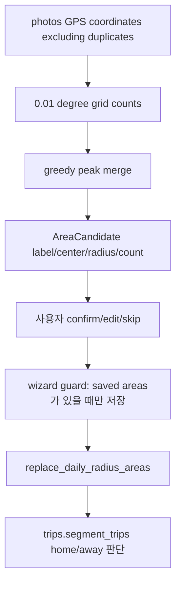
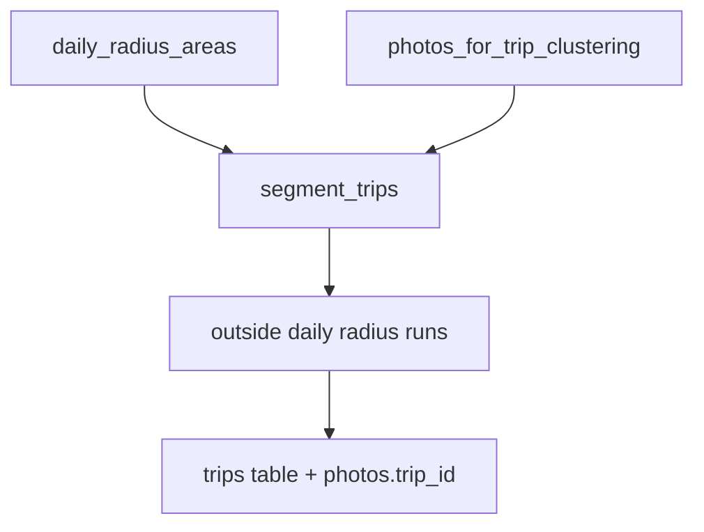

# src/eddr/daily_radius

집, 직장처럼 “일상 반경”으로 볼 좌표 군집 후보를 만들고 사용자가 확정한 영역을
`daily_radius_areas`에 저장하는 패키지다. trips는 이 영역 밖의 체류를 여행 후보로 본다.

## 어디에 끼는가

## 후보 생성 로직

| 단계 | 설명 |
|---|---|
| 입력 좌표 | `EddrDatabase.gps_coordinates(exclude_duplicates=True)` |
| 격자 | 기본 `0.01°`, 대략 1.1km |
| 병합 | 가장 많은 셀부터 주변 `merge_radius_km` 안의 셀을 greedy 병합 |
| 중심 | 병합된 셀의 가중 평균 |
| 반경 | 병합 spread + 반 셀, 최소 1km |
| 라벨 | 주변 사진의 최빈 `city district` |

DBSCAN 같은 외부 clustering 라이브러리는 쓰지 않는다. 현재 데이터 규모에서는 격자 count가
충분하고, 사용자가 최종 확정하는 workflow라 단순한 후보가 낫다.

## 저장 계약

| 테이블 | 필드 | 의미 |
|---|---|---|
| `daily_radius_areas` | `label` | 사용자가 확정한 이름 |
| `daily_radius_areas` | `center_lat`, `center_lng` | 반경 중심 |
| `daily_radius_areas` | `radius_km` | trips에서 home 판단에 쓰는 반경 |

wizard workflow에서는 확정된 영역이 하나 이상 있을 때만 테이블을 전체 교체한다. 아무 후보도
저장하지 않으면 기존 영역을 지우지 않는다. 단, repository의 `replace_daily_radius_areas()`
메서드 자체는 전달받은 목록으로 무조건 전체 교체하므로 빈 목록을 넘기면 테이블을 비운다.

## trips와의 연결

영역이 없으면 trips는 모든 좌표를 일상 밖으로 본다. 그래서 첫 설정이 중요하다.

## 검증 방법

- 후보 생성: `uv run pytest tests/daily_radius`
- trips 연결: `uv run pytest tests/trips/test_cluster.py tests/trips/test_pipeline.py`
