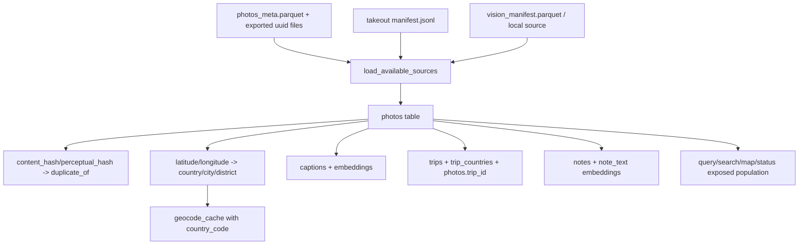
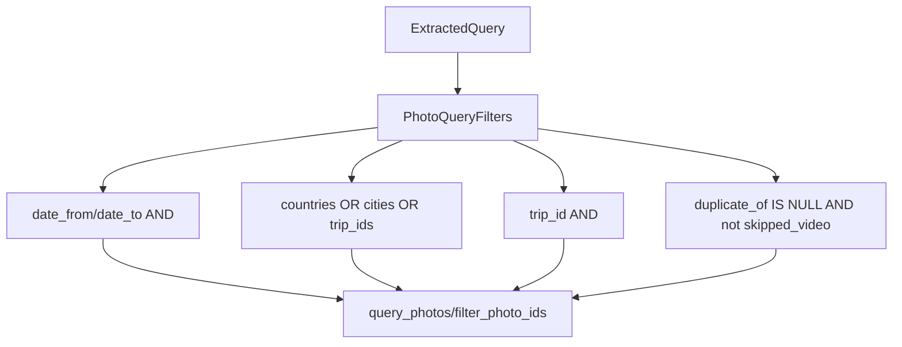

# src/eddr/db

EDDR의 SQLite 저장소 계층이다. 원천 메타데이터는 `PhotoRecord`로 들어오고,
dedup, geocode, trips, vision, notes 단계가 각자의 enrichment 필드를 갱신한다.

## 전체 데이터 흐름

## 핵심 테이블

| 테이블 | 소유 데이터 | 주요 소비처 |
|---|---|---|
| `photos` | 사진 identity, 파일 경로, 촬영시각, GPS, geocode, trip, dedup 상태 | 거의 모든 패키지 |
| `captions` | `(photo_id, model_id, lang)`별 영어 캡션 | 검색 lexical leg, 상세 응답 |
| `captions_fts` | `captions.text` external-content FTS5 | `keywords_en` BM25 매칭 |
| `embeddings` | SQLite 쪽 vector id ledger | Chroma 삭제/재색인 추적 |
| `geocode_cache` | 양자화 좌표 셀의 reverse geocode 결과와 `country_code` | geocode, trips |
| `trips` | 여행 구간 | search `trip_summary`, trip detail |
| `trip_countries` | trip별 방문 국가 ISO 코드 | trip summary/detail |
| `daily_radius_areas` | 사용자가 확정한 일상 반경 | trips segmentation |
| `notes` | 사진별 한국어 메모 | note leg, detail 응답 |
| `index_errors` | 재시도 가능한 단계별 오류 | 운영 점검 |

`load_available_sources()`의 입력 순서는 `vision_manifest.parquet`, `photos_meta.parquet`,
Takeout manifest 순이다. `vision_manifest.parquet` 경로는 `source=local` 같은 기존/수동
이미지 source도 `PhotoRecord(id=<source>:<content_hash>)`로 수렴시키는 세 번째 source path다.

## PhotoRecord 필드 수명

| 필드 | 최초 입력 | 갱신 단계 | 다음 소비처 |
|---|---|---|---|
| `id` | source + uuid/hash | 불변 | 전체 join key |
| `source`, `source_uri` | source loader | source reload 시 갱신 | provenance |
| `image_path` | Photos export/Takeout staging | source reload 시 갱신 | vision, thumbnails, originals |
| `content_hash` | Takeout/stage 또는 dedup backfill | dedup backfill | cross-source duplicate 판단 |
| `perceptual_hash` | vision manifest 또는 dedup backfill | dedup backfill | 유사도 분석용 보조 필드 |
| `taken_at` | source loader | KST normalize backfill | 날짜 필터, lane, trips |
| `latitude`, `longitude` | source loader 또는 manual location | manual location | map, geocode, trips |
| `country`, `city`, `district` | 없음 | geocode/manual reverse fill | 장소 필터, lane place |
| `trip_id` | 없음 | trips recompute | trip scope, trip detail |
| `duplicate_of` | 없음 | dedup mark | exposed population 제외 |
| `indexing_status` | `meta_done`/`missing_image` | vision/trips | status, exposed population |

## 검색 필터 계약

중요한 점은 장소 조건이다. `countries`, `cities`, `trip_ids`는 하나의 OR 그룹이다.
`trip_ids`는 지명으로 찾은 trip에 속한 GPS 없는 사진까지 회수하기 위한 확장 필드다.
반면 직접 지정된 `trip_id`는 독립 AND 조건이다.

## 노출 모집단

사용자-facing 검색, 지도, 상태의 주요 분모는 보통 다음을 제외한다.

- `duplicate_of IS NOT NULL`: cross-source 중복 행
- `indexing_status = 'skipped_video'`: 영상

이 규칙 때문에 DB 총 사진 수와 `/api/search`, `/api/map/photos`, `/api/status`의 숫자는 다를 수 있다.

## 검증 방법

- 스키마/CRUD/filter: `uv run pytest tests/db/test_repository.py`
- source loader: `uv run pytest tests/db/test_source_loader.py`
- 검색 연결: `uv run pytest tests/query/test_tools.py tests/server/test_search.py`
