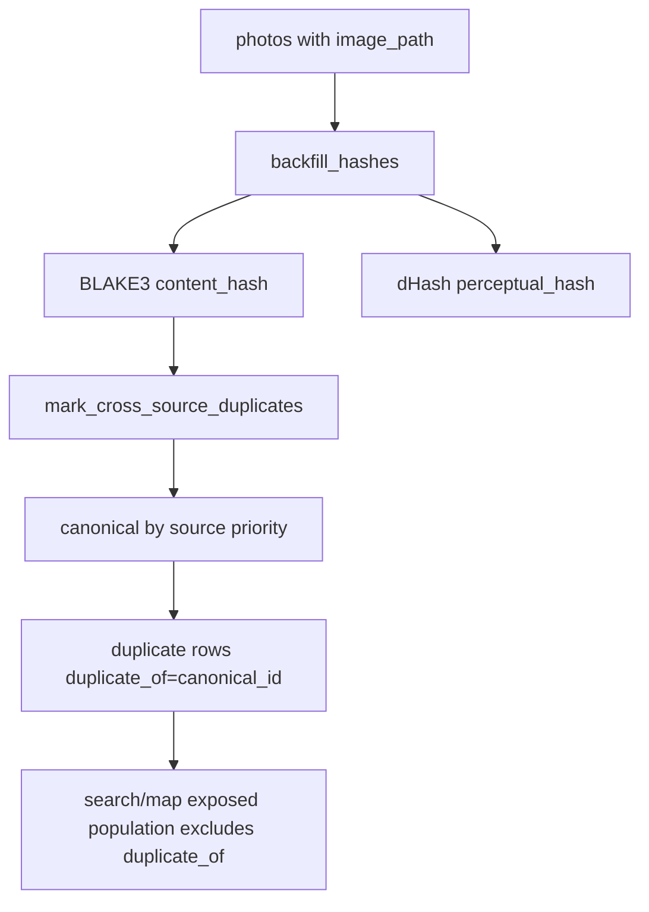
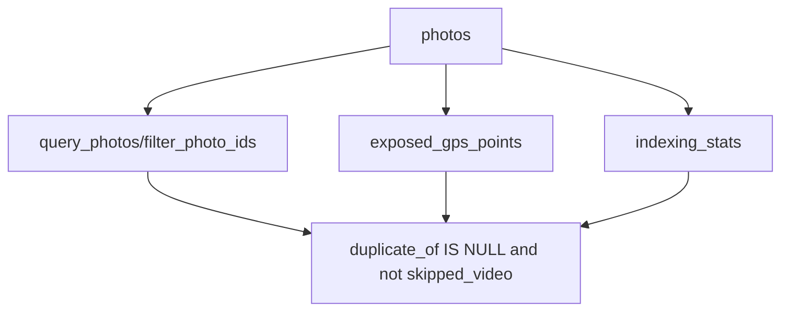

# src/eddr/dedup

파일 해시를 채우고 cross-source 중복을 `photos.duplicate_of`로 마킹하는 패키지다.
검색과 지도는 duplicate 행을 노출 모집단에서 제외한다.

## 어디에 끼는가

## 정책

| 항목 | 현재 정책 |
|---|---|
| canonical 기준 | `content_hash`가 같은 cross-source 그룹 |
| canonical 우선순위 | `photos_library`, `local`, `google_takeout`, 그 외는 뒤 |
| same-source duplicate | 마킹하지 않음 |
| perceptual hash | `dhash`를 채우지만 v1 dedup 판단에는 쓰지 않음 |
| 영상 | `skipped_video`는 hash backfill 대상에서 제외 |
| 재실행 | 기존 `duplicate_of`를 지우고 전체 재계산 |

## 필드 매핑

| 필드 | 생성/갱신 | 다음 소비처 |
|---|---|---|
| `content_hash` | Takeout stage 또는 `backfill_hashes()` | cross-source duplicate 그룹핑 |
| `perceptual_hash` | `dhash_hex()` | 유사 이미지 분석용 보조 필드 |
| `duplicate_of` | `apply_cross_source_dedup()` | 검색, 지도, status의 노출 제외 |

## 노출 모집단과 연결

따라서 dedup을 실행하면 DB 총 행 수는 그대로지만 사용자에게 보이는 사진 수는 줄 수 있다.

## 파일별 역할

| 파일 | 역할 |
|---|---|
| `hashes.py` | BLAKE3와 dHash 계산 |
| `pipeline.py` | hash backfill과 cross-source duplicate marking |

## 검증 방법

- hash/dedup 정책: `uv run pytest tests/dedup`
- 검색 노출 연결: `uv run pytest tests/db/test_repository.py tests/query/test_tools.py`
