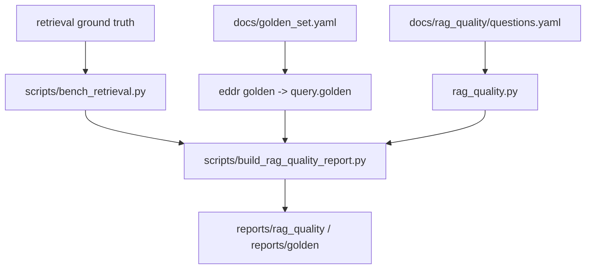

# src/eddr/eval

RAG/retrieval 품질 리포트용 평가 보조 패키지다. 운영 검색 자동 채점은 주로
`src/eddr/query/golden.py`와 `scripts/bench_retrieval.py`가 담당하고, 이 패키지는
질문/정답 artifact를 읽어 보고서 지표를 계산한다.

## 어디에 끼는가

## 평가 경로 구분

| 경로 | 무엇을 평가하나 | 검색 경로 |
|---|---|---|
| `rag_quality.py` | 질문/expected signal artifact의 형식과 요약 지표 | 문서 기반 |
| `scripts/bench_retrieval.py` | retrieval variant recall 등 | 벡터/BM25/RRF 실험 |
| `eddr golden` | end-to-end 검색 결과가 golden match를 만족하는지 | `run_search()`와 같은 코어 |
| `build_rag_quality_report.py` | 위 산출물을 사람 읽는 리포트로 합침 | 파일 artifact |

`eddr golden`은 추출과 검색 후보 생성은 `run_search()`와 같은 코어를 쓰지만, lane ordering은
API와 완전히 같지 않을 수 있다. API는 `date_intent or answer_type == "fact"`면 날짜순 lane을
쓰고, golden은 질문 문자열의 date intent 기준으로 lane을 묶는다. `date_lane_top`을 해석할 때
이 차이를 같이 봐야 한다.

## golden match 규칙

| 규칙 | 의미 |
|---|---|
| `photo_ids_any` | 결과 상위권에 특정 photo id 중 하나가 있으면 통과 |
| `date_lane_top` | 첫 lane 날짜가 기대 날짜면 통과 |
| `caption_contains_any` | 상위 `top_k` 사진의 캡션/키워드에 특정 단어가 있으면 통과 |

규칙이 없는 문항은 보류로 남긴다. 자동 채점 통과율을 말하려면 `match`가 작성된 문항만
분모로 봐야 한다.

## 필드 관점

| 입력 | 다음 단계 |
|---|---|
| `docs/golden_set.yaml` question | `run_search()`에 그대로 전달 |
| `ExtractedQuery.interpretation` | 리포트에 모델 해석으로 표시 |
| `groups[].photos[].photo_id` | `photo_ids_any` 평가 |
| `groups[0].date` | `date_lane_top` 평가 |
| `caption`, `keywords` | `caption_contains_any` 평가 |

## 검증 방법

- eval artifact: `uv run pytest tests/eval`
- golden runner: `uv run pytest tests/query/test_golden.py tests/cli/test_golden_cli.py`
