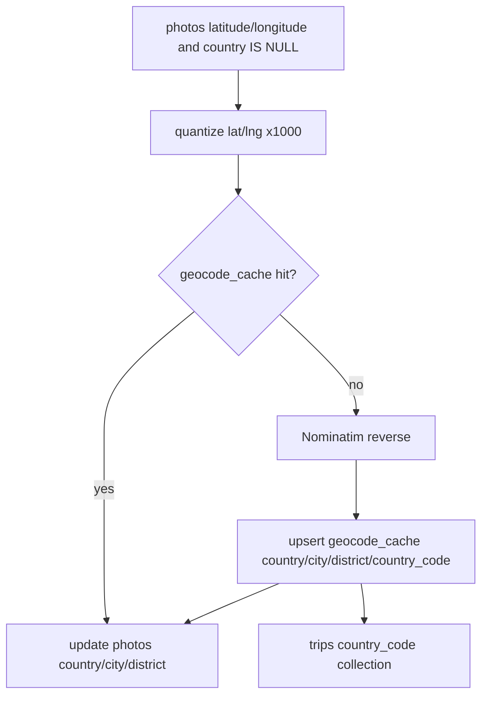

# src/eddr/geocode

GPS 좌표를 한국어 행정구역으로 바꾸는 reverse geocoding 패키지다. 운영 배치는
`eddr geocode run`, 수동 위치 지정은 `/api/photos/location`이 같은 reverse-fill 규약을 쓴다.

## 어디에 끼는가



## 필드 계약

| 저장 위치 | 필드 | 의미 |
|---|---|---|
| `photos` | `country`, `city`, `district` | 검색과 표시용 한국어 지명 |
| `geocode_cache` | `lat_quantized`, `lng_quantized` | 좌표를 0.001도 단위로 묶은 cache key |
| `geocode_cache` | `country`, `city`, `district` | 셀의 reverse geocode 결과 |
| `geocode_cache` | `country_code` | ISO 3166-1 alpha-2. `trip_countries` 산출용 |

`country_code`는 `photos`에 저장하지 않는다. 사진 행은 한국어 지명만 받고, trip 국가
요약은 cache의 ISO 코드를 이용한다.

## Nominatim 사용 방식

| 항목 | 값 |
|---|---|
| base URL | `https://nominatim.openstreetmap.org` |
| user agent | `eddr/0.1 (personal local photo indexer)` |
| 요청 단위 | 양자화 셀. 실측 GPS 7,888장이 약 2,047셀 |
| 실패 처리 | `index_errors(stage=geocode)` 기록 후 다음 사진으로 진행 |
| negative cache | 주소 없는 좌표도 전 필드 `None`인 cache entry로 저장 가능 |

## 수동 위치 지정 흐름

```mermaid
flowchart TD
  S[/api/geocode/search] --> C[candidate list only]
  C --> UI[사용자가 후보 선택]
  UI --> PUT[PUT /api/photos/location]
  PUT --> LOC[update_photo_location location_source=manual]
  LOC --> REV[quantized reverse fill]
  REV --> PH[photos country/city/district]
```

`/api/geocode/search`는 forward 후보를 보여줄 뿐 저장하지 않는다. 저장은
`PUT /api/photos/location`이 하며, 주소 필드는 후보 문자열을 그대로 쓰지 않고 기존
reverse 경로로 다시 채운다.

## 파일별 역할

| 파일 | 역할 |
|---|---|
| `nominatim.py` | HTTP client, Nominatim address 파싱, forward/reverse |
| `pipeline.py` | batch geocode, cache read/write, country_code backfill |

## 검증 방법

- reverse/cache pipeline: `uv run pytest tests/geocode`
- API 연결: `uv run pytest tests/server/test_geocode_api.py`
