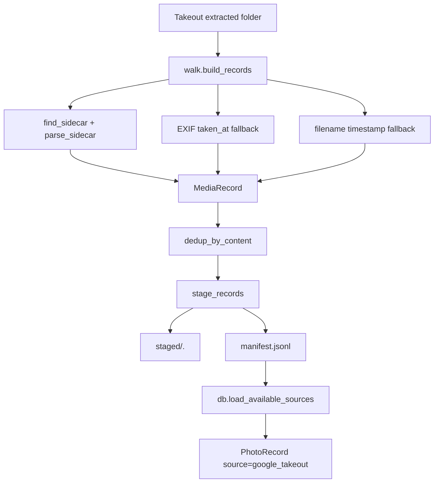
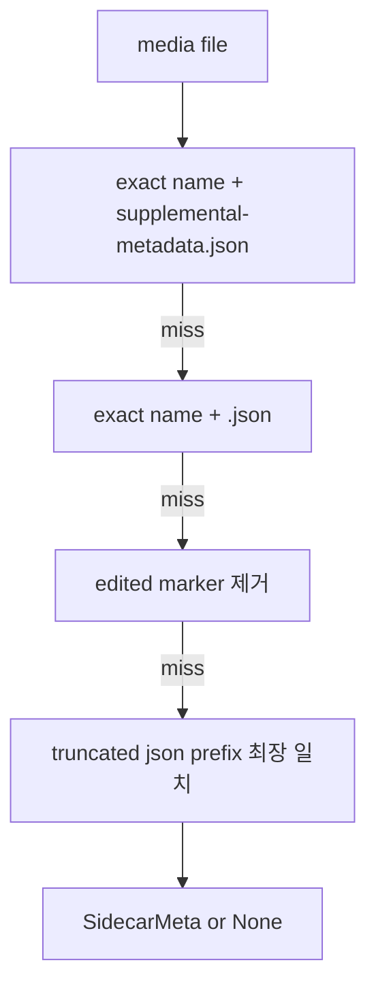

# src/eddr/google_takeout

Google Takeout 원본 폴더를 훑어 EDDR가 읽을 수 있는 staged 이미지와 `manifest.jsonl`로
정리하는 패키지다. DB 적재 자체는 `src/eddr/db/source_loader.py`가 한다.

## 어디에 끼는가

## 필드 계약

| 단계 | 필드 | 다음 단계 |
|---|---|---|
| `MediaRecord.source_uri` | Takeout root 기준 상대 경로 | manifest `source_uri`, DB `source_uri` |
| `MediaRecord.taken_at` | sidecar -> EXIF -> filename 순서 | manifest `taken_at`, DB `taken_at` |
| `MediaRecord.latitude/longitude` | `geoData` 또는 `geoDataExif`, `0.0/0.0`은 없음 처리 | DB `latitude/longitude` |
| staged file path | content hash 기반 복사본 | manifest `staged_path`, DB `image_path` |
| content hash | BLAKE3 | manifest `content_hash`, DB `content_hash`, dedup 기준 |
| sidecar `description`, `people` | manifest에는 기록 | 현재 DB `PhotoRecord`에는 적재하지 않음 |
| `original_filename` | manifest 추적용 | 현재 DB에는 적재하지 않음 |

## 사이드카 매칭 로직

Takeout은 JSON 사이드카 파일명이 잘리거나 편집본 이름과 어긋나는 경우가 있다.
그래서 exact match만 보지 않고 편집 마커와 절단 prefix까지 처리한다.

## 날짜 결정

1. sidecar `photoTakenTime.timestamp`
2. 이미지 EXIF `DateTimeOriginal`
3. 파일명 패턴 `YYYYMMDD_HHMMSS` 또는 `FB_IMG_<milliseconds>`
4. 모두 실패하면 `None`

DB 적재 뒤에는 `db normalize-taken-at`이 KST `+09:00` 표현으로 정규화한다.

## 파일별 역할

| 파일 | 역할 |
|---|---|
| `ingest.py` | Takeout zip/raw 추출 보조 |
| `walk.py` | media 확장자 필터, sidecar/EXIF/파일명 기반 `MediaRecord` 생성 |
| `sidecar.py` | JSON sidecar 탐색과 `SidecarMeta` 파싱 |
| `stage.py` | content hash dedup, staged 파일 복사, `manifest.jsonl` 작성 |

## 검증 방법

- sidecar/걷기/stage: `uv run pytest tests/google_takeout`
- DB 적재 연결: `uv run pytest tests/db/test_source_loader.py`
