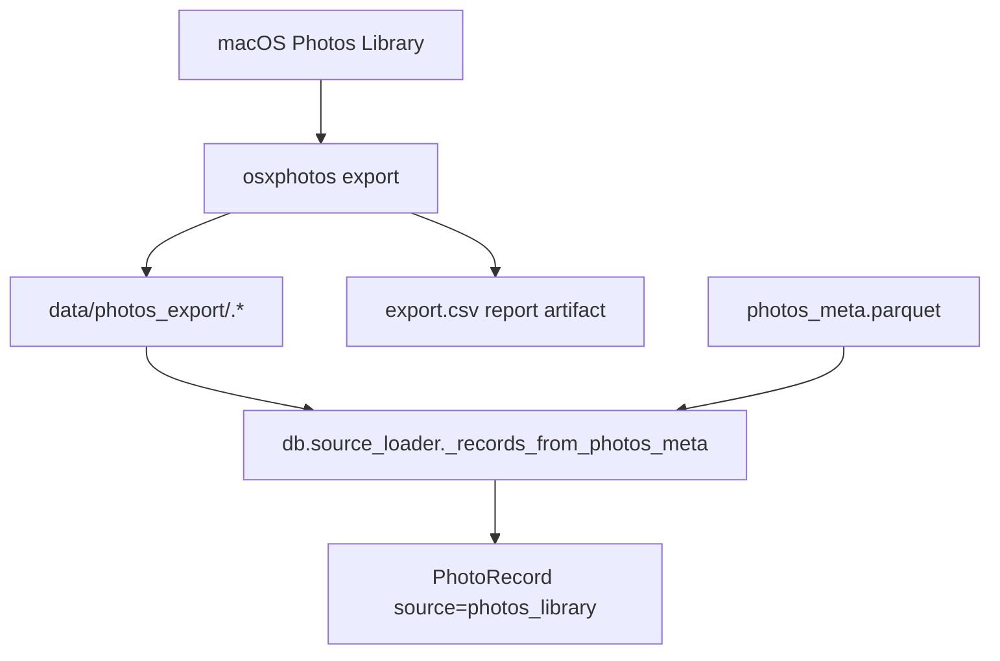

# src/eddr/photos_export

macOS Photos Library 원본을 `osxphotos export`로 파일 시스템에 내보내는 얇은 wrapper다.
현재 DB 적재 계약은 `export.csv`가 아니라 `photos_meta.parquet`의 UUID와
`data/photos_export/<uuid>.*` 파일명 매칭이다.

## 어디에 끼는가



## osxphotos 명령 계약

`build_export_command()`는 대략 다음 형태의 인수 목록을 만든다.

```text
osxphotos export <export_dir>
  --download-missing
  --use-photokit
  --update
  --only-photos
  --not-hidden
  --filename {uuid}
  --exportdb <export_db>
  --report <export_csv>
```

`run_export()`는 출력 디렉터리, export DB 부모, report 부모를 만든 뒤 명령을 실행한다.
버스트/문서앨범/스크린샷 같은 검색 제외 판단은 이 CLI flag가 아니라
`photos_meta.parquet`를 읽는 source loader 필터에서 처리한다.

## 산출물과 소비처

| 산출물 | 의미 | 현재 소비처 |
|---|---|---|
| `data/photos_export/<uuid>.*` | Photos Library UUID로 이름 붙은 실제 이미지 파일 | `db.source_loader._exported_files_by_stem()` |
| `data/photos_export/.osxphotos_export.db` | osxphotos incremental export DB | 다음 export 실행 |
| `data/photos_export/export.csv` | osxphotos report | 사람이 확인하는 artifact. 현재 source_loader는 읽지 않음 |

## 다음 단계 필드 매칭

| Photos source | PhotoRecord |
|---|---|
| `photos_meta.parquet.uuid` | `id=photos_library:<uuid>`, `source_uri=<uuid>` |
| exported `<uuid>.*` path | `image_path` |
| `photos_meta.parquet.date` | `taken_at` |
| `lat`, `lng` | `latitude`, `longitude` |
| `width`, `height` | `width`, `height` |
| `camera_make`, `camera_model` | `camera_make`, `camera_model` |

## 검증 방법

- command builder: `uv run pytest tests/photos_export/test_osxphotos_export.py`
- source loader 연결: `uv run pytest tests/db/test_source_loader.py`
