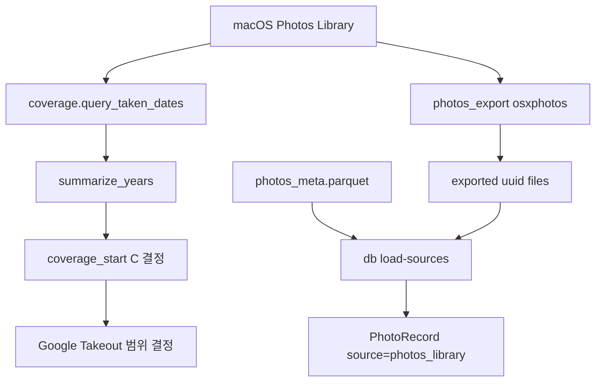

# src/eddr/photos_library

macOS Photos Library의 분포와 coverage를 확인하는 보조 패키지다. 실제 사진 파일 export는
`src/eddr/photos_export`, DB 적재는 `src/eddr/db/source_loader.py`가 맡는다.

## 어디에 끼는가

## 핵심 개념

`coverage`는 “내 Photos Library가 어떤 연도에 얼마나 분포하는가”를 보는 도구다.
Takeout과 Photos export를 같이 쓰는 이유는 누락을 줄이기 위해서다. coverage 결과는
Takeout을 어디까지 받을지 결정하는 근거가 된다.

## DB 적재 필터

Photos Library 행이 곧바로 모두 DB에 들어가는 것은 아니다. `db.source_loader`는 다음을
제외한다.

| 제외 조건 | 이유 |
|---|---|
| `hidden` | 사용자가 숨긴 항목 |
| `screenshot` | 개인 검색 대상에서 제외 |
| `ismovie` | 영상은 D18 이후 검색 모집단에서 제외 |
| `in_doc_album` | 문서/포스터 별도 strand |
| `burst`이면서 `burst_selected`가 아님 | 버스트 미선택 중복 제거 |
| `width < 300` 또는 `height < 300` | 너무 작은 이미지 제외 |

## PhotoRecord 매핑

| 입력 | 출력 |
|---|---|
| `photos_meta.parquet.uuid` | `photos_library:<uuid>` |
| exported file stem `<uuid>` | `image_path` |
| `date` | `taken_at` |
| `lat/lng` | `latitude/longitude` |
| `width/height` | `width/height` |
| `camera_make/camera_model` | `camera_make/camera_model` |
| exported 파일 없음 | `indexing_status=missing_image` |

## 검증 방법

- coverage: `uv run pytest tests/photos_library/test_coverage.py`
- DB 적재 필터: `uv run pytest tests/db/test_source_loader.py`
