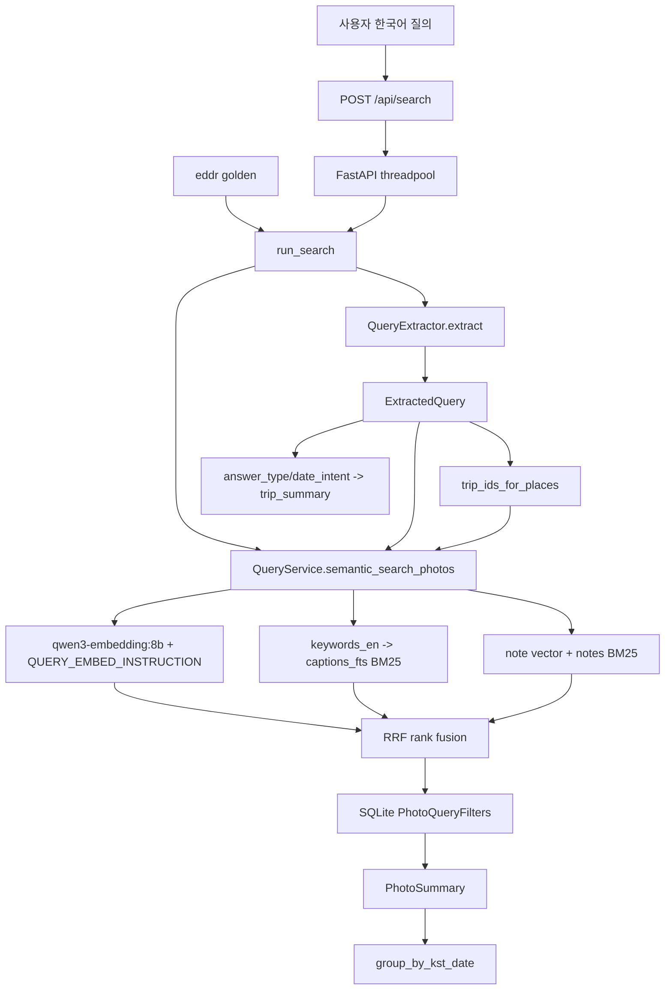
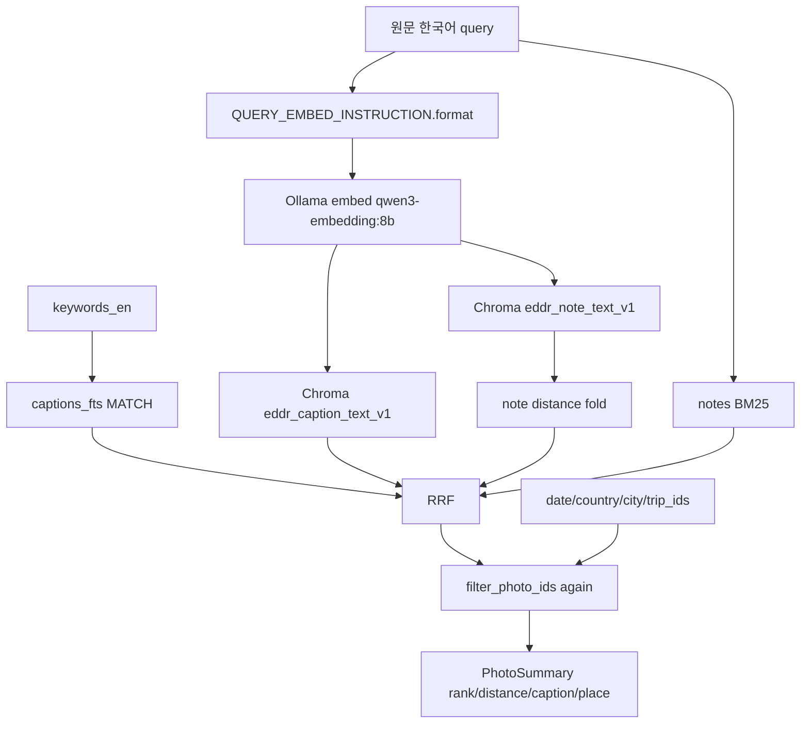

# src/eddr/query

한국어 자연어 질의를 실제 검색 조건과 랭킹 입력으로 바꾸는 패키지다. 운영 경로는
`/api/search`와 `eddr golden`이 공유하는 `server.routes.search.run_search()`이며,
별도 `QueryExecutor` 클래스는 없다.

## 어디에 끼는가

`embedding`은 텍스트를 숫자 벡터로 바꾸는 단계다. EDDR에서는 질의와 캡션을 같은
벡터 공간에 놓아 가까운 사진을 찾는다. `BM25`는 SQLite FTS5의 단어 기반 랭킹이고,
`RRF`는 여러 랭킹 목록을 순위 점수 `1 / (K + rank)`로 합치는 방식이다.

## 모델

| 역할 | 모델/구현 | 사용 지점 |
|---|---|---|
| 질의 구조화 추출 | `gemma4:e2b` (`EXTRACT_MODEL`) | `QueryExtractor.extract()`가 Ollama structured output으로 호출 |
| 질의 임베딩 | `qwen3-embedding:8b` (`EMBEDDING_MODEL`) | `QueryService.semantic_search_photos()`의 `embedding_client` |
| query instruction | `QUERY_EMBED_INSTRUCTION` | 질의 쪽에만 붙임. 캡션/메모 문서 쪽에는 붙이지 않음 |
| 선택 실험 | reranker, query expander | `RetrievalConfig`로 주입. baseline에서는 비활성 |

## 실행 주체

1. `src/eddr/server/routes/search.py`의 `search()`가 payload의 `query`를 검증한다.
2. `search()`가 `run_in_threadpool(run_search, state.extractor, state.service, query)`를 호출한다.
3. `run_search()`가 `state.extractor.extract(query)`를 호출한다. 실제 추출 객체는
   `AppState.extractor`, 타입은 `QueryExtractor`다.
4. `run_search()`가 추출된 지명으로 `service.db.trip_ids_for_places()`를 호출한다.
5. `run_search()`가 원문 질의와 `ExtractedQuery` 필드를 `QueryService.semantic_search_photos()`에 넘긴다.

`eddr golden`도 `run_search()`를 주입받아 같은 검색 코어를 탄다. `scripts/bench_extract.py`는
추출 모델만 벤치하기 위해 `QueryExtractor.extract()`를 직접 호출하는 비운영 경로다.

## ExtractedQuery 필드 매핑

| 필드 | 생성 방식 | 다음 단계에서 쓰는 곳 | 검색 의미 |
|---|---|---|---|
| `keywords_en` | 모델이 장면/사물/활동을 영어 키워드로 추출 | `semantic_search_photos(keywords=...)` -> `captions_fts MATCH` | 영어 캡션의 lexical leg. BM25 결과가 벡터 결과와 RRF로 합쳐짐 |
| `keywords_ko` | `keywords_en`의 한국어 표시명 | 응답 `interpretation` | 표시 전용. 검색에는 쓰지 않음 |
| `date_from` | 상대/절대 날짜를 KST 날짜 하한으로 추출 | `PhotoQueryFilters.date_from`, fact `list_trips` | 사진 검색은 `taken_at >= KST start`, trip 요약은 기간 겹침 필터 |
| `date_to` | KST 날짜 상한으로 추출 | `PhotoQueryFilters.date_to`, fact `list_trips` | 사진 검색은 `taken_at <= KST end`, trip 요약은 기간 겹침 필터 |
| `countries` | 질의에 나온 국가명만 한국어로 추출 | `trip_ids_for_places`, `PhotoQueryFilters.countries`, fact `list_trips` | `photos.country LIKE`와 trip 스코프 확장 |
| `cities` | 질의에 나온 도시/지역명만 한국어로 추출 | `trip_ids_for_places`, `PhotoQueryFilters.cities` | `photos.city` 또는 `photos.district LIKE` |
| `answer_type` | `fact` 또는 `photo_list` | lane 날짜 정렬, `trip_summary` 생성 | “언제 갔지?” 같은 사실 질의는 trip 요약을 붙임. route가 시간 의문사를 보면 `fact`로 보정 가능 |
| `fallback` | 추출 실패 시 `True` | 응답 `interpretation` | 추출 필드가 비어도 원문 임베딩 검색은 계속 수행 |

장소 조건은 단순 AND가 아니다. `countries`, `cities`, `trip_ids`는 하나의 장소 OR 그룹으로
묶인다. 예를 들어 `제주 현무암`은 `city LIKE 제주` 사진뿐 아니라, 제주에서 도출된
`trip_id`에 속한 GPS 없는 사진도 함께 회수한다.

## 검색 내부 흐름

Chroma에는 날짜/지명 메타데이터를 넣지 않는다. 그래서 벡터 후보를 넉넉히 가져온 뒤
SQLite에서 `PhotoQueryFilters`로 날짜, 장소, trip, dedup, 영상 제외 조건을 적용한다.
`keywords_en`으로 얻은 caption BM25 후보는 RRF 전에 같은 SQL 필터를 한 번 통과하고,
최종 RRF 결과도 다시 `filter_photo_ids()`를 통과한다.

메모는 두 갈래다. note vector 후보는 첫 query embedding과 같은 벡터 공간에서 거리로
caption vector leg에 접어 넣고, 채택된 note id는 별도 note leg에도 들어간다. notes BM25는
원문 한국어 질의로 메모 텍스트를 검색해 별도 leg로 RRF에 합류한다.

## 파일별 역할

| 파일 | 역할 |
|---|---|
| `extract.py` | `gemma4:e2b` structured output으로 `ExtractedQuery` 생성 |
| `tools.py` | 운영 검색 서비스. 벡터, FTS5, note leg, RRF, SQL 필터를 합침 |
| `captions.py` | 캡션 본문과 키워드 파싱 |
| `notes_bm25.py` | 한국어 메모 텍스트 BM25 검색 |
| `expansion.py` | 실험용 질의 확장 |
| `rerankers.py` | 실험용 cross-encoder reranker |
| `retrieval_config.py` | `EDDR_VARIANT` 기반 검색 변형 설정 |
| `golden.py` | `run_search()` 경로를 이용한 golden set 자동 채점 |
| `audit.py` | 캡션/검색 품질 감사 보조 |

## 검증 방법

- 추출 스키마와 날짜 해석: `uv run pytest tests/query/test_extract.py`
- field -> search 연결: `uv run pytest tests/query/test_tools.py tests/server/test_search.py`
- golden 경로: `uv run pytest tests/query/test_golden.py tests/cli/test_golden_cli.py`
