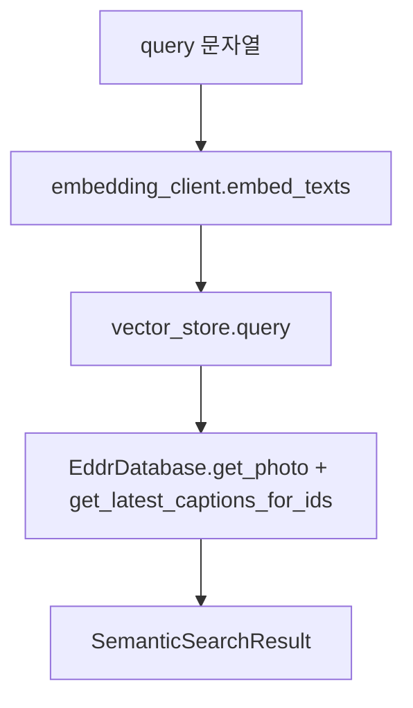

# src/eddr/search

낮은 수준의 raw semantic search helper다. 운영 검색(`/api/search`)의 전체 파이프라인이
아니며, 실서비스 흐름은 `src/eddr/query`와 `src/eddr/server/routes/search.py`가 맡는다.

## 어디에 끼는가

이 패키지는 쿼리를 그대로 임베딩해 Chroma 후보를 가져온다. 다음 기능은 없다.

| 운영 `/api/search` 기능 | `src/eddr/search` 상태 |
|---|---|
| `QueryExtractor.extract()` | 없음 |
| `QUERY_EMBED_INSTRUCTION` | 없음. raw query를 그대로 임베딩 |
| `keywords_en` BM25 lexical leg | 없음 |
| note vector / notes BM25 leg | 없음 |
| RRF fusion | 없음 |
| 날짜/지명/trip 후필터 | Chroma `where`만 선택적으로 전달 |
| KST 날짜 lane 그룹핑 | 없음 |

## 필드 흐름

| 입력/출력 | 의미 |
|---|---|
| `query` | 자연어 질의. `embedding_client.embed_texts([query])`로 바로 벡터화 |
| `where` | Chroma metadata filter. SQLite의 `PhotoQueryFilters`와 다름 |
| `VectorHit.photo_id` | DB join key |
| `VectorHit.document` | 벡터화된 문서. 최신 캡션이 없으면 결과 caption fallback으로 사용 |
| `SemanticSearchResult.distance` | 벡터 거리. 낮을수록 가깝지만 운영 품질 컷오프 기준은 아님 |

## 사용처

`search semantic` CLI나 작은 실험에서 “벡터 스토어가 동작하는지”를 확인하는 용도다.
사용자-facing 검색 품질을 판단할 때는 `QueryService.semantic_search_photos()`나
`eddr golden`을 봐야 한다.

## 검증 방법

- raw helper: `uv run pytest tests/search/test_semantic.py`
- 운영 검색과 비교: `uv run pytest tests/query/test_tools.py tests/server/test_search.py`
