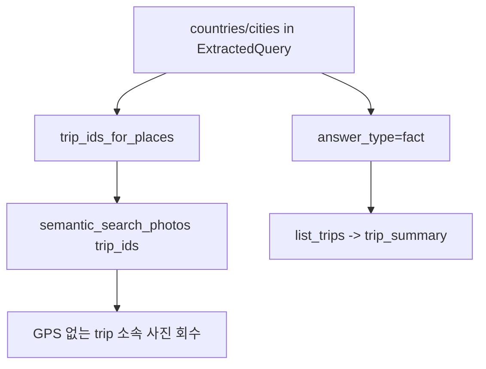

# src/eddr/trips

일상 반경 밖에서 일정 시간 이상 이어지는 사진 구간을 여행으로 재계산하고,
`trips`, `trip_countries`, `photos.trip_id`를 갱신하는 패키지다.

## 어디에 끼는가

```mermaid
flowchart TD
  P[photos_for_trip_clustering] --> SEG[segment_trips]
  A[daily_radius_areas] --> SEG
  SEG --> TR[TripSegment]
  TR --> INS[insert trips]
  TR --> ASSIGN[assign_trip_by_timerange]
  TR --> CC[insert trip_countries]
  ASSIGN --> PID[photos.trip_id]
  INS --> CNT[finalize_trip_photo_counts]
  PID --> SEARCH[/api/search trip_ids + trip_summary]
```

## 세그먼트 기준

| 입력/설정 | 의미 |
|---|---|
| `min_duration_hours` | trip 인정 최소 체류 span. 기본 24h |
| `max_gap_hours` | 복귀 사진 없이 run을 끊는 최대 사진 공백. 기본 72h |
| `daily_radius_areas` | 이 안이면 일상, 밖이면 away 후보 |
| `photos_for_trip_clustering` | GPS와 `taken_at`이 있고 영상이 아닌 사진. `duplicate_of`는 여기서 제외하지 않음 |

## 재계산 side effect

`recompute_trips()`는 incremental patch가 아니라 전체 재계산이다.

1. 기존 `photos.trip_id`를 지우고 `trips`를 비운다.
2. 새 segment를 만든다.
3. `trip_<YYYYMMDD>_<seq>` 형식의 deterministic id를 만든다.
4. `trips` 행을 넣는다.
5. segment 시간 범위 안의 사진에 `trip_id`를 배정한다. GPS 없는 사진도 시간만 맞으면 포함된다.
6. `caption_done`인 사진만 `trip_assigned`로 전이한다. 아직 caption 전이면 상태를 보존한다.
7. `trips.photo_count`는 `duplicate_of IS NULL` 사진만 세어 갱신한다.

즉, segmentation 입력에는 duplicate 행이 들어갈 수 있지만 사용자-facing count와 검색 노출은
duplicate를 제외한다.

## 필드 매핑

| 필드 | 생성 | 다음 소비처 |
|---|---|---|
| `trips.id` | `trip_<start_day>_<seq>` | photo detail, search summary |
| `trips.name` | 대표 장소 + `YYYY-MM` | UI 표시 |
| `trips.start_at/end_at` | segment range, naive UTC 문자열 | fact/date 질의 정렬 |
| `trips.center_lat/center_lng` | segment 중심 | 로컬 분석용 |
| `photos.trip_id` | segment time range assignment | place query 확장, trip detail |
| `trip_countries.country_code` | `geocode_cache.country_code` 수집 | trip summary/detail |

거주국 `KR`은 해외 trip의 방문 국가 목록에서 제외한다.

## 검색과의 연결



장소 질의에서 trip이 중요한 이유는 GPS 없는 사진도 같은 여행 시간대에 있으면 찾을 수
있기 때문이다.

## 검증 방법

- clustering: `uv run pytest tests/trips/test_cluster.py`
- DB side effect: `uv run pytest tests/trips/test_pipeline.py`
- 검색 연결: `uv run pytest tests/server/test_search.py`
