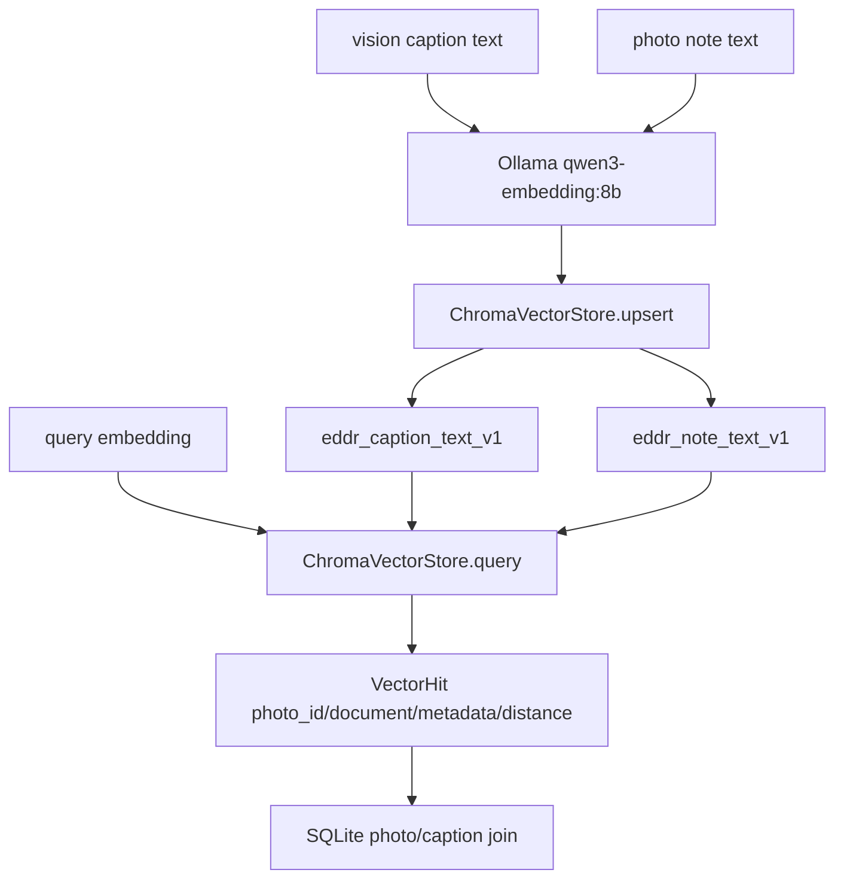

# src/eddr/vector

임베딩 벡터 저장소 adapter다. 운영은 Chroma persistent collection을 쓰고, 테스트는
in-memory store를 쓴다. 임베딩 모델을 실행하지는 않는다. 모델 호출은
`OllamaVisionClient.embed_texts()`가 담당한다.

## 어디에 끼는가

## 컬렉션 계약

| 컬렉션 | 생성 위치 | 문서 | vector id | metadata |
|---|---|---|---|---|
| `eddr_caption_text_v1` | 기본 `ChromaVectorStore(path)` | 영어 사진 캡션 | `caption_text:<photo_id>:<model>` | `photo_id`, `source`, `kind=caption_text`, `model_id` |
| `eddr_note_text_v1` | `server.deps.NOTE_COLLECTION` | 한국어 사진 메모 | `note_text:<photo_id>:<model>` | `photo_id` |

`photo_id`는 필수 join key다. 검색 결과의 최종 날짜, 장소, dedup, 영상 제외는 Chroma가
아니라 SQLite에서 처리한다.

## 주요 타입

| 타입/메서드 | 역할 |
|---|---|
| `ChromaVectorStore.upsert()` | `ids`, `embeddings`, `documents`, `metadatas`를 같은 길이로 저장 |
| `ChromaVectorStore.query()` | 쿼리 임베딩과 가까운 `VectorHit` 목록 반환 |
| `ChromaVectorStore.delete()` | note 삭제 경로에서 vector id 삭제 |
| `ChromaVectorStore.count()` | note leg가 비어 있는지 판단 |
| `VectorHit.distance` | Chroma 거리. 낮을수록 가까움 |
| `MemoryVectorStore` | 테스트용 dict store |

## 주의할 점

- 이 패키지는 query instruction을 붙이지 않는다. instruction은 `QueryService`가 질의 쪽에만 붙인다.
- Chroma metadata에는 geocode/date가 없다. 운영 필터는 `EddrDatabase.filter_photo_ids()`에서 한다.
- 벡터 거리 단독 컷오프를 품질 기준으로 쓰지 않는다. 운영 랭킹은 vector, BM25, note leg를 RRF로 합친다.

## 검증 방법

- Chroma adapter: `uv run pytest tests/vector/test_chroma_store.py`
- 운영 연결: `uv run pytest tests/query/test_tools.py tests/server/test_notes.py`
