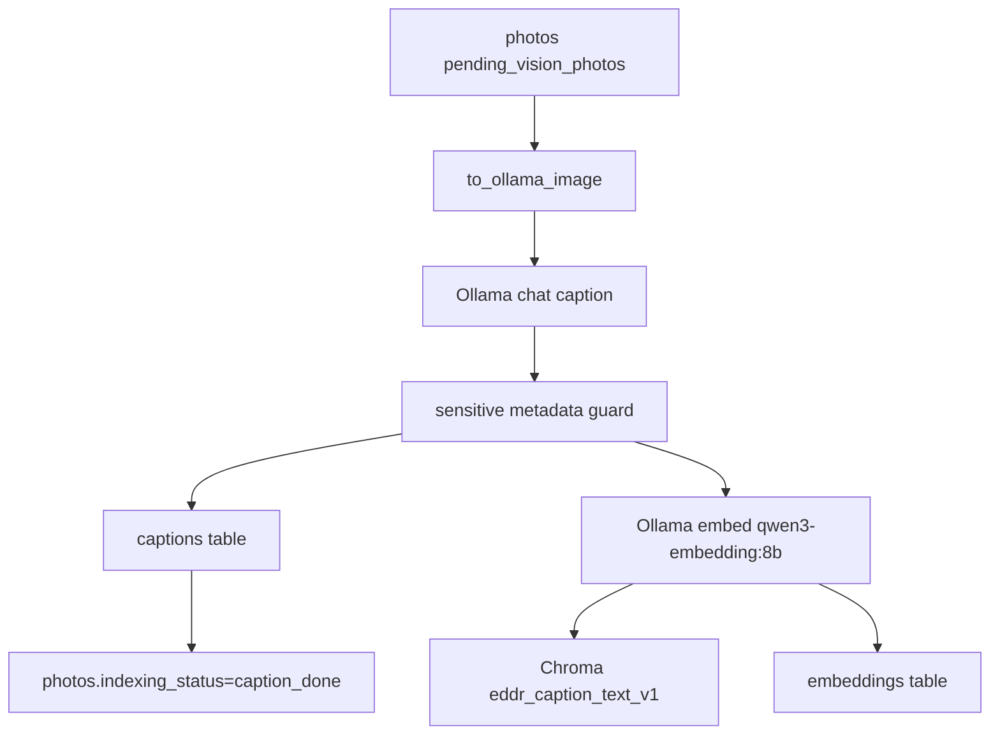

# src/eddr/vision

사진 이미지에서 영어 캡션을 만들고, 보통 그 캡션을 임베딩해 SQLite와 Chroma에 저장하는
패키지다. 운영 검색의 semantic leg는 이 패키지가 만든 `captions`와 `caption_text` 벡터에
의존한다.

## 어디에 끼는가

## 모델과 프롬프트

| 작업 | 기본값 | 위치 |
|---|---|---|
| 기본 캡션 | `gemma4:e2b` | `CAPTION_MODEL` |
| 캡션 임베딩 | `qwen3-embedding:8b` | `EMBEDDING_MODEL` |
| 문서/포스터 재캡션 | `qwen3-vl:8b` | `DOC_RECAPTION_MODEL` |
| 비문서 재캡션 | `gemma4:31b` | `NONDOC_RECAPTION_MODEL` |
| 기본 prompt | `p3_hybrid` | `vision run` |
| 재캡션 prompt | `p5_grounded` | `vision recaption` |

캡션은 영어다. 그래서 `query.extract`도 장면/사물 키워드를 `keywords_en`으로 만든다.

## 저장 계약

| 저장 위치 | 필드 |
|---|---|
| `captions` | `photo_id`, `model_id=<caption_model>`, `lang=en`, `text` |
| Chroma caption collection | document=`caption`, id=`caption_text:<photo_id>:<embedding_model>` |
| Chroma metadata | `photo_id`, `source`, `kind=caption_text`, `model_id=<embedding_model>` |
| `embeddings` | `photo_id`, `kind=caption_text`, `model_id`, `vector_id`, `dimensions` |
| `photos` | `indexing_status=caption_done` |

예외가 있다. `vision recaption --no-vector`는 캡션과 `caption_done` 상태만 저장하고 Chroma와
`embeddings`를 건드리지 않는다. 이 경로 뒤에는 `vision reindex-vectors`를 따로 실행해야
`caption_text` 벡터가 생긴다.

## 이미지 입력 처리

Ollama가 직접 읽는 확장자는 JPEG/PNG 계열이다. HEIC, TIFF, RAW 등은 macOS `sips`로
임시 JPEG로 변환해 보낸 뒤 임시 파일을 삭제한다. 캡션에 파일 경로나 좌표 같은 민감
메타데이터가 들어가면 저장하지 않고 오류로 기록한다.

## 배치 실행

| 경로 | 설명 |
|---|---|
| `run_caption_text_batch` | 단일 Ollama host에서 캡션, 임베딩, 저장을 순차 수행 |
| `run_caption_text_batch_dual` | 캡션 생성은 local/remote host에 분산, 임베딩과 저장은 단일 client로 수행 |
| `run_caption_text_batch_routed_dual` | doc/nondoc strand별 모델 라우팅 |
| `vision reindex-vectors` | 기존 최신 캡션을 다시 임베딩해 Chroma와 `embeddings`를 갱신 |

듀얼 host에서도 임베딩과 Chroma/SQLite write는 단일 흐름으로 둔다. 벡터 공간 일관성과
동시 write 위험을 피하기 위해서다.

## 검증 방법

- client/prompt/batch: `uv run pytest tests/vision`
- 검색 연결: `uv run pytest tests/query/test_tools.py tests/server/test_search.py`
