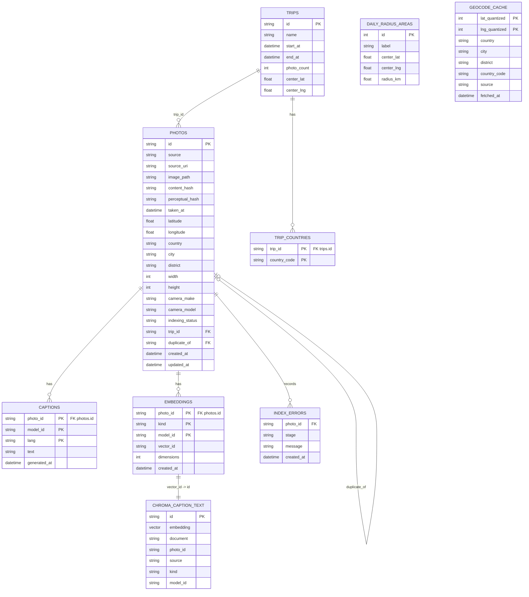

# DB 스키마 요약

SQLite 원장 + Chroma sidecar. SQLite는 사진 메타데이터·caption·status checkpoint를 소유하고, Chroma는 caption_text 벡터 payload를 소유한다(ADR-0006).

---

## 현재 구현 ERD

2026-06-11 ⑥ 단계(Trip 클러스터링) 기준.
현재 구현은 SQLite 8테이블 + Chroma caption-text collection이다.

## 현재 구현 테이블 인벤토리

### `photos` — 사진 메타데이터 원장

사진 1건 = 1행. `UNIQUE(source, source_uri)`로 source 단위 중복을 막고,
인덱싱 진행 상태를 `indexing_status`로 체크포인트한다.

| 컬럼 | 설명 |
|---|---|
| `id` | EDDR 내부 사진 ID. 예: `photos_library:<uuid>`, `google_takeout:<hash>` |
| `source` | `photos_library`, `google_takeout`, `local` |
| `source_uri` | Photos UUID, 원본 경로, Takeout source URI |
| `image_path` | Vision 처리 가능한 로컬 파일 경로. 없으면 `missing_image` |
| `content_hash` | content hash. 없으면 loader가 안정 hash로 보강 가능 |
| `perceptual_hash` | dHash 64bit. 현재는 보관만 함 |
| `taken_at` | 촬영 일시 — **KST(+09:00) aware ISO로 정규화됨**(D26 M1, 2026-06-12). aware 원본은 인스턴트 보존 변환, naive(local 806)는 벽시계 보존 +09:00 부여. `substr(taken_at,1,10)` = KST 달력일. 로더(`_iso_or_none`)도 동일 정규화 — 재적재 drift 없음 |
| `taken_at_raw` | **DB에 최초 저장된 표현의 1회성 스냅샷**(정규화 전 값, D26 M1). 백필 이후 신규 적재 행은 로더가 이미 KST로 쓰므로 raw도 KST — "정규화 전 원본"이 아니라 "최초 저장값"으로 읽을 것. upsert 불가침 |
| `latitude`, `longitude` | 외부 LLM 미전송(ADR-0001) — **D26부터 지도 렌더용 "내 서버→내 브라우저" 노출은 허용**(ADR-0009 §3) |
| `country`, `city`, `district` | reverse geocode 결과 (④, `eddr geocode run`이 채움) |
| `width`, `height`, `camera_make`, `camera_model` | 이미지/카메라 메타 |
| `indexing_status` | `meta_done`, `missing_image`, `caption_done`, `skipped_video`, `trip_assigned` |
| `trip_id` | FK → `trips`, ⑥이 채움. trip 삭제 시 SET NULL |
| `duplicate_of` | cross-source dedup canonical 사진 id (④, PLAN §4.2). 질의 레이어는 `duplicate_of IS NULL`만 노출 |
| `created_at`, `updated_at` | 감사 타임스탬프 |

enrichment 필드(country·city·district·trip_id·duplicate_of)는 전용 UPDATE
메서드로만 채워지며 `upsert_photo`(재적재)는 건드리지 않는다.

### `captions` — Vision 모델 캡션

| 컬럼 | 설명 |
|---|---|
| `photo_id` | FK → `photos.id`, composite PK 일부 |
| `model_id` | 예: `gemma4:e2b`, composite PK 일부 |
| `lang` | `en` (v1 단일), composite PK 일부 |
| `text` | 생성된 캡션 텍스트 |
| `generated_at` | 생성 일시 |

### `embeddings` — Chroma vector 참조 원장

| 컬럼 | 설명 |
|---|---|
| `photo_id` | FK → `photos.id`, composite PK 일부 |
| `kind` | 현재 구현은 `caption_text`, composite PK 일부 |
| `model_id` | 예: `qwen3-embedding:8b`, composite PK 일부 |
| `vector_id` | Chroma id (`caption_text:<photo_id>:<model_id>`) |
| `dimensions` | 벡터 차원 |
| `created_at` | 생성 일시 |

실제 벡터 payload는 Chroma `eddr_caption_text_v1` collection에 저장한다.

### `index_errors` — 인덱싱 오류 로그

| 컬럼 | 설명 |
|---|---|
| `photo_id` | FK → `photos.id`, nullable. source load처럼 row 확정 전 오류는 null 가능 |
| `stage` | 예: `load_takeout`, `vision`, `hash_backfill`, `geocode` |
| `message` | 오류 메시지 |
| `created_at` | 기록 일시 |

### `trips` / `trip_countries` — 여행 단위 (⑥ 구현 완료, 2026-06-11)

`trips(id TEXT PK, name, start_at, end_at, photo_count, center_lat, center_lng)`,
`trip_countries(trip_id FK, country_code, 복합 PK)`. 다국가 1 trip (D14).

| 항목 | 계약 |
|---|---|
| `trips.id` | 결정적 `trip_<시작일 YYYYMMDD>_<NN>` |
| `trips.name` | 자동 생성 — 해외=최빈 외국 국가명·국내=최빈 city, `"{지명} 여행 YYYY-MM"` |
| `trips.start_at/end_at` | naive UTC `YYYY-MM-DD HH:MM:SS` (구간 첫/끝 사진) |
| `trips.photo_count` | ⑦ 노출 기준 — 영상 미배정·`duplicate_of IS NULL`만 집계 |
| `trip_countries.country_code` | **ISO 3166-1 alpha-2 대문자**. 해외 trip은 거주국(KR) 제외 (CONTEXT.md 정의) |

`eddr trips recompute`가 전체 재계산(멱등). 실측: **83 trips · 배정 3,760 ·
방문국 9개국**. → [impl-log](../impl-log/trip-clustering.md)

### `daily_radius_areas` — 일상 반경 (④)

| 컬럼 | 설명 |
|---|---|
| `id` | INTEGER PK |
| `label` | `"집"`, `"직장"` 등 — setup wizard에서 사용자가 입력 (D15) |
| `center_lat`, `center_lng` | 중심 좌표 |
| `radius_km` | 반경(km) — wizard에서 편집 가능 |

`eddr setup daily-radius`가 격자 밀도 후보를 제안하고 사용자 확정분으로
**전체 교체**한다(재실행 멱등).

### `geocode_cache` — Nominatim 응답 캐시 (④, ⑥에서 country_code 추가)

| 컬럼 | 설명 |
|---|---|
| `lat_quantized`, `lng_quantized` | 3dp 밀리도 양자화 좌표(INTEGER, 복합 PK) — 0.001° ≈ 110m |
| `country`, `city`, `district` | 역지오코딩 결과. 주소 없는 좌표(바다)는 전부 NULL(negative cache) |
| `country_code` | ISO 3166-1 alpha-2 대문자 (⑥, trip_countries 산출용. ④분 2,047셀은 `eddr geocode backfill-country-code`로 재조회 백필 완료) |
| `source` | `'nominatim'` |
| `fetched_at` | 캐시 생성 일시 |

---

## PLAN 기반 향후 모델 인벤토리

아래 항목은 `docs/PLAN.md#4` 중 아직 미구현인 부분이다. 구현이 진행되면
위의 "현재 구현" 섹션을 먼저 갱신한다.

### D26 예정 변경 (ADR-0009, [prd v2 §6-d](../../docs/prd.md))

| 변경 | 내용 | M |
|---|---|---|
| ~~`photos.taken_at` KST 정규화~~ | **완료(M1, 2026-06-12)** — 위 "현재 구현" photos 표 참조. 달력일 변경 1,743행, 백업 `data/eddr_backup_pre_kst_20260611.sqlite`, trips 83→82·배정 3,760→3,777 | ~~M1~~ |
| `photos.location_source` | TEXT, NULL=EXIF 유래 · `'manual'`=수동 지정. `_migrate_photos_columns` 멱등 ALTER. **VALID_SOURCES·INDEXING_STATUSES 비변경**(doc-contract hook 무관) | M4 |
| `notes` 테이블 | `photo_id TEXT PK REFERENCES photos ON DELETE CASCADE, text, updated_at` — 사진별 1메모 | M5 |
| `embeddings.kind='note_text'` | 기존 복합 PK 그대로 수용(D20 설계 계승). 벡터는 Chroma **`eddr_note_text_v1` 별도 컬렉션**(캡션 컬렉션 재구축과 격리) | M5 |

### `persons` / `photo_persons` — Photos.app 인물 레이블

**v1: 데이터 적재만 수행, person 기반 질의는 폐기 (ADR-0004).** 미구현.
`persons(id, photos_person_uuid, name, photos_count)` + `photo_persons` M2M.

### `embeddings.kind = 'image'` — 이미지 직접 임베딩 leg

D20 후속 검증 대상(TODO D20). 현재는 `caption_text` 단일.

### `photos.near_duplicate_group_id`

**v1 보류(ADR-0004)** — 컬럼 자체를 만들지 않았다. D8 재검토 ADR flag가
풀리면 추가.

---

## Dedup 규칙 (§4.2) — ④ 구현 완료 (2026-06-10)

- **BLAKE3 일치 + cross-source** → canonical(photos_library > local >
  google_takeout, 동순위 id 사전순) 외 행에 `duplicate_of` 마킹.
  적재 후 일괄 마킹 방식이며 캡션·임베딩 데이터는 보존, 질의 레이어(⑦)가
  `duplicate_of IS NULL`로 거른다. 같은 소스 내 동일 해시는 마킹하지 않음
  (ADR-0002: dedup은 cross-source만).
- 실측(2026-06-10): 165그룹·165건 마킹 (local 160 + google_takeout 5,
  canonical 전부 photos_library). `eddr dedup mark` 재실행 멱등.
- **dHash 기반 near-duplicate 그룹핑** → **v1 보류 (ADR-0004)**: 중복 허용.
  dHash 자체는 백필 완료(7,653장, RAW 65장 제외) — D8 재검토 데이터 확보됨.

---

## ADR-0004 영향 요약

| 대상 | 변경 |
|---|---|
| `near_duplicate_group_id` | 컬럼 미생성, v1 보류 |
| `persons` / `photo_persons` | 데이터 적재는 유지(미구현), person 기반 LLM 질의는 폐기 |

**코드가 진화하면 코드 기준으로 갱신**한다.
